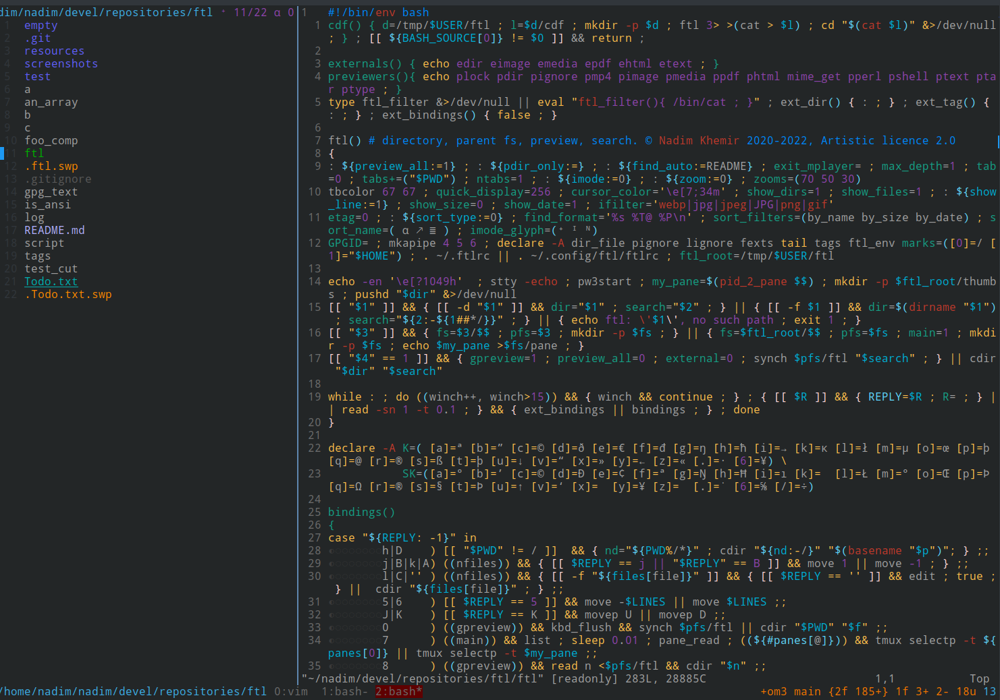

# ftl — terminal file manager, with live previews, hyperorthodox



[](https://opensource.org/licenses/Artistic-2.0)

**ftl** is a terminal file manager built in Bash that leverages [tmux](https://github.com/tmux/tmux) for pane management and live previews. It is *hyperorthodox* — each pane is an independent `ftl` process, panes synchronize selection state, and the preview pane runs real programs (`vim`, `mupdf`, `mplayer`, `w3mimgdisplay`) rather than reimplementations.

## Introduction Video

[](https://www.youtube.com/watch?v=nvSDmhXymVA)

## Key Features

- **Live previews** — 20+ file types supported (images, PDFs, video, audio, markdown, JSON, archives, and more)
- **Hyperorthodox panes** — each pane is a separate `ftl` process with independent tabs, filters, and sort
- **Vim-like bindings** — leader key, count prefix, multi-key sequences, sub-modes
- **fzf integration** — 8+ fzf variants for finding files, including HTTP-polled fzf-as-backend mode
- **ripgrep integration** — search file contents and jump to matches
- **TMSU tagging** — deep integration with the TMSU file-tagging tool
- **Filter pipeline** — 5-layer filter system (external, dir, two file filters, reverse) with composable plugins
- **Selection classes** — 4 selectable tag classes for organizing different selection groups
- **Shell pane** — a real `bash -i` in a sibling tmux pane, synchronized with ftl's directory
- **Virtual entries** — inject fake entries into the listing with custom preview and key handling
- **Plugin system** — 6 plugin categories (filters, etags, generators, viewers, commands, bindings)

## Quick Start

### Prerequisites

- Linux (X11 or XWayland)
- [tmux](https://github.com/tmux/tmux) 3.0+
- Bash 5.0+
- [fzf](https://github.com/junegunn/fzf) 0.30+
- [ripgrep](https://github.com/BurntSushi/ripgrep) (`rg`)
- [fd](https://github.com/sharkdp/fd) (`fd`)
- vim (for text previews)

### Installation

```bash
# Download the installer
wget https://raw.githubusercontent.com/nkh/ftl/reformat/INSTALL

# READ IT and modify for optional packages
# Then source it
source INSTALL
```

The installer installs all dependencies, clones the repo, sets up symlinks, and generates man pages.

### Running

```bash
# Must be inside tmux
ftl                          # open in current directory
ftl /path/to/dir             # open in specific directory
ftl /path/to/file.txt        # open and select a file
ftl -s <(find -name '*.py')  # pre-select files from a list
ftl -t <(find -name '*.py')  # open files in separate tabs
```

### Basic Bindings

| Key | Action |
|-----|--------|
| `h`/`j`/`k`/`l` | Navigate (vim-style) |
| `ENTER` | Enter directory / open file |
| `?` | Show help (man page) |
| `c` | Show all bindings (fzf-searchable) |
| `:` | Command prompt |
| `q` | Quit (tab → pane → ftl) |
| `Q` | Quit all |
| `zv` | Toggle preview pane |
| `ff` | Filter entries |
| `gff` | fzf find in current directory |
| `grr` | ripgrep search |
| `yy` | Select entry (tag down) |
| `pp` | Copy selection here |
| `d` | Delete selection |
| `R` | Rename |

Press `c` inside ftl to see the full, fzf-searchable binding list.

## Configuration

Configuration is in `~/.config/ftl/etc/ftlrc`. Key settings:

```bash
# Editor for text files
ftl_cfg_editor="vim -p"

# Deletion command (consider trash-put or rip for safety)
ftl_cfg_delete_command="rm -rf"

# Image preview
ftl_cfg_image_viewer=sxiv
ftl_cfg_image_clean_borders=1
ftl_cfg_char_width_px=10
ftl_cfg_char_height_px=21

# Show git status as etags
ftl_state_etag_enabled=1
source "$FTL_CFG/etc/etags/git"
```

See the [configuration guide](docs/src/configuration.md) for the full reference.

## Plugin System

ftl has 6 plugin categories. Each is a Bash script that gets sourced at startup:

| Category | Location | Contract |
|----------|----------|----------|
| Filters | `filters/` | Defines `ftl::plugin::<name>::filter` |
| Etags | `etags/` | Defines `ftl::plugin::<name>::scan_directory` and `::get_entry_tag` |
| Generators | `generators/` | Executable; produces preview thumbnails |
| Viewers | `viewers/` | Defines `ftl::plugin::<name>::preview` |
| Commands | `commands/` | Sourced or executable; user commands |
| Bindings | `bindings/` | Calls `ftl::kbd::bind` |

See the [plugin API guide](docs/src/plugins.md) for details.

## Testing

ftl includes a test framework:

```bash
# Run all unit tests
./test/harness.sh

# Run a specific test file
./test/harness.sh test/unit/test_keyboard.sh

# Verbose mode
./test/harness.sh -v
```

## Documentation

- **Man page** — press `?` inside ftl, or read [`man/ftl.md`](man/ftl.md)
- **mdBook docs** — in the [`docs/`](docs/) directory (run `mdbook serve docs/`)
- **Analysis documents** — in the [`documentation/`](documentation/) directory

## Architecture

ftl is written in Bash and organized into 16 core modules under `etc/core/modules/`:

```
util.sh        log.sh        state.sh       keyboard.sh
selection.sh   tab.sh        pane.sh        filter.sh
list.sh        preview.sh    etag.sh        virtual.sh
mark.sh        time.sh       debug.sh       commands.sh
```

Each module uses namespaced functions (`ftl::<module>::<function>`) and variables (`ftl_<module>_<name>`). See the [architecture document](documentation/ftl2-rewrite-report.md) for details.

## License

Artistic License 2.0 or GPL 3.0, at your option.

© Nadim Khemir 2020-2025 · [nadim.khemir@gmail.com](mailto:nadim.khemir@gmail.com) · CPAN/Github ID: NKH

## See Also

[ranger](https://github.com/ranger/ranger) · [vifm](https://vifm.info/) · [lf](https://github.com/gokcehan/lf) · [nnn](https://github.com/jarun/nnn) · [broot](https://github.com/Canop/broot)
