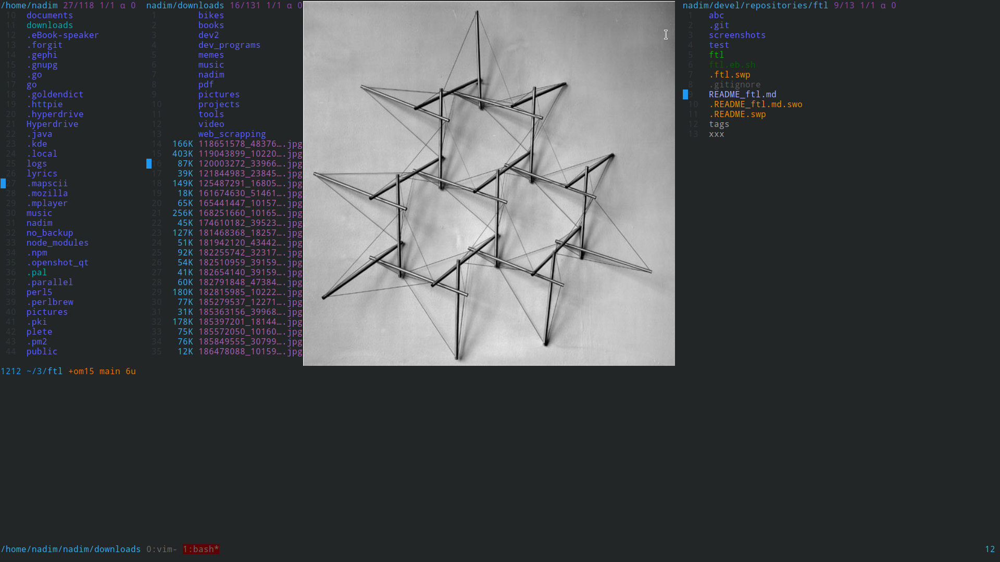
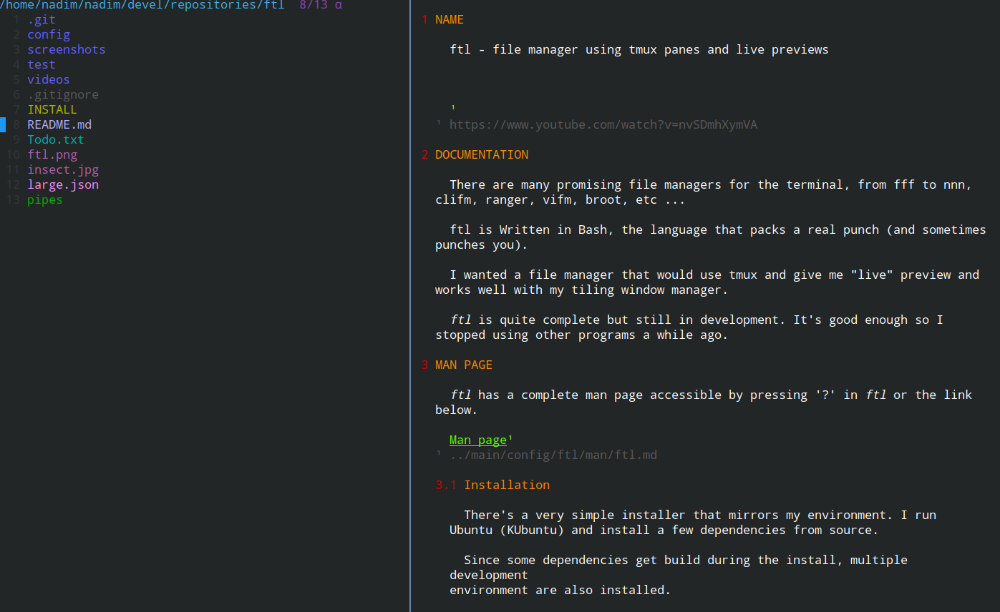

# Introduction




> **ftl** — *terminal file manager, with live previews, hyperorthodox.*

## Overview

**ftl** is a terminal file manager written in **Bash 5+** that uses
**tmux** as its composition substrate. Unlike most terminal file
managers, which implement their own preview pane and pane multiplexer
internally, ftl delegates both responsibilities to tmux. Each pane is a
separate `ftl` process, and the preview pane runs *real programs* —
`vim`, `mupdf`, `mplayer`, `w3mimgdisplay`, `vlc` — rather than
re-implementations of them.

This architecture is described as **hyperorthodox**: panes are
independent processes that share state through the filesystem, adhering
to standard Unix process boundaries. The shell pane is a real `bash -i`
in a sibling tmux pane. The fzf integration is the real fzf running in a
tmux popup. PDF preview is the real `mupdf` running in a real tmux pane.

The design prioritizes integration over reimplementation, which yields a
file manager with broad preview support (images, PDFs, video, audio,
markdown, JSON, YAML, archives, virtual entries) and a low-friction
extension model. Almost all user-facing functionality is implemented as
plugins, and the plugin contract for each subsystem is consistent and
well-documented.

## Introduction Video

[](https://www.youtube.com/watch?v=nvSDmhXymVA)

## Functional Overview

The following sections describe the principal subsystems and their
operational characteristics.

### The Listing

The main view is a single-column listing with an optional preview pane.
Navigation follows vim conventions: `j` / `k` for cursor movement,
`h` / `l` for parent / child directory traversal, `g` / `G` for top /
bottom, `SPACE` or `t` for selection. A leader key (`\` by default), a
count prefix (`3j` moves down 3 entries), and a redo key (`.` repeats
the last command) are provided.

The listing is streamed through a 5-layer filter pipeline. Filtering is
supported by extension, regex, size, tag class, visibility, and
arbitrary external filter plugins. The `fe` binding swaps filter
plugins at runtime.

### The Preview Pane

Cursor movement over a JPEG renders the actual image (not a placeholder
or `file` output) scaled to the pane dimensions. PDFs render the first
page via `mupdf`. MP4 files render the first frame via `ffmpeg`.
Markdown files are rendered through the configured markdown pager.
Archive files list their contents via `tar` / `unzip` / `unrar`.

This is accomplished without a custom rendering pipeline: ftl delegates
to `w3mimgdisplay`, `mupdf`, `ffmpeg`, `glow`, `tar`, and similar tools
running in real tmux panes. Any tool capable of previewing a file type
can be integrated.

### The Shell Pane

The `;` binding opens a real `bash -i` in a sibling tmux pane,
synchronized with ftl's current directory. The shell has full readline,
history, job control, and access to ftl's environment variables.
Closing the pane returns focus to ftl with the listing refreshed.

### Selection and Tags

Entries are tagged with `SPACE` (default class `▪`) or with a class
glyph (`¹`, `²`, `³`, `D`). Classes enable independent operations on
disjoint groups (copy class 1, delete class 2, etc.). Selection
persists across directory changes and synchronizes between panes via a
shared state directory and a revision counter.

### Search and Filter

- `/` — incremental search; cursor jumps to the first matching entry as
  characters are typed
- `\f` — fzf-based file search across the directory tree
- `\g` — ripgrep-based content search with in-place match navigation
- `fe` — swap filter plugins (extension, regex, size, tag, visibility,
  custom external)

### Marks and History

Single-character session marks are set with `'` followed by a
character. The global history (across sessions) is available via
`LEADER H` as an fzf list.

### Tabs and Panes

New tabs: `§`. Tab switching: `TAB` or `gt`. Pane splits:
`LEADER |` (vertical) and `LEADER -` (horizontal). Each pane is a fully
independent `ftl` process with its own tabs, filters, sort, and
selection state. Selection and marks synchronize through a shared state
directory.

### Inline Rename Mode

`LEADER r i` enters a modal rename workflow. Features include single
filename editing with a live cursor, `TAB` to commit and advance to the
next entry, `r` for sequential numbered rename, `R` for regexp-based
rename, and `l` for EXIF/IPTC label editing without filename
modification. Refer to [Inline Rename Mode](./user-guide/inline-rename.md)
for the complete specification.

## Architecture

ftl follows the Unix principle of reusing existing tools rather than
reimplementing them. It functions as a directory changer, a file picker
for scripts, and a `vim` file picker (via `ftll`/`cdf`). The codebase
is implemented in Bash 5+ (non-portable to other shells by design) and
is structured for extensibility.

The core is organized into **17 modules** under `etc/core/modules/`
with strict namespacing:

- Functions: `ftl::<module>::<function>` (e.g. `ftl::kbd::bind`)
- Module variables: `ftl_<module>_<name>` (e.g. `ftl_kbd_trie`)
- Config variables: `ftl_cfg_*`
- State variables: `ftl_state_*`

The `reformat` branch introduced this structure: the previous monolithic
core was split into 17 modules, all variables and functions were
renamed into the namespaced scheme, a 925-test suite was added, and the
documentation was expanded from a single man page into a full mdBook.

## Feature Summary

- **Live previews** — 20+ file types: images, PDFs, video, audio, markdown, JSON, archives, and more
- **Hyperorthodox panes** — each pane is a separate `ftl` process with independent tabs, filters, and sort
- **Vim-like bindings** — leader key, count prefix, multi-key sequences, sub-modes, redo key
- **fzf integration** — 8+ fzf variants for file discovery, plus an HTTP-polled fzf-as-backend mode
- **ripgrep integration** — content search with in-place match navigation
- **TMSU tagging** — integration with the TMSU file-tagging tool
- **Filter pipeline** — 5-layer filter system (external, dir, two file filters, reverse) with composable plugins
- **Selection classes** — 4 selectable tag classes (`¹²³D`) for disjoint selection groups
- **Shell pane** — a real `bash -i` in a sibling tmux pane, synchronized with ftl's directory
- **Virtual entries** — injection of synthetic entries with custom previews and key handling
- **Plugin system** — 6 categories: filters, etags, generators, viewers, commands, bindings
- **Inline rename mode** — modal single/sequential/regexp/image-label rename
- **42+ extended features** — duplicate, hardlink, checksums, chmod-numeric, git blame/log/diff, zip/7z, scp, wget, workspace save/load, command palette (see [Missing Functionalities](./missing-functionalities.md))

## Comparison to Other Terminal File Managers

Engineers evaluating ftl against `ranger`, `vifm`, `lf`, `nnn`,
`broot`, or `yazi` should note the following architectural differences:

- **Panes are processes, not views.** Splitting a pane spawns a new
  `ftl` process. The two processes communicate via filesystem state,
  not shared memory. A crash in one pane does not affect the other, and
  a misbehaving pane can be terminated with `kill -9` without losing
  the session.
- **Previews are real programs.** Ranger implements its own preview
  pipeline. ftl runs `mupdf` / `mplayer` / `w3mimgdisplay` / etc. in a
  real tmux pane. A hung preview process can be interrupted directly
  with `C-c`.
- **The shell pane is a real shell.** It is not an emulator; it is
  `bash -i` (or the configured shell) with full readline, history, job
  control, and access to ftl's environment.
- **The implementation language is Bash.** No Python, Lua, Rust, or Go.
  The extension surface is a Bash function with a known name and a
  known set of globals. This lowers the barrier to contribution for
  users already proficient in shell scripting.

## Extensibility

ftl is designed to be extended. The following example registers a key
binding that compresses the current selection into a tar.bz2 archive:

1. Create `~/.config/ftl/etc/bindings/my_compress`:

   ```bash
   my_compress() {
       local out="$PWD/selection-$(date +%s).tar.bz2"
       tar cjf "$out" "${ftl_selection_current[@]}"
       ftl::list::refresh_dir
   }
   ftl::kbd::bind	ftl	entry	"LEADER f z"	my_compress	"compress selection into tar.bz2"
   ```

2. Restart ftl, or execute `:source ~/.config/ftl/etc/bindings/my_compress` from the command prompt to load the binding without restarting.

3. Press `\fz` to invoke.

No build step, compilation, manifest file, or package manager is
required. Binding plugins are Bash scripts that call `ftl::kbd::bind`;
ftl auto-discovers and sources every file in `etc/bindings/` at
startup. The same pattern applies to all extension types:

| Objective | Location | Implementation |
|-----------|----------|----------------|
| Bind a key | `etc/bindings/<name>` | Bash function + `ftl::kbd::bind` call |
| Add a `:` command | `etc/commands/<name>` | Bash script (sourced or executable) |
| Filter the listing | `filters/<name>` | Override `ftl::filter::apply_external` |
| Tag entries with metadata | `etags/<name>` | Define `etag_dir()` and `etag_tag()` |
| Generate a thumbnail | `generators/<name>` | Executable producing a thumbnail |
| Preview a file type | `viewers/<name>` | Define a viewer function (e.g. `pmytype`) |

For a detailed walkthrough of each extension type — including examples,
rationale, and implementation considerations — refer to
[Extending ftl](./extending-ftl.md). For a catalog of every binding,
command, etag, filter, viewer, and generator shipped with ftl, refer to
[Extra Features](./extra-features.md).

## Documentation Index

- **[Installation](./getting-started/installation.md)** — system setup and dependencies
- **[First Steps](./getting-started/first-steps.md)** — a guided tour of essential keys
- **[Basic Bindings](./getting-started/bindings.md)** — the 20 most frequently used keys
- **[User Guide](./user-guide/navigation.md)** — subsystem deep dives (navigation, selection, filtering, searching, preview, tabs, panes, shell, marks, file operations)
- **[Inline Rename Mode](./user-guide/inline-rename.md)** — modal rename workflow specification
- **[Configuration](./configuration.md)** — all `ftl_cfg_*` variables
- **[Key Bindings](./key-bindings.md)** — complete binding table
- **[Missing Functionalities](./missing-functionalities.md)** — 42 extended features (duplicate, hardlink, checksums, git blame, zip/7z, scp, wget, workspace save/load, command palette)
- **[Extra Features](./extra-features.md)** — catalog of shipped bindings, commands, etags, filters, viewers, and generators
- **[Extending ftl](./extending-ftl.md)** — authoring bindings, commands, filters, etags, viewers, and generators
- **[Plugin API](./plugins.md)** — the 6 plugin categories
