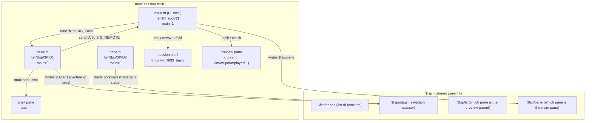
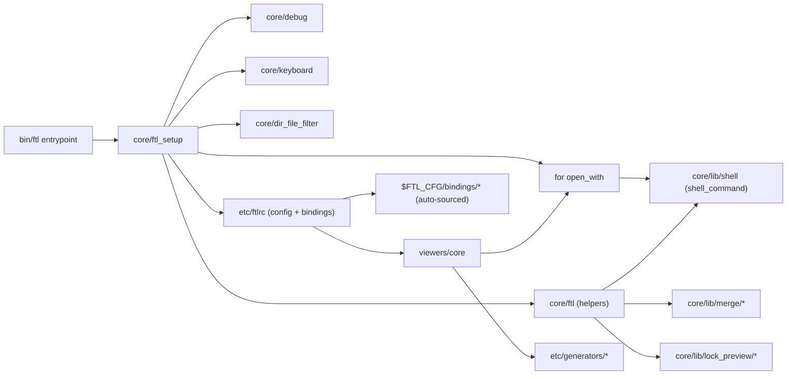
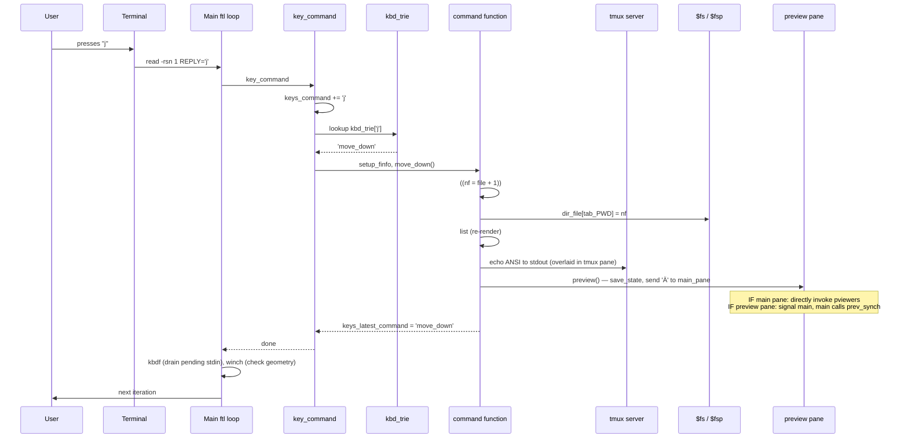
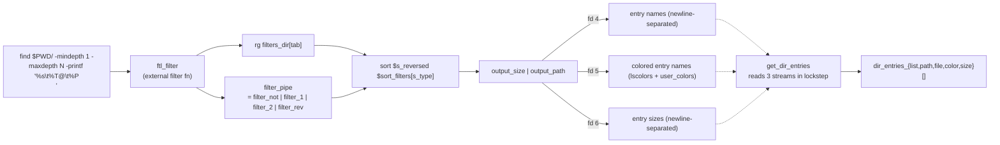

# `nkh/ftl` — A Deep Functional, Code, and Architecture Analysis

> **Subject:** `ftl` — *terminal file manager, with live previews, hyperorthodox*
> **Author:** Nadim Khemir (CPAN/Github ID: NKH) © 2020–2025
> **License:** Artistic License 2.0 *or* GPL 3.0 (dual, at user's option)
> **Implementation language:** Bash (Bash 5+; intentionally non-portable to other shells)
> **Upstream:** <https://github.com/nkh/ftl>
> **Analysis basis:** clone of `main` branch, full source read (≈770 LoC of core Bash + ≈60 plugin scripts + man page ≈1550 lines + Perl helpers)

---

## Table of Contents

1. [Executive Summary](#1-executive-summary)
2. [Project Identity & Positioning](#2-project-identity--positioning)
3. [Functional Analysis](#3-functional-analysis)
4. [Repository Layout & File Map](#4-repository-layout--file-map)
5. [Architecture](#5-architecture)
6. [The Core Engine — Code Walkthrough](#6-the-core-engine--code-walkthrough)
7. [The Plugin Subsystems](#7-the-plugin-subsystems)
8. [Cross-Cutting Concerns](#8-cross-cutting-concerns)
9. [Code Quality, Idioms, and Complexity](#9-code-quality-idioms-and-complexity)
10. [Strengths, Weaknesses, and Risks](#10-strengths-weaknesses-and-risks)
11. [Comparison with Peers](#11-comparison-with-peers)
12. [Recommendations for Contributors & Evaluators](#12-recommendations-for-contributors--evaluators)
13. [Appendix A: Glossary](#appendix-a-glossary)

---

## 1. Executive Summary

`ftl` is a **single-developer, opinionated, terminal-based file manager** that treats `tmux` not as an integration target but as its *primary composition substrate*. Where `ranger`/`vifm`/`lf` reimplement pane management, previews, and even mouse handling inside their own process, `ftl` *delegates* almost everything: previews are real tmux panes running real programs (`vim -R`, `mupdf`, `mplayer`, `w3mimgdisplay`, `moar`, `fzf`); the "shell pane" is literally `bash -i` in a sibling tmux pane; the fzf integration is the *real* fzf running in a tmux popup. This is the "Unix spirit" the README claims — and unlike many projects that claim it, `ftl` actually delivers.

The price for that purity is extreme: **the entire core engine is roughly 700 lines of Bash** (`ftl`, `commands`, `keyboard`, `ftl_setup`, `dir_file_filter`, `lib/shell`, `debug`), and most of those lines are *one-liners that do an enormous amount of work* — spawning background processes, manipulating tmux panes via string interpolation, juggling associative arrays, and serializing state to a temp directory so sibling panes can read it. There is no test suite, no CI.

Three architectural decisions dominate the codebase and shape every strength and weakness:

1. **Every pane is a fully independent `ftl` process**, not a thread or a coroutine inside one process. Panes communicate by writing serialized Bash state (`declare -p tags`, hand-written `var=...` files) into a shared `$fsp` temp directory and sending each other single-character tmux "signals" (`å`, `Ä`).
2. **Keyboard handling is a hand-rolled trie built on top of `read -rsn 1`**, with a custom escape-sequence normalizer that maps the mess of `ESC[A` / `ESC OA` / `ESC[A ESC[` all to a single `UP` token. There is a vim-style leader key, a count prefix, and a redo key.
3. **Everything user-facing is a plugin** — filters, etags, viewers, generators, bindings, and commands all live as standalone scripts that get `source`d at runtime. The plugin contract for each subsystem is informal (a function name to define, a global variable to set) but consistent.

The result is a file manager that is *simultaneously* one of the most powerful TUI file managers in existence (its preview system alone supports images, PDFs, comics, videos, music, STL, markdown, JSON, YAML, archives, virtual entries, and more) **and** one of the most fragile (a single typo in a plugin script can corrupt global state, the install procedure pulls in 40+ dependencies, and the code is essentially unreadable without already understanding it).

**Verdict for evaluators:** a *power user's tool* — comparable to `stumpwm` or `dwm` in spirit. Excellent if your workflow matches the author's; risky to deploy in shared/multi-user environments; **not** a drop-in replacement for `ranger` in a team setting.

**Verdict for contributors:** welcoming if you can write a 20-line Bash one-liner and want to add a single feature; hostile if you want to refactor the core. The author explicitly states "Most of the code is one-liners, albeit long, and it's structured to be 'easy' to expand" — that is the design ethic.

---

## 2. Project Identity & Positioning

### 2.1 What `ftl` *is*

A **terminal file manager with live previews**, structured as an *orthodox* file manager (pane-based, with separate "list" and "preview" regions) but extended to "hyperorthodox" — meaning panes can be split arbitrarily, each pane is a fully independent `ftl` process, and panes synchronize selection/tags via a shared temp directory.

The README frames it as:

> I wanted a file manager that would use tmux and give me "live" preview and works well with my tiling window manager.

That sentence is the entire design brief. Everything else follows.

### 2.2 What `ftl` is *not*

- **Not a cross-platform tool.** Linux-only. Wmctrl, xdotool, fuse-archive, w3m-img, inotifywait, xclip/xsel — all hard Linux/X11 dependencies.
- **Not a portable shell script.** "Written in Bash, the language that packs a real punch (and sometimes punches you)" — the author explicitly says it will not work in other shells. Bash 5+ is required (uses `${var@Q}`, `${var##*/}`, `declare -n`, `declare -A`, `mapfile`, `printf -v`).
- **Not lightweight.** The `INSTALL` script `apt install`s ~40 packages, `pip3 install`s 3 more, `cargo install`s Rust tools, `cpanm`s Perl modules, and recommends Homebrew on Linux. Disk footprint after a full install is multiple gigabytes.
- **Not a library.** No public API surface, no `libftl`. Everything is consumed via Bash `source` and tmux IPC.

### 2.3 Target user

The author, and people like the author: Vim users on Linux tiling window managers who already have `tmux`, `fzf`, `rg`, `fd`, `vim`, `mupdf`, `mplayer`/`vlc` installed, and who want a file manager that treats those tools as first-class rather than as plugins bolted onto a self-contained binary.

### 2.4 Maturity

Single-maintainer project, © 2020–2025, "quite complete but still in development" per README. The author uses it daily and has stopped using other file managers. Active commit history (the `Todo.txt` shows live design thinking about pane splitting, async lists, multi-column attributes). No release tags visible in the shallow clone; no CHANGELOG; no semver.

---

## 3. Functional Analysis

### 3.1 Feature inventory

The man page (`config/ftl/man/ftl.md`, ~1550 lines) is the source of truth. Features fall into eleven categories.

#### 3.1.1 Core listing & navigation

- Single-pane listing with optional preview pane
- Vim-like movement: `h`/`j`/`k`/`l`/arrow keys, `gg`/`G`, `pgup`/`pgdn`, `:N` to jump to entry index, `COUNT %` to jump by percentage
- Per-directory cursor memory (`dir_file[${tab}_$PWD]`)
- Auto-select README on first visit to a directory (`find_auto=README`)
- Multiple listing modes: directories+files, dirs only, files only (`lmode[tab]`)
- Multiple image modes: all / images only / non-images only (`vmode[tab]`)
- Dot-file toggle (`z.`), size display toggle (`zs` cycles: none → file sizes → file+dir-entries → file+recursive-dir-sizes), stat in header (`zg`), date in header
- Quick display mode for huge directories: while scanning, every `quick_display=512` entries a counter is flashed in red on the header

#### 3.1.2 Tabs and panes

- Tabs are per-pane, with per-tab filters, sort order, hidden-file state, and view modes
- Panes are *independent ftl processes* in tmux splits — `CTL-W h`/`j`/`k`/`l` to create new panes in the four cardinal directions
- Each pane has its own tabs and its own state; only *selection* (tags) and *preview-synchronization* cross pane boundaries, and only when `auto_selection=1`
- Pane navigation with `gp`; `CTL-W L`/`H` create panes "on the other side" while keeping focus

#### 3.1.3 Preview system

This is `ftl`'s flagship feature. Every preview is a *running program in a tmux pane*, not a screenshot. The dispatch table is in `viewers/core` (see §7.4):

| Entry type       | Internal preview (`pviewers`)                                      | External viewer (`ext_viewers`, modes 1/2/3)        |
|------------------|--------------------------------------------------------------------|-----------------------------------------------------|
| Directory        | 6 modes: ftl, du, ls, README, exa, image-montage                   | (none — uses `ext_dir`)                             |
| Image            | `w3mimgdisplay` via `ftli` (with zoom, bg-erase)                   | `sxiv` (current dir's images) / GUI viewer          |
| Video            | Single-frame thumbnail via `ffmpegthumbnailer` (or per-format gen) | `mplayer -vo null` background / `vlc -f`            |
| Music (mp3)      | `mplayer` live preview                                             | `cmus` queue / terminal player                      |
| PDF              | `mutool draw` to text, or to PNG                                   | `mupdf`                                             |
| EPub             | text extract                                                       | `okular`                                            |
| CBR/CBZ          | `unrar`/`unzip` single page → PNG                                  | `zathura`/`mcomix`                                  |
| Markdown         | 4 modes: plain text, `vmd`, `mo`+vimb, AnsiEsc                     | (uses pmd)                                          |
| HTML             | text dump via generator                                            | `qutebrowser` or `w3m` in pane                      |
| SVG              | `rsvg-convert` to PNG                                              | `mupdf` (after svg→pdf)                             |
| GIF              | first-frame PNG                                                    | configurable `GIF_VIEWER` (e.g. pixelhopper)        |
| JSON             | `jless` (or `jq`-based pager)                                      | `jless`                                             |
| YAML             | `yam -i`                                                           |                                                     |
| STL (3D)         | `openscad` to PNG                                                  |                                                     |
| Plain text       | `vim -R` in pane                                                   | `vim -R` in split                                   |
| Binary/unknown   | `file -b` + mime info display                                      | `mimeopen` or `open_with` fzf dialog                |
| Archive          | `tar`/`unzip`/`unrar` listing                                      | fuse-archives via `mount_archive`                   |
| ANSI text        | plain / `vim -c AnsiEsc` / `ansi_show` piped to pager              |                                                     |
| Named pipe       | "fifo (named pipe)" + read                                         |                                                     |

All of this is implemented as a 170-line Bash file that mostly *calls other programs*. The dispatch logic itself is a chain of `[[ ... ]] && { func ; return ; }` checks. There is no plugin registry — adding a new previewer means editing this file (or overriding `user_pviewers`/`user_eviewers` in your `ftlrc`).

#### 3.1.4 Filtering

Five layers of filtering, applied in a fixed pipeline:

1. **External filter** (`ftl_filter` function, sourced from `$FTL_CFG/filters/$filter_ext` when one is active). This is a true plugin API — see §7.1.
2. **Directory filter** (`filters_dir[tab]`, applied to directory entries only)
3. **Filter #1** (`filters[tab]`) — passed as a regex to `rg`
4. **Filter #2** (`filters2[tab]`) — second regex to `rg`
5. **Reverse filter** (`rfilters[tab]`) — `rg -v`, applied last
6. Optional image-mode filter (`tfilters[tab]`) injected/removed when image mode is toggled

All of these are *per-tab*, so two tabs in the same pane can show different filtered views of the same directory. Filters are typed at a `prompt`, support history, and the default value `.` means "match everything".

#### 3.1.5 Searching

- **Incremental search** (`/`): characters stream into `to_search`, find-next runs on every keystroke, BACKSPACE deletes one char, ESCAPE exits, LEFT/RIGHT work mid-search
- **Find next/prev** (`n`/`N`)
- **fzf integration**: 8 variants — current dir only, with subdirs, dirs only, images via `sxiv`, images via `fzfi`+ueberzug, regexp/fuzzy via `frf`, all of the above with ctrl-t to open results in tabs
- **ripgrep integration**: 4 variants — `grr` opens a file in `$EDITOR`, `grt` jumps to file, `grl` opens all matched files in vim, `grf` jumps to single match
- **fzf pane preview** (`gfp`): fzf runs in the listing pane while the *real ftl preview pane* mirrors the highlighted entry. This is implemented with a separate fifo and a `previewd` background subshell that re-sources `viewers/core` and dispatches through the normal `pfzf` function.
- **fzf-as-frontend** (`V` binding in `fzf_search`): runs `fzf --listen` in a tmux popup, queries its state via `xh` (HTTP), and renders results in the ftl listing using `get_custom_entries`. This is a remarkable piece of work — using fzf as a backend service that ftl polls.

#### 3.1.6 Selection (tags)

- Single-entry tag/untag with `a` (down) / `s` (up) / `yy` / `yu`
- Class-tagging with 4 selectable classes (`y1`/`y2`/`y3`/`y4`), each rendered with a distinct glyph (`tglyph=('' ¹ ² ³ D)`)
- Bulk: select all files / all dirs / all entries / all of current extension (recursive or not)
- fzf-based multi-select with `--marker '▪'`
- Bash-based selection (`yx`): opens a shell, you write paths to a temp file, ftl reads them back
- "Ultimate Plumber" integration (`yX`): pipes `fd` through `up` TUI to build a selection pipeline
- Selection is synchronized between panes (when `auto_selection=1`) via `$pfs/stagsi` counter and `$ofs/tags` serialized state
- Selection count and total size shown in header
- Clipboard copy of selected paths (`ytc`)

#### 3.1.7 Etags (extra tags)

Optional per-entry metadata prepended to the listing line. Built-in etags:

| etag script   | what it shows                                              |
| ------------- | ---------------------------------------------------------- |
| `none`        | nothing                                                    |
| `date`        | entry modification date `MM/DD/YYYY-HH:MM`                 |
| `lines`       | line count for text files (`wc -l` via `xargs`)            |
| `image_size`  | `WIDTHxHEIGHT` for images (via `file` + perl parse)        |
| `git`         | git status short codes, parsed from `git status -s`        |
| `tmsu`        | `ᵀ` glyph for files with no TMSU tag                       |
| `virtual`     | `ᵛ` glyph for virtual entries                              |

Etags are designed as a plugin contract: each etag script defines two functions, `etag_dir()` (called once per directory scan to pre-compute a global map) and `etag_tag(name, result_var, length_var)` (called per entry). The plugin model is documented in §3.4 of the man page.

#### 3.1.8 TMSU integration (tags proper)

TMSU is a separate FUSE-based file tagging tool. `ftl` integrates with it deeply:

- Tag display in preview pane as a table (`tmsu_preview`)
- Tag editing via vim (`tmsu_tag`), fzf (`tmsu_tag_fzf`), or sc-im spreadsheet (`tmsu_tag_scim`)
- Mount TMSU's virtual filesystem (`tmsu_mount`)
- Filter listing by TMSU tags or queries (`tmsu_filter`, `tmsu_filter_query`)
- Goto tagged file via fzf (`tmsu_goto`)

#### 3.1.9 Bookmarks & history

- **Marks**: single-character local bookmarks (`m<char>` to set, `'<char>` to jump, `*<char>` to jump in new tab). Default marks: `0`→`/`, `1`→`$HOME`, `'`→last visited
- **Persistent marks**: saved to `$ftl_root/marks`, `MM` adds, `gM` jumps via fzf, `Mc` clears
- **Session history**: every directory change appends to `$fs/history`, fzf-navigable with `Hh`
- **Global history**: across all sessions, `$ftl_root/history`, navigable with `HH`, subdir-filtered with `Hs`, editable with `He`

#### 3.1.10 File operations

- Copy / move (single or selection), with optional destination prompts
- Copy/move to other tab (`pop`/`pom`) — the "orthodox two-pane" pattern reimagined as two tabs
- `fzf_mv` integration for fuzzy destination selection
- Delete via configurable `$RM` (default `rm -rf`, easily changed to `trash-put` or `rip`)
- Rename via `edir` (interactive bulk renamer)
- Bulk create via `$EDITOR` (lines ending in `/` become directories)
- Chmod via `scim` (spreadsheet-style) or `whiptail` (per-entry dialog) or simple bit flips (`xmr`/`xmw`/`xmx`)
- Symlink (`xl`), follow symlink (`gL`)
- Hex view (`xh`) / hex edit (`xH`)
- GPG encrypt/decrypt (`\fe`), password encrypt (`\fE`)
- Compress / decompress (tar.bz2, rar, zip, tar.gz, tar.xz, tar.bz2)
- Image optimization (`jpegoptim` for jpg, `convert` to jpg for png)
- PDF optimization (`ghostscript` with `/screen` preset)
- Video re-encode (`ffmpeg` libx265 crf 24, run in tmux session)
- Shred (overrides `$RM`)
- Mail files via `mutt`
- Diff two selected files (`vimdiff`) or directories (`tdiff`)
- Open URL in `qutebrowser`

#### 3.1.11 Shell integration

This is the other flagship feature. `ftl` can:

- Spawn a shell pane (`Ss`/`Sv` for horizontal/vertical) — a real `bash -i` in a tmux split
- Send selection to the shell pane (`Sf`)
- Synch shell's `cwd` to ftl's (`Sg`)
- Run a command in the shell pane (`Sp`) — closes on success, drops to bash on failure
- Use a separate tmux session `ftl$$:ftl$$_bash` as the "session shell" for command-prompt commands — this is what `:` (command mode) and `fsh` use
- Run shell commands *with ftl context*: `finfo` dumps `FTL_PID`, `FTL_FS`, `FTL_PWD`, `selection`, `n` to a temp file, so external commands can do `finfo | xargs -0 ls -l`
- Be used as a directory changer (`cdf` sourced in `.bashrc`) — quit drops you into the current directory
- Be used as a file picker (`ftll` — opens ftl in a tmux window, selection returned on fd 3 via `cdfl()`)
- Be used as a vim file picker (`ftlvim` — vim blocks on `tmux wait`, ftl writes selection to a temp file)

### 3.2 Non-functional characteristics

| dimension              | observation                                                                                         |
| ---------------------- | --------------------------------------------------------------------------------------------------- |
| Startup latency        | A few hundred ms (sources ~10 files, runs `pid_2_pane` which iterates tmux panes)                   |
| Listing throughput     | Filtered through `find` → `rg` → `sort` pipeline; ok for thousands of entries; async gen helps      |
| Memory                 | One bash process per pane (~10–20 MB each); generators run as separate processes                    |
| Disk                   | Thumbnail cache at `$ftl_root/thumbs/` grows unbounded (md5-hashed filenames)                       |
| Stability              | Mostly stable for daily use; rare races in pane synchronization (see `Todo.txt` re: inotify)        |
| Latency on actions     | All tmux sends/respawns have a 0.01–0.2 s sleep to allow tmux to settle — adds up                   |
| Image preview          | Real-time-ish; w3mimgdisplay redraw requires `FTL_RESTART_W3M` kill+respawn on image change         |

### 3.3 Configuration surface

The default `ftlrc` is 419 lines and exposes ~80 user-tunable variables plus ~5 hook functions. Notable:

- All preview/viewer commands (`EDITOR`, `G_PLAYER`, `T_PLAYER`, `JSON_VIEWER`, `MD_PAGER`, `SXIV`, `HEXVIEW`, `MIMETYPE`, `NCDU`, ...)
- All filter regexes (`ifilter`, `mfilter`, `rfilter0`)
- All glyph tables (`sglyph`, `iglyph`, `lglyph`, `tglyph`)
- Tmux pane colors, image preview geometry hints (`FTLI_W`, `FTLI_H`, `FTLI_Z`, `FTLI_CLEAN`)
- Hook arrays: `time_event_handlers`, `cmd_aliases`, `dir_dest`, `marks`, `user_colors`
- Hook functions: `user_pviewers`, `user_eviewers`, `gmark_fzf_user`, `ftl_event_quit`

### 3.4 Extension points

| extension   | location                            | contract                                                                                    |
| ----------- | ----------------------------------- | ------------------------------------------------------------------------------------------- |
| filter      | `$FTL_CFG/filters/<name>`           | defines `ftl_filter()`; called with stdin entries, must echo kept entries to stdout         |
| etag        | `$FTL_CFG/etags/<name>`             | defines `etag_dir()` and `etag_tag(name, result_var, length_var)`                           |
| viewer      | `$FTL_CFG/viewers/<name>`           | sourced; can override `user_pviewers`/`user_eviewers` or define new `p*`/`ext_*` funcs      |
| generator   | `$FTL_CFG/etc/generators/<ext>`     | executable; args: `source_file thumb_dir [extmode] [FORCE]`; echoes path to generated file  |
| command     | `$FTL_CFG/commands/<name>`          | either sourced (can mutate ftl state) or executable (any language)                          |
| binding     | `$FTL_CFG/bindings/<name>`          | sourced at startup; calls `bind map section keys command help`                              |

The extension model is "Bash scripts that get sourced and re-define global functions". There is no sandboxing, no API versioning, no error isolation — but the simplicity is also the strength: any Bash programmer can write a filter in 20 lines.

---

## 4. Repository Layout & File Map

```mermaid
graph TD
    Repo["nkh/ftl repo"]
    Repo --> README["README.md (short)"]
    Repo --> INSTALL["INSTALL (bash, ~155 lines)"]
    Repo --> Todo["Todo.txt (design notes)"]
    Repo --> Screenshots["screenshots/"]
    Repo --> Config["config/ftl/  (the actual product)"]

    Config --> Ftlrc["etc/ftlrc  (419 lines — config + bindings)"]
    Config --> Bin["etc/bin/  (CLI helpers + ftl launcher)"]
    Config --> Core["etc/core/  (~700 LoC — the engine)"]
    Config --> Plugins["etc/{filters,etags,generators,viewers,commands,bindings}/"]
    Config --> Man["man/ftl.md + gen_man_pages"]

    Core --> CoreFtl["ftl  (192 LoC, top-level)"]
    Core --> CoreSetup["ftl_setup  (17 LoC, init)"]
    Core --> CoreKbd["keyboard  (185 LoC, key parsing + bind)"]
    Core --> CoreCmd["commands  (235 LoC, all built-in commands)"]
    Core --> CoreDff["dir_file_filter  (52 LoC, find pipeline)"]
    Core --> CoreDebug["debug  (22 LoC, stacktrace + log)"]
    Core --> CoreLib["lib/  (shell, merge/, lock_preview/)"]

    Bin --> BinFtl["ftl  (entrypoint — 207 LoC)"]
    Bin --> BinFtli["ftli  (image preview daemon via w3mimgdisplay)"]
    Bin --> BinFinfo["finfo  (state dumper for external commands)"]
    Bin --> BinFsh["fsh  (run command in shell pane)"]
    Bin --> BinFrf["frf  (rg+fzf integration)"]
    Bin --> BinFzfr["fzfr  (ripgrep+fzf)"]
    Bin --> BinPiper["piper  (perl — ANSI colorizer)"]
    Bin --> BinParse["parse_parts  (perl — shell word splitter)"]
    Bin --> BinThirdParty["third_party/  (vimkat, tdiff, git-tree-status, ...)"]
```



### 4.1 File-by-file role of the core

| file                                      | LoC      | role                                                                                                           |
| ------------------------------            | -----    | -------------------------------------------------------------------------------------                          |
| `etc/bin/ftl`                             | 207      | Entrypoint. Parses args, sets up fs, runs main loop, defines `cdir`/`cview`/`get_dir_entries` ...              |
| `etc/core/ftl_setup`                      | 17       | Sources everything else, declares the global associative arrays, sets up tabs and fifos.                       |
| `etc/core/ftl`                            | 192      | The "library of one-liners": ~100 helper functions covering tmux pane mgmt, tag mgmt, history, inotify, etc... |
| `etc/core/keyboard`                       | 185      | `bind()`/`unbind()` registration, key normalization (`get_key`), key trie dispatch (`key_command`).            |
| `etc/core/commands`                       | 235      | All built-in command functions — `move_*`, `goto_*`, `find_*`, `select_*`, `tag_*`, `tab_*`, `pane_*`, etc...  |
| `etc/core/dir_file_filter`                | 52       | The filter pipeline: `as_dir`, `dir`, `files`, `output_size`, `output_path`, plus filter manipulation API.     |
| `etc/core/debug`                          | 22       | `stacktrace`, `log`, `numfmt` wrapper that catches errors.                                                     |
| `etc/core/lib/shell`                      | 67       | `shell_command` (the command-prompt dispatcher), `load_sel`, `shell_cmd_in_pane`.                              |
| `etc/core/lib/merge/{all,pick,synch}`     | ~15 each | Selection-merge strategies between panes (all/synch/pick).                                                     |
| `etc/core/lib/lock_preview/stat_and_text` | 4        | "Lock" a preview so it doesn't update — writes a fixed text file.                                              |

### 4.2 Plugin counts

| subsystem     | count   | example files                                                                       |
| ------------- | ------- | --------------------------------------------------------------------------------    |
| filters       | 18      | `by_extension`, `by_size`, `by_regexp`, `by_tag`, `by_bash_keep`, `no_filter`       |
| etags         | 7       | `none`, `date`, `lines`, `image_size`, `git`, `tmsu`, `virtual`                     |
| generators    | 18      | `pdf`, `svg`, `gif`, `mp4`, `stl`, `cbz`, `montage`, `generator_one`                |
| viewers       | 5       | `core`, `cmus`, `mplayer_local`, `mplayer_background`, `vlc`                        |
| commands      | 9       | `tree`, `url`, `fma`, `fmr`, `open_with`, `etags`, `show_cmd_log`, `0X_example`     |
| bindings      | 11      | `leader`, `leader_ftl`, `leader_git`, `tmsu`, `virtual_entries`, `via_bash`, etc... |

The `etc/` versions are the defaults; the user's `$FTL_CFG/` (also `$HOME/.config/ftl/`) is supposed to contain symlinks to these plus any overrides. The install procedure (`INSTALL` file) explicitly creates those symlinks so users can drop their own files alongside.

---

## 5. Architecture

### 5.1 Process model

`ftl` is a *multi-process* application by design. The "main" ftl is one bash process; every additional pane is a *separate* bash process running the same script. They share state through the filesystem.



The shared `$fsp` directory is the integration backbone. Each pane writes its serialized state there; the parent (or other panes) polls it. The two "signals" `å` (SIG_PANE — focus moved to next pane) and `Ä` (SIG_REMOTE — preview pane wants to synch) are tmux `send-keys` of single characters, which arrive in the main key loop and are dispatched by `key_command` to `SIG_PANE()`/`SIG_REMOTE()` rather than to a user binding. This is a remarkably clever (and remarkably fragile) IPC mechanism.

### 5.2 Module dependency graph



The dependency graph is intentionally flat — almost everything is sourced at startup, so by the time the main loop runs every function is in scope. The cost is that startup is a multi-megabyte shell script in memory, and any function name collision between plugins silently overrides earlier definitions. There is no namespace mechanism.

### 5.3 The data flow of one keystroke



Two things to notice:

1. **`list` is the rendering primitive**. It writes raw ANSI escape codes directly to stdout, which tmux renders in the pane. There is no screen buffer abstraction — `list` re-renders the entire visible window every time, using `\e[H` (cursor home) and `\e[K` (clear line) heavily. Performance is fine because the visible window is at most `LINES` entries.
2. **Preview dispatch differs based on whether this is the main pane or a child pane**. The main pane spawns the preview program directly (`pviewers`). A child pane serializes its state to `$fsp/fs` and sends `Ä` to the main pane, which calls `prev_synch` to source the child's state and then dispatch the preview. This is because the preview pane is shared — only one program can be running there at a time.

### 5.4 The four-fifo data pipeline

`get_dir_entries` (in `etc/bin/ftl`) and `dir` (in `dir_file_filter`) together implement a streaming pipeline using four named pipes opened at startup via `mkapipe 4 5 6`:



This is one of the more sophisticated parts of `ftl`. The `tee >(cut -f 1 >&6) | cut -f 3-` trick in `output_size` and `tee >(cat >&4) | vfiles_clr | user_color | lscolors >&5` in `output_path` simultaneously emits the entry name, the colorized entry name, and the size to three different file descriptors. The consumer in `get_dir_entries` reads them back in lockstep with `read -s -u 4`, `read -s -u 5`, `read -s -u 6`.

This is necessary because:

- The size and the colored name both need to be carried alongside the name, but they're computed at different stages of the pipeline.
- Doing it in pure Bash arrays would require buffering the entire directory in memory.
- Using `awk` or `perl` would forfeit the user's `lscolors` setup.

The streaming approach lets `ftl` show entries incrementally: every `quick_display=512` entries, `prepare_entries` flashes a count in the header (`echo -e "\e[H\e[31m$nfiles\e[0m"`) so the user knows the scan is progressing.

### 5.5 State management

State in `ftl` lives in five scopes:

1. **Process-local globals** — `PWD`, `n`, `f`, `e`, `b`, `p`, `selection`, `files`, `files_color`, `nfiles`, `file` (current index), `top`/`bottom` (window), `R` (pending key input from signals), `REPLY`, `keys_command`, `COUNT`, `HAS_COUNT`. These die with the pane.
2. **Process-local associative arrays** — `tags`, `dir_file`, `mime`, `marks`, `dir_dest`, `lignore`, `lkeep`, `lkeep_tab`, `du_size`, `vfiles`, `vdirs`, `time_event_handlers`. Also die with the pane.
3. **Per-pane filesystem state** at `$fs = $ftl_root/$$` — `history`, `tags` (serialized `declare -p tags`), `ftl` (serialized state for the preview pane), `errors_log`, `cmd_log`, `lock_preview/`, `mnt/` (mounted archives).
4. **Shared parent state** at `$fsp = $pfs/prev` — `panes` (list of child pane ids), `pane` (main pane id), `fs` (which pane is the preview parent), `stagsi` (selection counter for sync), `synch_with_shell`, `synched_tags`.
5. **Global persistent state** at `$ftl_root` — `history` (global), `marks` (persistent bookmarks), `cmds` (shell command history), `thumbs/` (preview thumbnail cache).

The `save_state` function (in `etc/core/ftl`) serializes a curated subset of state to `$fs/ftl`:

```bash
save_state() {
    declare -p tags | sed 's/\-A/-A -g/' >$fs/tags
    echo "$stagsi" >$fsp/stagsi
    echo $fs >$fsp/fs
    ((!nfiles)) && : >${1:-$fs}/ftl || {
        >${1:-$fs}/ftl echo "sdir=\"${files[file]}\"    ; sindex=${dir_file[${tab}_${files[file]}]}     ; n=\"$n\"
                                ftag=$ftag              ; show_size=$show_size                          ; prev_cb=\"$prev_cb\"
                                etag=$etag              ; etag_s=\"$etag_s\"                            ; etag_cb=\"$etag_cb\"
                                dirmode=\"$dirmode\"
                                filter_ext=\"$filter_ext\"
                                vmode[tab]=\"${vmode[tab]}\"
                                ..."
        >>${1:-$fs}/ftl declare -p lignore lkeep
    }
}
```

That `echo` with a hand-built multi-line variable assignment is the serialization format. `prev_synch` sources it back. The format is intentionally a Bash source file — there is no JSON, no TOML, no parser. This is a feature, not a bug: it means any ftl pane can write state that another pane can directly execute, with no parsing overhead.

### 5.6 The "signal" IPC mechanism

Two characters are reserved for ftl's internal signaling (the man page warns users: "Reserved for *ftl*: [ÅåÄ]"):

- **`å` (SIG_PANE)** — sent by `pane_close`/`SIG_PANE` to tell the main pane "the next child pane should now be focused". Handler: read `$pfs/panes`, select the first one, send it a `refresh_pane` key.
- **`Ä` (SIG_REMOTE)** — sent by a child pane to the main pane saying "I've changed state and I want my preview updated". Handler: `prev_synch prev` — source the child's `$fs/ftl`, dispatch the preview, then select the child's pane back.

These arrive in the main key loop because `read -rsn 1` doesn't distinguish between user keystrokes and tmux-send-keys. The `key_command` function checks `kbd_trie` for these characters — they're registered as bindings with `SIG_PANE`/`SIG_REMOTE` command names, so they take precedence over user bindings.

This is a clever abuse of the input stream, but it has consequences:

- Users can't bind `å`, `Ä`, or `Å` to anything (these are documented as reserved).
- If the main loop is busy (e.g. spawning a slow preview), signals queue in stdin and are processed later — `kbdf` (which drains stdin with `read -t 0.01`) is called after every command to discard spurious signals.
- Race conditions are possible if multiple signals arrive in the same input batch.

---

## 6. The Core Engine — Code Walkthrough

### 6.1 Entrypoint: `bin/ftl`

The whole product starts here. The interesting structure:

```bash
#!/bin/env bash

ftl() # dir[/file], pfs, preview_ftl. © Nadim Khemir 2020-2025, Artistic licence 2.0
{
    source $FTL_CFG/etc/core/ftl_setup           # load the whole world
    [[ "$1" == '-f' ]] && { pfs=$ftl_root/$$ ; mkdir -p $pfs ; try load_filter "$2" ; shift 2 ; }
    [[ "$1" == '-s' ]] && { sel_read "$@" && shift 2 ; }    # -s file: preselect entries
    [[ "$1" == '-t' ]] && { tab_read "$@" && shift 2 ; }    # -t file: open multiple tabs

    [[ "$1" ]] && { ... resolve dir/search from arg ... }

    alt_screen                                                 # enter alt screen, hide cursor

    [[ "$2" ]] && { ...we're a child pane — set fs=$2/$$, gpreview=1, source prev_synch... } \
              || { ...we're the main pane — set fs=$ftl_root/$$, write our pane id to $fs/pane... }

    fsp=$pfs/prev ; PPWD="$dir"

    ftl_main_info_file="$(mktemp -p $fs ftl_main_info_XXXXXXX)"
    setup_finfo "$ftl_main_info_file"

    # THE MAIN LOOP
    while : ; do
        tag_synch ; winch ; time_event
        { [[ "$R" ]] && { REPLY="${R:0:1}" ; R="${R:1}" ; } || get_key $KEY_TIMEOUT ; } \
            && try key_command
        kbdf ; winch=1 ; REPLY=
    done
}

# a few top-level functions defined outside ftl() so they can be called by sourced files
cdir() { ... }       # change directory and re-list
rdir() { ... }       # like cdir but for preview pane (sets qd=1 for quick display)
cview() { ... }      # the actual cd implementation — inotify_k, $get_entries, prepare_entries, inotify_s, view_list
get_dir_entries() { ... }
prepare_entries() { ... }
view_list() { ... }
list() { ... }
show_header() { ... }
preview() { ... }
setup_finfo() { ... }

[[ $TMUX ]] && { : ${FTL_CFG:=$HOME/.config/ftl} ; ftl "$@" ; } || echo 'ftl: run me in tmux'
```

The main loop is **6 lines of code** and is the entire application. Everything else is setup and library code. The loop:

1. `tag_synch` — check if other panes have newer selection state than us, source it if so
2. `winch` — check if our pane geometry changed (compared to last `geo_winch` snapshot), set `R` (pending input) to a refresh signal if so
3. `time_event` — if `time_event_handlers` is non-empty and the configured interval has elapsed, call them
4. Either consume one character from `R` (pending input) or read one keystroke from the user with `get_key $KEY_TIMEOUT`
5. `try key_command` — run the key command inside `try` (which redirects stderr to a log file and shows it as an error popup if non-empty)
6. `kbdf` — drain any pending input (signals that arrived during command execution)
7. `winch=1 ; REPLY=` — re-arm the winch check, clear REPLY

The `KEY_TIMEOUT=1` is one second — `read -rsn 1 -t 1` will time out after 1s and return `ERROR_142`. This is intentional: it lets `time_event` and `winch` fire even if no key is pressed. This is the only way the UI updates without user input.

### 6.2 Key parsing: `keyboard`

The `get_key` function is 80 lines of `case` statements that normalize terminal escape sequences:

```bash
get_key() {
    OIFS="$IFS" ; IFS=
    [[ "$1" ]] && { read -rsn 1 -t "$1" || REPLY=ERROR_$? ; } || { read -rsn 1 || REPLY=ERROR_$? ; }
    OREPLY="$REPLY"
    read -rsn 4 -t 0.001 E1 E2 E3 E4         # slurp up to 4 more bytes (for escape sequences)
    case "$REPLY$E1$E2$E3$E4" in
        $'\e'                           ) REPLY=ESCAPE ;;
        $'\177'                         ) REPLY=BACKSPACE ;;
        $'\\'                           ) REPLY=BACKSLASH ;;
        ...
        $'\e[A' | $'\e[OA' | $'\e[A\e[' ) REPLY=UP ;;
        $'\e[B' | $'\e[0B' | $'\e[B\e[' ) REPLY=DOWN ;;
        ...
        $'\001'                         ) REPLY=CTL-A ;;
        ...
        $'\ej'                          ) REPLY="ALT-J" ;;
        $'\ek'                          ) REPLY="ALT-K" ;;
    esac
    IFS="$OIFS"
}
```

The interesting bits:

- It reads **1 byte** first, then tries to read **4 more bytes** with a 1ms timeout to capture the rest of an escape sequence. This handles `\e[A` (3 bytes for arrow up) and longer sequences for function keys.
- The case alternations like `$'\e[A' | $'\e[OA' | $'\e[A\e['` handle the fact that different terminals emit different sequences for the same key. The third alternative `'\e[A\e['` handles the case where a "ghost" escape byte arrives after the sequence (common when typing fast in some terminals).
- The result is a normalized token: `UP`, `DOWN`, `F1`, `CTL-A`, `ALT-J`, `ENTER`, `ESCAPE`, `QUESTION_MARK`, etc. These are the names used in `bind` calls.

The `bind` function builds a trie:

```bash
bind() {
    local map="$1" section="$2" keys="$3" command="$4" help="$5" shortcut= dscut=
    local keysa=( $keys )
    for key in "${keysa[@]}" ; do
        shortcut="$shortcut$key"
        ((ftl_bind_check)) && [[ "${kbd_trie[$shortcut]}" =~ [[:alpha:]] ]] && \
            echo "ftl: bind: ... is overriding '${kbd_trie[$shortcut]}'"
        ((kbd_trie[$shortcut]++))
        # build a display string showing alt-gr / shift+alt-gr shortcuts
        { [[ -n "${LA[$key]}"  ]] && dscut="$dscut ⇑${LA[$key]}/$key" ; } || \
        { [[ -n "${LSA[$key]}" ]] && dscut="$dscut ⇈${LSA[$key]}/$key" ; } || dscut="$dscut $key"
    done
    C[$command]="$shortcut"         # reverse map: command → keys
    kbd_trie[$shortcut]="$command"  # forward map: keys → command
    bindings[$dscut]="$map\t$section\t$dscut\t$command\t$help"  # for the binding display
}
```

So `bind ftl move j move_down "down to next entry"` sets `kbd_trie["j"]="move_down"` and `C["move_down"]="j"`. Multi-key bindings like `bind ftl find grr open_rg` set `kbd_trie["g"]++` (just a counter, no command yet), `kbd_trie["gr"]++` (counter, no command), and `kbd_trie["grr"]="open_rg"`. This is a classic trie.

The dispatch logic in `key_command`:

```bash
key_command() {
    (( keys_in > 3 ))               && { keys_in= keys_command= HAS_COUNT= COUNT= ; return ; }  # OVERFLOW
    [[ "$REPLY" == ERROR_142     ]] && { keys_in= keys_command= HAS_COUNT= COUNT= ; return ; }  # TIMEOUT
    [[ "$REPLY" == "?"           ]] && REPLY=QUESTION_MARK
    [[ "$REPLY" == "$leader_key" ]] && REPLY=LEADER
    [[ -n "$key_map"             ]] && { $key_map ; return ; }   # in a sub-mode (incremental search, fzf_client)
    [[ "$REPLY" == ESCAPE ]]        && { keys_in= keys_command= HAS_COUNT= COUNT= ; return ; }  # INTERRUPTED
    # accumulate count digits
    [[ -z "$keys_command" || "$keys_command" =~ ^[0-9]$ ]] && [[ "$REPLY" =~ ^[0-9]$ ]] && \
        { [[ "$COUNT$REPLY" != 0 ]] && { HAS_COUNT=COUNT ; COUNT="$COUNT$REPLY" ; } ; return ; }
    keys_command="$keys_command$REPLY" ; (( keys_in++ ))
    # virtual entry key handler gets first shot
    ((${#vfiles[@]} || ${#vdirs[@]})) && { vfile_key "$keys_command" && return ; }
    # if the trie has a function for our current prefix, run it
    [[ $(type -t "${kbd_trie[$HAS_COUNT$keys_command]}") == function ]] && {
        setup_finfo "$ftl_main_info_file"
        keys_function=${kbd_trie[$HAS_COUNT$keys_command]}
        $keys_function
        [[ "${exclude_from_redo[$keys_function]}" ]] || keys_latest_command="$keys_function"
        keys_in= keys_command= HAS_COUNT= COUNT= REPLY=
    }
    # redo key
    [[ "$HAS_COUNT$keys_command" == "$redo_key" && "$keys_latest_command" ]] && {
        $keys_latest_command
        keys_in= keys_command= HAS_COUNT= COUNT= REPLY=
    }
}
```

Notes:

- **Count prefix**: digits accumulate into `$COUNT`. The trie lookup is `kbd_trie[$HAS_COUNT$keys_command]`, where `$HAS_COUNT` is either empty or "COUNT". This means you can bind `bind test count "COUNT t" count_test` and `bind test count "t" count_test_default` to have count-optional behavior.
- **Sub-mode dispatch**: `key_map` is set to a function name (e.g. `incremental_find` or `fzf_client`) when entering a sub-mode. The sub-mode function gets the raw key and decides what to do. ESCAPE always exits.
- **Virtual entry intercept**: if virtual entries are active, `vfile_key` is called first — it can swallow the key (return 0) or pass it through (return 1).
- **Redo key**: `.` re-runs the last command, unless the last command was in `exclude_from_redo` (the move_* commands are excluded by default — you don't want `.` to repeat a navigation).

### 6.3 Listing pipeline: `dir_file_filter`

This is the 52-line file that produces the colored, sorted, filtered entry list. The key functions:

```bash
# the filter API
filter_add() { filter_list+=("$@") ; IFS=$'|' ; echo "${filter_list[*]}" ; }
filter_clr() { filter_list=() ; }
filter_rst() { ftag= ; filter_rxt ; eval 'ftl_filter(){ cat ; } ; ftl_sort(){ sort_by ; } ; sort_glyph(){ echo ${sglyph[s_type]} ; }' ; }
filter_rxt() { [[ $filter_ext ]] && . "$FTL_CFG/filters/$filter_ext" "reset" ; filter_ext= ; }

# the rg-based filters (each is a separate process in the pipeline)
filter_not() { rg ${ntfilter[tab]} "${tfilters[tab]}" ; }
filter_1()   { rg ${filters[tab]} ; }
filter_2()   { rg ${filters2[tab]} ; }
filter_rev() { [[ "${rfilters[tab]}" ]] && rg -v ${rfilters[tab]} || cat ; }

# the composite filter pipe
filter_pipe="$(filter_add filter_not filter_1 filter_2 filter_rev)"

# find directory entries, filter, sorts, color them add split data in name, colored, size fifos
as_dir() {
    ((lmode[tab]<2)) &&  { files "-type  d,l -xtype d" ; dirs_virt ; }  | ftl_filter | rg ${filters_dir[tab]} | ftl_sort | cut -f 3-
                       files "-xtype p,l"                              | ftl_filter | eval "$filter_pipe"    | ftl_sort | cut -f 3-
    ((lmode[tab]!=1)) && { files "-type  f,l -xtype f" ; files_virt ; } | ftl_filter | eval "$filter_pipe"    | ftl_sort | cut -f 3-
}

dir() {
    ((lmode[tab]<2)) &&  { files "-type  d,l -xtype d" ; dirs_virt ; }  | ftl_filter | rg ${filters_dir[tab]} | ftl_sort | output_size | output_path
                       files "-xtype p,l"                              | ftl_filter | eval "$filter_pipe"    | ftl_sort | output_size | output_path
    ((lmode[tab]!=1)) && { files "-type  f,l -xtype f" ; files_virt ; } | ftl_filter | eval "$filter_pipe"    | ftl_sort | output_size | output_path
    dir_done
}

files()      { find "$PWD/" -mindepth 1 -maxdepth ${depth[tab]:-1} ${hidden[tab]:+\( ! -path "*/.*" \)} $1 -printf '%s\t%T@\t%P\n' 2>&- ; }
files_virt() { ((${#vfiles[@]})) && printf "0\t0\t%s\n" "${!vfiles[@]}" ; }
dirs_virt()  { ((${#vdirs[@]}))  && printf "0\t0\t%s\n" "${!vdirs[@]}" ; }

output_size(){ tee >(cut -f 1 >&6) | cut -f 3- ; }
output_path(){ tee >(cat >&4) | vfiles_clr | user_color | lscolors >&5 ; }
dir_done()   { echo >&4 ; echo >&5 ; echo 0 >&6 ; }
```

Several things are worth highlighting:

1. **Three `find` invocations per listing**, one per category (directories, special files like pipes and symlinks-to-non-existent, regular files). Each goes through the full filter/sort pipeline. The three streams are concatenated, then `dir_done` writes a sentinel to each fifo to signal end-of-stream.
2. **`files_virt` and `dirs_virt`** inject virtual entries with size=0, date=0. This is how the virtual entries subsystem (see `bindings/virtual_entries`) hooks in — it sets `vfiles` and `vdirs` arrays, and `dir()` includes them in the find output via a simple `printf`.
3. **`output_path` does three jobs at once**: tee the raw name to fd 4 (for `dir_entries_file`), strip virtual-entry marker (`vfiles_clr`), apply user color override, apply `lscolors`, write to fd 5 (for `dir_entries_color`).
4. **`cut -f 3-`** in `as_dir` strips the size and date columns from the name-only output. The `dir` variant keeps them via the fifos instead.
5. **The pipe is built at filter-definition time** by `filter_add`, which echoes a `|`-separated string. This becomes `filter_pipe`, which `dir` evaluates as `eval "$filter_pipe"`. The use of `eval` is necessary because the filter list can change at runtime (e.g. when `tfilters[tab]` is added/removed by image-mode toggles).

### 6.4 Command library: `commands`

This 235-line file defines ~110 functions, one per user command. They follow a consistent pattern:

```bash
# Simple commands: do something, then call list or cdir to refresh
move_down()             { ((nfiles)) && { move 1 && list ; } ; }
tab_next()              { ctab=$tab ; _tab_next ; ((tab != ctab)) && cdir "${tabs[tab]}" '' "${dir_file[${tab}_${tabs[tab]}]}" ; }

# Commands that prompt
copy()                  { prompt 'write to: ' && [[ $REPLY ]] && { tag_check && cp_mv_tags copy "$REPLY" || cp_mv copy "$REPLY" "${selection[@]}" ; } ; cdir ; }
create_dir()            { prompt 'mkdir: ' && [[ "$REPLY" ]] && mkdir -p "$PWD/$REPLY" && cdir "$PWD/$REPLY" || list ; }

# Commands that open fzf
find_fzf()              { exec 2>&9 ; tcpreview ; go_loop fzf "$({ fd -HI -d1 -td | sort ; fd -HI -d1 -tf -tl | sort ; } | sed 's/^.\///' | fzf_vvip -m $fzfp_opt)" ; exec 2>"$fs/log" ; }

# Commands that spawn a tmux pane
shell_pane()            { tcpreview ; P=$pane_id ; tsplit bash $shell_h -v -U ; shell_id=$pane_id ; pane_id=$P ; sleep 0.2 ; shell_send "$1" "$(printf "%s " "${selection[@]@Q}")" C-b ; cdir ; }

# Signal handlers
SIG_PANE()              { pane_read ; ((${#panes[@]})) && tmux selectp -t ${panes[0]} || tmux selectp -t $my_pane ; ofs= ; R=${C[refresh_pane]} ; }
SIG_REFRESH()           { ((gpreview)) && kbdf && prev_synch ; }
SIG_REMOTE()            { ((prev_all)) && { read op <$fsp/pane ; prev_synch prev ; tmux selectp -t $op ; kbdf ; } ; }
```

Most commands are 1–3 lines. The complexity is in the helper functions (defined in `core/ftl`), which compose tmux calls, file operations, and state mutations.

The `try` wrapper (in `core/ftl`) is the error-handling mechanism:

```bash
try()       { exec 9>&2 2>"$fs/log" ; "$@" ; exec 2>&9 ; [[ -s $fs/log ]] && { ((gpreview)) && try_error "$@" || try_errorp "$@" ; } ; }
try_error() { echo -en "\e[2J\e[H\e[31m;" ; [[ -s $fs/log ]] && { { cat $fs/log ; } | tee -a $fs/errors_log && rm $fs/log ; } ; }
```

Every command is run with stderr redirected to `$fs/log`. If the log is non-empty after the command, it's displayed as a red error popup (or, if we're the main pane with a preview child, in the preview pane). This is the only error handling in the entire codebase — there are no `set -e`, no `trap ERR`, no return-code checks except where strictly necessary.

### 6.5 Rendering: `list`, `show_header`, `view_list`

The rendering is pure ANSI. `list()` re-renders the visible window every time:

```bash
list() {
    [[ "$1" ]] && dir_file[${tab}_$PWD]="$1" ; file=${dir_file[${tab}_$PWD]:-0}
    ((file = file > nfiles - 1 ? nfiles - 1 : file)) ; ((nfiles)) && path "${files[file]}" || path_none
    ((gpreview)) || save_state $fsi
    selection ; geo_winch
    ((top = nfiles < lines || file <= center ? 0 : file >= nfiles - center ? nfiles - lines : file - center, bottom = top + lines - 1, bottom = bottom < 0 ? 0 : bottom))
    ((flipi^=1)) ; flip="${flips[$flipi]}"            # alternate-space trick for visual row separation
    show_header
    ((nfiles)) && {
        for((i=$top, tline=2 ; i <= bottom ; i++, tline++)) ; do
            cursor=${tags[${files[$i]}]:- } ; [[ $i == $file ]] && cursor="${cursor_color}$cursor\e[m"
            echo -ne "\e[${tline};0H\e[m\e[K$cursor${files_color[i]/¿/$flip}\e[0m" ; ((i != bottom)) && echo ; ((l++))
        done
        clear_list $tline
        ((qd || gpreview)) || { preview ; geo_winch ; }
    } || { tcpreview ; clear_list 0 ; }
}
```

Several clever tricks here:

- **`flips=(' ' ' ')` and `((flipi^=1))`**: alternate rows use a different whitespace character (regular space vs. some wider space), giving a subtle striped effect that helps the eye track rows. The `¿` in `files_color[i]/¿/$flip` is a marker placed by `prepare_entries` (via `((show_line)) && printf -v pc "$line_color%${pad}d\e[m¿${pc/\%/%%}" $line`), and `list` substitutes it with the current flip character.
- **Cursor positioning with `\e[${tline};0H`**: jump to absolute row, no scrolling. This is why `list` works without a screen buffer.
- **`save_state` on every render**: writes the current selection and index to disk so the preview pane (or any other pane) can read it.
- **`((gpreview))` skips the `preview` call**: preview panes don't recursively spawn previews — that would be infinite recursion.

The header:

```bash
header()    { tsc=$(tsc) ; h="${@:2} $(sort_glyph)$s_reversed$(tags_head)" ; header_pos "$h$tsc" ; echo -e "\e[H\e[K\e[${1:-94}m${PWD:hpl} \e[${1:-95}m${h:hal}\e[m \e[4;33m$tsc\e[0m" ; }
header_pos(){ [[ $pane_id ]] && cols=$COLS || cols=50 ; hal=$((${#1} - ($cols - 1))) ; hpl=$((${#PWD} + (hal < 0 ? hal : 0) )) ; ((hal = hal < 0 ? 0 : hal, hpl = hpl < 0 ? 0 : hpl)) ; }
```

`header_pos` computes how much of `$PWD` (left side, blue) and how much of the info string (right side, magenta) to display so they fit in `cols` columns. The `hpl` (header path length) and `hal` (header attribute length) variables are bash arithmetic on string lengths. The `tsc` is the "tmux session command" count — a check that no background tmux windows have been left running.

### 6.6 Pane management: `tsplit`, `ctsplit`, `psplit`

Three layers of pane creation:

```bash
tsplit()    { tmux sp $(ftl_env) $5 -t $my_pane ${3:--h} -l ${2:-${zooms[zoom]}%} -c "$PWD" "$1" ; sleep 0.04 ; pane_id=$(tmux display -p '#{pane_id}') ; tsplitf ; tselectp $4 ; }
ctsplit()   { in_pdir= in_viprev= in_ftli= ; [[ $pane_id ]] && tmux respawnp -k -t $pane_id "$1" &>/dev/null || tsplit "$1" ; sleep 0.2 ; }
psplit()    { ((fzf_viewer)) && [[ $pane_id ]] && tmux respawn-pane -k -t $pane_id "$@" || ctsplit "$@" ; true ; }
```

- **`tsplit`** is the lowest level — a tmux split-window with ftl's environment propagated (`ftl_env` emits `-e ftl_pfs=... -e ftl_fs=...` so the child knows its parent).
- **`ctsplit`** ("clear-then-split") first tries to respawn an existing pane (`tmux respawnp -k` kills the current process in that pane and starts a new one), and only splits if there's no pane yet. This is how moving the cursor in the listing reuses the same preview pane for different files — `vim -R file1` is killed and `vim -R file2` is respawned in the same pane.
- **`psplit`** ("preview-split") adds a special case for when fzf is the viewer — fzf doesn't like being respawned, so it uses `tmux respawn-pane` (note: `respawn-pane`, not `respawnp`).

The `ftl_env` function:

```bash
ftl_env()   { ftl_env+=([ftl_pfs]=$pfs [ftl_fs]=$fs) ; for i in "${!ftl_env[@]}" ; do echo -n "${1:--e} $i=${ftl_env[$i]} " ; done ; }
```

This is how the parent's identity is propagated to the child. The child gets `ftl_pfs` (parent's fs, for state sharing) and `ftl_fs` (its own fs, for its own state). When the child starts, it sets `pfs=$ftl_pfs` so all subsequent `save_state` writes go to the parent's `$fsp`.

### 6.7 The preview dispatcher: `viewers/core`

Already shown in §3.1.3. The structure is two large if-else chains (`pviewers` for in-pane previews, `ext_viewers` for external viewers), each trying entry type after entry type until one matches, with `mime_get` and `file -b` as fallbacks.

The interesting pattern is the `extmode` variable, which lets the same entry type have multiple preview modes:

```bash
pmd()       { pmd_1 || pmd_2 || pmd_3 || pmd_def ; extmode=0 ; }
pmd_1()     { ((extmode==1)) && { psplit "$MD_RENDER1 \"$f\" | $MD_PAGER" ; true ; } ; }
pmd_2()     { ((extmode==2)) && { psplit "$MD_RENDER2 \"$f\" | $MD_PAGER" ; true ; } ; }
pmd_3()     { ((extmode==3)) && { tcpreview ; ... mo_vimb ... ; true ; } ; }
pmd_def()   { $MD_RENDER0 \"$f\" ; }
```

`z1`/`z2`/`z3`/`z4`/`z5` cycle `extmode` between 1–5, and the preview dispatcher reads it on the next render. Default is `pmd_def` (plain text). This is how you can switch between `vmd`, `lowdown`, `mo`+browser previews of the same markdown file.

### 6.8 The `try`/error/log system

There is no exception system. The convention is:

- All side effects (tmux calls, file writes) are best-effort.
- All stderr is captured to `$fs/log` by `try`.
- After `try` returns, if `$fs/log` is non-empty, an error popup is shown.
- A separate `$fs/errors_log` accumulates errors across the session.
- A `pdh` ("pane debug helper") function lets plugins send debug messages to a separate tmux pane for inspection (`¿` binding opens the pdh pane).

The `numfmt` override in `debug` is illustrative:

```bash
numfmt() { /usr/bin/numfmt "$@" || { echo "$@" >>nmfmt_log ; echo -e "------------------\n\n" >>nmfmt_log ; stacktrace >>nmfmt_log ; error nmfmt: error "$@" ; } ; }
```

`numfmt` is used for size formatting. The author hit bugs where it was called with bad arguments, so they wrote a wrapper that logs the call stack on failure. This is the closest thing to defensive programming in the codebase.

---

## 7. The Plugin Subsystems

### 7.1 Filters

**Contract**: a sourced Bash script that defines `ftl_filter()`. The function reads entries from stdin (one per line, tab-separated `size\tdate\tname`) and writes the kept entries to stdout.

**Lifecycle**: `load` (run when filter is selected) → multiple `ftl_filter` calls (one per directory scan) → `reset` (run when filter is cleared).

**Caching**: filters can persist their computed state to `$pfs/<name>` (e.g. `declare -p keep >"$pfs/by_tag"`) so that re-loading is fast.

**Example** — `filters/by_extension`:

```bash
declare -g -A fexts=()

[[ "$1" == reset ]] && { unset -v fexts ; } ||
{
    [[ "$1" == load ]] && [[ -e "$2/by_extension" ]] && source "$2/by_extension" ||
    {
        shopt -s dotglob
        for ext in $(for i in * ; do [[ -f "$i" ]] && [[ "$i" =~ \. ]] && echo ".${i##*.}" ; done | \
                        sort -u | { echo "-no_extension-" ; cat ; } | lscolors | \
                        fzf-tmux -p 30% --cycle -m --ansi --info=inline --layout=reverse --bind ctrl-s:select-all)
            do
                fexts[$ext]=1 ; ftag="~"
            done
        declare -p fexts >"$fs/by_extension"
    }
}

ftl_filter() {
    while read -r file_data ; do
        fn="${file_data#$'*\t'*$'\t'}" ; ext= ; [[ "$fn" =~ \. ]] && ext=".${fn##*.}"
        [[ -d "$fn" ]] || [[ "$ext" && ${fexts[$ext]} == 1 || -z "$ext" && ${fexts[-no_extension-]} == 1 ]] && echo "$file_data"
    done
}
```

This is a textbook example of the pattern: `reset`/`load`/`compute-and-cache` lifecycle, `ftl_filter()` is the per-directory-scan hot path, and the `${file_data#$'*\t'*$'\t'}` trick extracts the filename without spawning a `cut` subprocess (a comment in `by_extension` notes: `# the slowwwwwwww way, left here as an example of when to optimize`).

The 18 built-in filters cover: extension selection, regexp, size, tag queries (TMSU), bash-based keep/hide (let user write a bash command), visible-entries (whitelist file), no-filter, no-sort, sort-by-extension.

### 7.2 Etags

**Contract**: a sourced Bash script that defines two functions:
- `etag_dir()` — called once per directory scan; should populate a global associative array with per-entry tag strings.
- `etag_tag(name, result_var, length_var)` — called per visible entry to retrieve its tag. Must use `local -n` (nameref) to set the result.

**Example** — `etags/git`:

```bash
yellow=$'\e[93m' ; reset=$'\e[0m'

etag_dir() {
    declare -g -A git_tags=() ; is_git=0
    ((etag)) && git rev-parse HEAD &>/dev/null &&
    {
        readarray -t lines < <(unbuffer git status -s * 2>/dev/null)
        is_git=1
        for line in "${lines[@]}" ; do
            # ... parse git status short codes including ANSI color codes from git ...
            file=${line# } ; file=${file#\"} ; file=${file%\"}
            case $file in
                */*) file="${file%%/*}" ; git_status="$yellow**$reset" ;;  # directory with changes inside
            esac
            git_tags[$file]="${git_status} "
        done
    }
}

etag_tag() { local -n r2=$2 r3=$3 ; r2= ; r3=0 ; (( is_git && etag )) && { r2="${git_tags[$1]:-   }" ; r3=3 ; } ; }
```

Note the `unbuffer` call — that's from `expect`, used to preserve git's color codes through `readarray`. The author is willing to lean on exotic tools to get the right behavior.

The `etag_tag` signature uses `local -n` (Bash 4.3+ namerefs) to return two values without command substitution (which would fork a subshell). This is the standard pattern for "out-parameters" in Bash.

### 7.3 Generators

**Contract**: an executable script (note: not sourced — these run in their own process). Args:
- `$1` — source file path
- `$2` — destination thumbnail directory
- `$3` — extmode (optional, for multi-mode generators)
- `$4` — `FORCE` to force regeneration (optional)

Must echo the path of the generated preview file to stdout. The generator is expected to be idempotent (skip if the output exists and is newer than the input).

**Example** — `generators/pdf`:

```bash
#!/bin/bash
mkdir -p "$2"
exec 2>> "$2/generators_log"
extmode=${3:-0}
f="$(md5sum <<<"$1" | cut -d' ' -f1)_$(basename "$1")"
t="$2/$f.$extmode.txt"
[[ FORCE == "$4" || "$t" -ot "$1" ]] && {
    mutool draw -o "$t" "$1" $( (($extmode)) || echo 1-3 ) 2>/dev/null
}
echo "$t"
```

Three things to notice:

1. **The output filename includes the md5 of the source path**, not just the basename. This handles the case where two files in different directories have the same name.
2. **`$t -ot $1`** is the cache invalidation — if the thumbnail is older than the source, regenerate. Simple and correct.
3. **`extmode` is encoded in the output filename** (`.$extmode.txt`) so multiple preview modes can coexist in the cache.

The `generators/generator` script (the "batch" driver) is called from `get_dir_entries` with `nice -10` (low priority) in the background:

```bash
((gpreview)) || nice -10 $pgen/generator $thumbs &
```

It iterates all generators, builds a regex of supported extensions, finds matching files, and runs them in parallel via `parallel --plus`. This is the async thumbnail generation system.

`generators/montage` is special — it builds a montage of all images in a directory for the directory preview "image mode" (`zd5`). It uses `vipsthumbnail` for thumbnails and `montage` (ImageMagick) for composition. It also has a clever "incremental" mode where it touches `ftl_add`/`ftl_remove` sentinel files so the parent knows when to refresh.

### 7.4 Viewers

Already covered in §3.1.3 and §6.7. The interesting extension point is `user_pviewers`/`user_eviewers`:

```bash
user_pviewers() { false ; }    # default: do nothing, fall through to built-ins
user_eviewers() { false ; }
```

A user can override these in their `ftlrc` to intercept preview dispatch. The man page gives an example for `.pbs_log` files. The pattern is: define `user_pviewers()`, check entry type, return 0 if handled (default viewers are skipped) or non-zero to fall through.

### 7.5 Commands

**Contract**: a script in `$FTL_CFG/commands/<name>`. Either:
- Sourced (no execute bit) — runs in ftl's process, can mutate state directly
- Executable (execute bit set) — runs as a subprocess, can be any language

Both receive `${@:2}` (the command arguments parsed by `parse_parts`).

**Example** — `commands/tree`:

```bash
tmux popup -h 90% -w 90% -E -d "$PWD" "tree -C $@ | less -R"
```

That's the entire command. Three lines including the vim modeline. This is the level of effort `ftl` expects from a plugin author.

The command prompt is implemented in `core/lib/shell`:

```bash
shell_command() {
    [[ "$1" == 0 ]] && return 1
    [[ "$1" =~ ^[1-9][0-9]*$ ]] && { file="${files[(($1 - 1))]}" ; ... return 1 ; }   # goto entry by number
    [[ "$1" == "qa" ]] && { quit_all ; return ; }
    [[ "$1" == "load_sel" ]] && { load_sel ; return ; }
    [[ "${kbd_trie[$1]}" ]] && R=${kbd_trie[$1]} && return ;     # shortcut to a binding
    [[ ${C[$1]} ]] && R=${C[$1]} && return                      # shortcut to a binding
    cmd_parts=() ; eval "$($FTL_CFG/etc/bin/parse_parts "$1")" ; cmd="$cmd_parts"
    setup_finfo
    user_cmd="$FTL_CFG/commands/$cmd"
    [[ -f "$user_cmd" ]] && {
        [[ ! -x "$user_cmd" ]] && { source "$user_cmd" "${cmd_parts[@]:1}" ; true ; } || { "$user_cmd" "${cmd_parts[@]:1}" ; }
        return
    }
    # fall through to running in the session shell
    ...
}
```

The `parse_parts` script is a Perl one-liner using `Text::ParseWords`:

```perl
use Text::ParseWords ;
$i = 0 ;
for ( quotewords '\s+', 0, $ARGV[0] ) {
    print qq{cmd_parts[$i]="$_"\n} ;
    $i++ ;
}
```

It outputs Bash source that populates the `cmd_parts` array. The `eval` in `shell_command` runs this output. This is using Perl as a more capable shell-word splitter than Bash's built-in `read -a`.

### 7.6 Bindings

Bindings are loaded at startup from two locations:

```bash
for b in $(fd . "$FTL_CFG/etc/bindings" --type f | sort -u) ; do source "$b" ; done
for b in $(fd . "$FTL_CFG/bindings" --type f | sort -u) ; do source "$b" ; done
```

Each file calls `bind` zero or more times. The default bindings (`etc/bindings/leader`, `leader_ftl`, `leader_git`, `tmsu`, `virtual_entries`, `via_bash`, `incremental_search`, `fzf_search`, `shred`, `user_command`, `add_to_a_log`, `file_diff`, `change_mode`, `type_handlers`, `fzf_pane_preview`, `to_other_tab`) demonstrate every common pattern:

- A single binding: `shred` defines one function and binds it.
- A multi-function subsystem: `tmsu` defines 8 functions and binds them under a `LEADER t <x>` namespace.
- A complete sub-system with virtual entries: `virtual_entries` defines `virt_*_get`, `virt_color`, `virt_prev`, `virt_key`, plus commands to turn injection on/off, plus an etag binding.

The `type_handlers` binding is interesting — it *overrides* the built-in `enter` and `move_left` functions to add archive mounting:

```bash
move_left() { [[ "$PWD" =~ _#$ ]] && exit_archive || { [[ "$PWD" != / ]] && nd="${PWD%/*}" && cdir "${nd:-/}" "$(basename "$p")" ; } ; }
enter() {
    ((nfiles)) || return
    [[ -d "${files[file]}" ]] && cdir "${files[file]}" ||
    {
        [[ $mount_archive && $e =~ ^7z|bz2|cab|gz|iso|rar|tar|tar.bz2|tar.gz|zip$ ]] && { mount_archive "$n" ; return ; }
        [[ $e = asciio ]] && { run_maxed asciio "$n" ; cdir ; return ; }
        mime_get ; is_bin "$n"
        [[ $is_bin == 0 && "$file_b" =~ ^Unicode || $mtype =~ ^text || ... ]] && edit
    }
}
```

This is the override pattern: since Bash functions are looked up by name at call time, redefining `enter` after the original definition effectively replaces it. There's no way to call the original (no `super`), so the new definition has to replicate the original behavior plus the new behavior. This is fragile but powerful.

---

## 8. Cross-Cutting Concerns

### 8.1 Error handling

- No `set -e`. Errors are non-fatal.
- `try` captures stderr to a log file and shows it as a popup if non-empty.
- `try_error`/`try_errorp` are the two display variants (full-screen red vs. popup).
- The `numfmt` wrapper is the only example of defensive wrapping.
- Plugins are responsible for their own error handling — most don't bother, relying on `try` to catch their stderr.

### 8.2 Concurrency

`ftl` has multiple concurrent processes:

- The main bash process (one per pane)
- The inotify watcher (`inotify_s` spawns `inotify_` in a subshell)
- The thumbnail generator (`nice -10 $pgen/generator $thumbs &`)
- The w3mimgdisplay process (`ftli` runs it in the background, reading from a fifo)
- Any media player started by `ext_media` (mplayer, vlc — run with `&`)
- Any shell pane or session shell

Synchronization is via:
- `sleep` calls scattered through the code (0.01–0.2s) to give tmux time to settle
- The `$fsp/stagsi` counter for tag synchronization
- The `$fsp/fs` file pointer for "which pane is currently the preview parent"
- File existence checks (`[[ -e $ftl_root/montage/$n/montage.jpg ]]`)

There is no proper locking. Race conditions are possible but rare in practice because the user's keystroke rate is much slower than the process coordination.

### 8.3 File watching

`inotifywait` is used to watch the current directory for changes:

```bash
inotify_s() { inotify_k ; (inotify_ ) & : ; ino1=$! ; ino_processes=($ino1 $(pchild $ino1 0)) ; }
inotify_()  { inotify_w | { read a b f ; [[ "$f" ]] && tmux send -t "$my_pane" ${C[refresh_pane]} 2>&- ; } ; }
inotify_w() { inotifywait --exclude 'index.lock|(.*\.sw.?)' -e create -e delete -e move -e modify "$PWD/" 2>&- ; }
inotify_k() { [[ $ino1 ]] && { for p in "${ino_processes[@]}" ; do disown $p 2>&- ; kill $p 2>&- ; done ; ino1= ; } ; }
```

`inotify_s` (start) kills any existing watcher, spawns a new one in a subshell, and records the PID plus all its children (via `pchild`). `inotify_k` (kill) disowns and kills them all. The watcher sends a `refresh_pane` key to the current pane when any change is detected, which causes `cdir` to re-run.

The `Todo.txt` notes "issue: inotify not working!" — there are known races where the watcher is killed before it fires, or where it fires after `ftl` has already moved to a different directory.

### 8.4 Memory and disk

- **Memory**: One bash process per pane, plus child processes (vim, mupdf, etc.). Typical session: 50–200 MB RSS total.
- **Disk**: `$ftl_root/thumbs/` grows unbounded. Each generator creates files named `<md5>_<basename>.<ext>`. There is no cleanup, no LRU, no max-size. After months of use this can be gigabytes. The user is expected to `rm -rf` it manually.
- **Temp**: `$fs = $ftl_root/$$` is created per session and removed on quit (`rm -rf $fs` in `quit`). Crashes leave stale dirs behind.

### 8.5 Security

- `ftl` runs as the user, with the user's permissions. No privilege escalation.
- The `ftl_event_quit` hook (used by `type_handlers` for archive unmounting) is the only "cleanup" mechanism. A crash bypasses it.
- GPG encryption (`\fe`) uses the user's keyring — no special handling.
- The `mount_archive` feature uses `fuse-archive -o allow_other`, which exposes the mounted archive to other users on the system. This is a security concern in multi-user environments and should probably be `allow_other` only when needed.
- Shell command injection: `ftl` uses `${var@Q}` (Bash 5+ Q-format) for quoting in most places, but `eval` is used in several spots (`eval "$filter_pipe"`, `eval "$($FTL_CFG/etc/bin/parse_parts "$1")"`). The `parse_parts` path uses Perl's `quotewords` which is safe; the `filter_pipe` path is constructed from internal variables only.

### 8.6 Internationalization

- `LANG=C LC_ALL=C` is set at the top of `ftlrc`. This is intentional — it ensures consistent sorting, consistent `find` output, and avoids locale-related surprises. The trade-off is that non-ASCII filenames work but are sorted by byte value, not by locale-aware collation.
- The `A`/`LA`/`SA`/`LSA` associative arrays in `keyboard` map AltGr and Shift+AltGr key combinations, supporting European keyboard layouts. This is rare in TUI applications.

### 8.7 Accessibility

- No screen reader support (TUI applications in tmux generally lack this).
- No mouse support (intentional — vim-like philosophy).
- High contrast by default (black bg, bright colors). User-configurable.
- No `--no-color` mode; ANSI codes are integral to the rendering.

---

## 9. Code Quality, Idioms, and Complexity

### 9.1 Style

The author has a *very* consistent style that takes some getting used to:

- **One-liners preferred**. Functions are typically 1–3 lines, often with multiple statements separated by `;` and conditional execution via `&&`/`||`.
- **Alignment via tabs**. The `bind` calls in `ftlrc` are meticulously aligned in 5 columns.
- **Heavy use of arithmetic context** for control flow: `((cond)) && { ... }` instead of `if`.
- **`[[ ... ]]` for tests**, never `[ ... ]` or `test`.
- **`printf -v` for string formatting into variables** (avoids subshells).
- **`declare -A` for associative arrays** everywhere — `ftl` uses them as the primary data structure.
- **`local -n` for nameref out-parameters** (Bash 4.3+).
- **`mapfile -t` for reading lines into arrays**.
- **`${var@Q}` for safe quoting** (Bash 5+).
- **`source` instead of `.`** mostly, but `.` is used in some plugins — inconsistency.
- **No comments inside functions**. Comments exist at the top of files and as section dividers, but the code itself is comment-free. The assumption is that the code is short enough to be self-documenting.
- **Vim modeline at the bottom of every file**: `# vim: set filetype=bash :`.

### 9.2 Cyclomatic complexity hotspots

The complexity is concentrated in:

1. **`get_dir_entries` + `dir` + `prepare_entries`** (in `bin/ftl` and `dir_file_filter`) — the streaming pipeline with fifos. Hard to modify without breaking the lockstep read.
2. **`key_command`** (in `keyboard`) — the trie dispatch with count, sub-modes, virtual entries, and redo. Five different early returns.
3. **`pviewers`** (in `viewers/core`) — 40-line if-else chain with multiple modes per entry type.
4. **`cview`** (in `bin/ftl`) — the cd implementation, with inotify management, history, marks, per-tab state, sort type resolution, and a sourced `.ftlrc_dir` per directory.
5. **`preview` + `prev_synch`** — the dual-mode (main vs. child) preview dispatch with state serialization.

### 9.3 Code smells

- **Globals everywhere**. There is no encapsulation. A plugin can accidentally clobber `n`, `f`, `selection`, `files`, etc.
- **`eval` is used in 4 places**: `eval "$filter_pipe"`, `eval "$($FTL_CFG/etc/bin/parse_parts "$1")"`, `eval "exec $arg<>$PIPE"` in `mkapipe`, and `eval "$etag_cb"` for virtual entries. All are controlled, but `eval` is a code smell.
- **Magic numbers**: `0.01`, `0.04`, `0.05`, `0.2`, `0.5` sleeps are scattered through the code with no explanation. They're tmux-settling heuristics.
- **`sleep 0.2` after `tsplit`** — this is the largest single latency contributor. Every preview change incurs a 200ms wait.
- **Commented-out code** in several places (e.g. the `time_event` code in `core/ftl` is mostly commented out, the `pane_right` function has three competing definitions with two commented out).
- **`PATCHING` file is declared obsolete by its first line**: `OLD FILE! NEEDS LOTS OF UPDATES!`. There is no replacement.
- **No tests**. Not even smoke tests. The author presumably tests manually.

### 9.4 Defensive coding

Where the author does defend against problems, it's pragmatic:

- `try` wrapping every `key_command` call
- `numfmt` wrapper with stack trace logging
- `[[ -d "$1" ]]` checks before `cd`
- `mkdir -p` everywhere a directory is needed
- `2>&-` (close stderr) on tmux commands to suppress noise
- `&>/dev/null` on background process spawns
- `pid_2_pane` walks the tmux pane tree and `ps` tree to find which pane corresponds to a PID — defensive against tmux's lack of a direct API

### 9.5 Documentation

- The **man page** (`man/ftl.md`) is excellent as user documentation — 1550 lines, every binding documented, multiple examples, configuration reference. Generated into `ftl.1.gz` by `pandoc`.
- The **README** is minimal — basically "see the man page".
- The **`PATCHING`** file is supposed to be developer documentation but is declared obsolete.
- **Inline comments** are sparse but helpful where they exist (e.g. the `slowwwwwwww way` comment in `by_extension`).
- The **`Todo.txt`** is a candid design-notes file showing what the author is thinking about.
- **No architecture document**, no CONTRIBUTING.md, no code style guide. The code is the documentation.

### 9.6 Testability

There is no testability. The code is tightly coupled to:
- `tmux` (must be running inside `$TMUX`)
- A terminal (`stty`, `tput`)
- The filesystem layout (`$FTL_CFG`, `$ftl_root`)
- The current process's PID (`$$` is used as a unique identifier throughout)

There is no way to unit-test any function in isolation. Integration testing would require a fake tmux server and a pty. The author has not invested in this.

---

## 10. Strengths, Weaknesses, and Risks

### 10.1 Strengths

1. **Genuine Unix philosophy**. `ftl` composes existing tools rather than reimplementing them. The preview pane *is* `vim`, *is* `mupdf`, *is* `mplayer`. This means `ftl` benefits from every improvement to those tools, and any customization the user has made (vim syntax files, mplayer config) is automatically available.
2. **Exceptional preview coverage**. 20+ file types supported out of the box, with multiple preview modes for many. The generator cache makes repeated previews fast.
3. **Real orthogonality between panes**. Each pane is independent — different directory, different filters, different sort, different view mode. This is rare; most TUI file managers have a single global state.
4. **Powerful selection model**. 4 selection classes, synchronization between panes, fzf-based multi-select, bash-based selection, clipboard integration. The `yX` (ultimate plumber) integration is unique and inspired.
5. **Excellent fzf integration**. 8 fzf variants for finding files, plus the remarkable `fzf --listen` mode that uses fzf as a backend service polled via HTTP.
6. **Deep TMSU integration**. Spreadsheet-style tag editing via sc-im is a killer feature for heavy taggers.
7. **Configurable without forking**. `ftlrc` + per-directory `.ftlrc_dir` + user bindings/commands/filters/etags/viewers/generators means almost any behavior can be changed without touching the core.
8. **Compact core**. ~700 LoC for the engine is impressive given the feature set. The author has resisted scope creep in the core.
9. **Honest about its nature**. The README, the comments, the `Todo.txt` — all are candid about the project's "Bash punching you" nature. No false advertising.

### 10.2 Weaknesses

1. **No tests, no CI, no release process**. The code is one `git push` away from breaking. There is no way to verify a change doesn't regress.
2. **Steep learning curve**. The vim-like bindings, the leader key, the count prefix, the multiple preview modes — all powerful, all require investment. The `ftlrc_not_so_vim_like` file exists as an escape hatch, but the default is uncompromising.
3. **Heavy dependency footprint**. 40+ apt packages, multiple languages (Bash, Perl, Python, Rust), multiple tools that must be installed from source (`fuse-archive`, `tmsu`, `pixelhopper`). The install script is brittle.
4. **Fragile IPC**. The single-character tmux signals (`å`, `Ä`) are clever but can race. The `sleep` calls are heuristics, not guarantees.
5. **No graceful degradation**. If `w3mimgdisplay` is missing, image preview silently fails. If `mutool` is missing, PDF preview silently fails. There's no "checking dependencies on startup" — things just break.
6. **Thumbnail cache grows unbounded**. No cleanup, no eviction. After a year of use this can be 10+ GB.
7. **Code readability**. The one-liner style, while consistent, makes the code hard to debug. A bug in a 200-character one-liner is hard to isolate. The lack of comments inside functions compounds this.
8. **Single maintainer**. Bus factor of 1. The author has been active 2020–2025 but there's no succession plan.
9. **No Windows/macOS support**. Linux + X11 + tmux only. Wayland support is implicit (w3mimgdisplay works under XWayland) but not tested.
10. **No `set -e` or equivalent**. Errors propagate silently. A failing `tmux` command, a missing file, a permission denied — all are swallowed.

### 10.3 Risks for adopters

- **Security**: `mount_archive -o allow_other` exposes archives to other users. The shell pane executes arbitrary user input with no sandboxing. The `fsh` command runs user-typed commands in a separate window with ftl's environment variables set — a malicious `ftl_info_file` could be injected.
- **Stability**: Crashes leave stale `$ftl_root/$$/` directories. Long sessions can accumulate state that triggers rare bugs.
- **Upgradability**: There are no version tags. Updating means pulling `main` and hoping nothing breaks. The author can change any function signature or global variable name without notice.
- **Data loss**: The delete command defaults to `rm -rf`. The man page shows how to change this to `trash-put` or `rip`, but the default is destructive. The shred command (`\fs`) bypasses `$RM` entirely.

### 10.4 Risks for contributors

- **Implicit contracts**. The plugin API is "define a function with this name". If the author changes the function name (e.g. from `ftl_filter` to `ftl_filter_v2`), all third-party plugins break with no warning.
- **No namespace**. A plugin that defines a function called `list` or `cdir` will silently override the core. There is no `ftl::` prefix convention.
- **State coupling**. A plugin that touches `tags`, `files`, `n`, `selection`, or any of the ~50 other globals can corrupt ftl's state in subtle ways.
- **No review process**. Pull requests are accepted at the author's discretion. There is no CI to run.

---

## 11. Comparison with Peers

| feature                        | `ftl`                              | `ranger`                 | `vifm`              | `lf`              | `nnn`              | `broot`           |
| ------------------------------ | -------                            | ----------               | --------            | -------           | -------            | ---------         |
| Language                       | Bash                               | Python                   | C                   | Go                | C                  | Rust              |
| Preview mechanism              | tmux pane                          | internal                 | internal            | internal          | external           | internal          |
| Image preview                  | w3mimgdisplay                      | w3mimgdisplay / ueberzug | ueberzug / w3m      | ueberzug / chafa  | ueberzug           | kitewing          |
| Multi-pane                     | yes (independent processes)        | yes (internal)           | yes (internal)      | yes (internal)    | limited            | no (tree view)    |
| Tabs                           | yes (per-pane)                     | no                       | yes                 | yes               | limited (plugins)  | no                |
| Vim-like bindings              | yes (with leader + count)          | yes                      | yes                 | yes               | no (vi-like)       | no (custom)       |
| Filter pipeline                | 5 layers + external filter plugins | scope.sh                 | no (regex only)     | no                | no                 | no (fuzzy search) |
| Selection classes              | 4                                  | 1 (visual mode)          | 1 (visual mode)     | 1 (tags)          | 1                  | 1                 |
| External tag integration       | TMSU (deep)                        | no                       | no                  | no                | no                 | no                |
| Git integration                | etag + 5 commands                  | plugin                   | plugin              | plugin            | plugin             | builtin           |
| Shell pane                     | yes (real bash, synch cwd)         | no                       | no                  | no                | no (but `!` shell) | no                |
| fzf integration                | 8+ variants + HTTP-polled mode     | plugin                   | plugin              | plugin            | yes (limited)      | no                |
| Ripgrep integration            | 4 variants                         | via `:grep`              | via `:grep`         | no                | no                 | no                |
| Configuration                  | ftlrc (Bash)                       | rc.conf (Python-like)    | vifmrc (custom DSL) | lfrc (shell-like) | env vars + plugins | conf.toml         |
| Extension model                | sourced Bash scripts               | Python plugins           | external scripts    | shell commands    | plugins (C)        | none              |
| Test suite                     | no                                 | yes                      | yes                 | yes               | yes                | yes               |
| Install complexity             | high (40+ deps)                    | low (pip)                | low (apt)           | low (apt/brew)    | low (apt)          | low (cargo)       |
| Startup time                   | ~300ms                             | ~500ms                   | <50ms               | <50ms             | <10ms              | <50ms             |
| Maturity                       | 5 years, single dev                | 15+ years, active        | 15+ years, active   | 8 years, active   | 5 years, active    | 5 years, active   |

`ftl`'s distinctive position: **the most powerful preview system, the deepest TMSU integration, and the most flexible filter pipeline**, at the cost of **the heaviest dependencies, the most fragile IPC, and the smallest community**.

`ftl` is closest in spirit to `vifm` (vim-like, multi-pane, extensible) but trades `vifm`'s C performance and stability for Bash flexibility and tmux-native previews. It is closest in *implementation* to `nnn`'s plugin model (shell scripts all the way down) but goes much further in making the core itself shell-scriptable.

---

## 12. Recommendations for Contributors & Evaluators

### 12.1 For evaluators considering `ftl` for production use

**Do** adopt `ftl` if:
- You are a solo developer or small team on Linux
- You already live in tmux and use vim, fzf, rg, fd daily
- You want preview quality unmatched by any other TUI file manager
- You are comfortable with Bash and willing to debug it

**Do not** adopt `ftl` if:
- You need cross-platform support (macOS/Windows/BSD)
- You need a stable, versioned API for automation
- You are in a multi-user environment where `allow_other` fuse mounts are a problem
- You want a tool with a large community and commercial support
- You are not comfortable with `rm -rf` as the default delete

### 12.2 For contributors wanting to extend `ftl`

**Easy entry points** (low risk, high value):
- Write a new `etag` (20 lines, isolated, no core changes)
- Write a new `filter` (20–50 lines, isolated, follows a clear contract)
- Write a new `generator` for a file type `ftl` doesn't handle (10–20 lines, runs as subprocess)
- Write a new `command` (can be a one-liner, sourced or executable)
- Add a `binding` that combines existing functions

**Medium entry points**:
- Write a new `viewer` for a file type (requires understanding `pviewers`/`ext_viewers` dispatch)
- Override `user_pviewers`/`user_eviewers` in your `ftlrc` for a custom workflow
- Add a virtual entry subsystem (study `bindings/virtual_entries` carefully)

**Hard entry points** (touch the core):
- Modify `key_command` (affects all input handling)
- Modify `get_dir_entries`/`dir`/`prepare_entries` (affects all listing)
- Modify `cview` (affects all directory changes)
- Add a new IPC signal (requires reserving a character, adding a SIG_ function, wiring it everywhere)

**Before contributing**:
1. Read the man page end-to-end
2. Read `etc/bin/ftl`, `etc/core/ftl`, `etc/core/keyboard`, `etc/core/commands` end-to-end
3. Read 2–3 filters, 2–3 etags, 2–3 generators to internalize the contracts
4. Run `ftl` with `pdhl=1` set in your `ftlrc` to see debug messages
5. Open the `¿` (pdh) pane to watch runtime messages
6. Keep your changes under 50 lines if possible — the author prefers many small plugins over few large ones

### 12.3 For anyone wanting to fork or rewrite

The valuable ideas in `ftl` worth preserving in a rewrite:

1. **Per-pane independent processes with filesystem-based state sync** — this is the right model for a tmux-native file manager. A rewrite in Rust or Go could keep this model while adding type safety.
2. **The filter pipeline as a chain of `rg` invocations plus a sourced `ftl_filter` function** — this is the right balance between power and extensibility.
3. **The etag plugin contract** (`etag_dir` + `etag_tag` with namerefs) — clean and generalizable.
4. **The virtual entry subsystem** — a remarkably powerful idea (inject fake entries with custom preview/key handling) that no other file manager has.
5. **The fzf-as-backend mode** (`fzf --listen` + HTTP polling) — a unique idea worth copying.
6. **The leader-key + count + redo keyboard model** — vim-like without being vim-bound.

The ideas worth *not* preserving:
1. **Single-character tmux signals for IPC** — replace with a proper socket or fifo protocol.
2. **`sleep`-based synchronization** — replace with proper event-driven coordination.
3. **`eval` for pipeline construction** — replace with a real plugin registry.
4. **No tests** — add at least integration tests with a fake tmux.
5. **Unbounded thumbnail cache** — add LRU eviction.
6. **`rm -rf` as default delete** — default to `trash-put` or similar.

A rewrite in a systems language (Rust, Go) with the same architectural principles but proper type safety, tests, and dependency management could be a significant contribution to the terminal file manager ecosystem. The `ftl` codebase is the spec.

---

## Appendix A: Glossary

| term                            | meaning                                                                                         |
| ---------------------           | ----------------------------------------------------------------------------------------------- |
| `ftl`                           | the file manager itself                                                                         |
| pane                            | a tmux pane running one `ftl` process                                                           |
| main pane                       | the pane with `main=1`; the parent of all other panes                                           |
| preview pane                    | the tmux pane running the preview program (vim, mupdf, etc.)                                    |
| child pane                      | a pane spawned by the main pane via `pane_extra`/`pane_ftl`                                     |
| tab                             | a per-pane listing state (directory + filters + sort + view mode)                               |
| tag (selection)                 | a user-applied mark on an entry, stored in the `tags` associative array                         |
| etag                            | "external tag" — computed metadata prepended to an entry (git status, date, image size, ...)    |
| TMSU tag                        | a tag managed by the external TMSU tool, stored in TMSU's database                              |
| leader key                      | a prefix key (default `\`) that introduces multi-key bindings                                   |
| redo key                        | a key (default `.`) that re-runs the last command                                               |
| count                           | a numeric prefix typed before a command, stored in `$COUNT`                                     |
| ftlrc                           | the configuration file, sourced at startup                                                      |
| `.ftlrc_dir`                    | a per-directory override file sourced by `cview`                                                |
| `$FTL_CFG`                      | the config directory (default `$HOME/.config/ftl`)                                              |
| `$ftl_root`                     | the runtime directory (`$FTL_CFG/var`); per-session state lives under `$ftl_root/$$/`           |
| `$fs`                           | this pane's runtime directory (`$ftl_root/$$` for main, `$ftl_root/$PID` for child)             |
| `$pfs`                          | the parent fs — for main pane, same as `$fs`; for child pane, the main pane's `$fs`             |
| `$fsp`                          | the shared preview-sync directory (`$pfs/prev`)                                                 |
| `pdh`                           | "pane debug helper" — a function and a pane for runtime debug messages                          |
| virtual entry                   | a fake entry injected into the listing by a plugin (e.g. "save_as.txt")                         |
| signal (IPC)                    | a single character sent via `tmux send-keys` to another pane to trigger an action               |
| `å` / `Ä`                       | reserved IPC signals: `å`=pane-focus-changed, `Ä`=preview-state-changed                         |
| `ftl_filter`                    | the function a filter plugin must define                                                        |
| `etag_dir`/`etag_tag`           | the functions an etag plugin must define                                                        |
| generator                       | an executable script that produces a preview file for a given source file                       |
| `pviewers`/`ext_viewers`        | the in-pane / external preview dispatch functions                                               |
| `user_pviewers`/`user_eviewers` | user-overridable hooks called before the default dispatch                                       |
| `kbd_trie`                      | the associative array mapping key sequences to command names                                    |
| `C`                             | the reverse map: command name → key sequence                                                    |
| `bindings`                      | the associative array of all bindings, for the `c` (show bindings) command                      |
| `dir_file`                      | associative array remembering the selected entry index per (tab, directory)                     |
| `time_event_handlers`           | associative array of functions called every `time_event` seconds                                |
| `cmd_aliases`                   | associative array of command aliases (e.g. `csx` → `split finfo | xargs -0`)                    |
