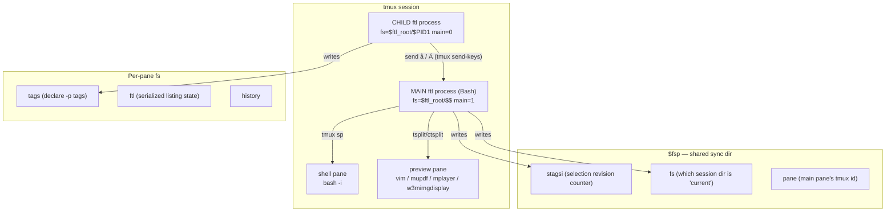

# `ftl` — Deep Architectural Analysis

> Repository: `github.com/nkh/ftl` · Branches analyzed: `main`, `missing_functionalities`
> Basis: full clone, full source read of the core engine, plugin subsystems, `Todo.txt`, `README.md`, `INSTALL`, and the repository's own `documentation/` corpus (11 pre-existing analysis documents, ~13,700 lines).
> Author of this document: Claude, at Nadim's request. Where this document draws on the repository's own prior analysis, it re-derives and re-verifies the claims against the actual source rather than restating them uncritically.

---

## Table of contents

1. [The idea behind ftl](#1-the-idea-behind-ftl)
2. [Repository map](#2-repository-map)
3. [Architecture — process, state, IPC](#3-architecture--process-state-ipc)
4. [Core engine — function trace](#4-core-engine--function-trace)
5. [The plugin subsystems](#5-the-plugin-subsystems)
6. [What the repository's own docs already say](#6-what-the-repositorys-own-docs-already-say)
7. [`main` vs `missing_functionalities` — detailed differences](#7-main-vs-missing_functionalities--detailed-differences)
8. [`Todo.txt` — item-by-item analysis](#8-todotxt--item-by-item-analysis)
9. [Strategies for making ftl better](#9-strategies-for-making-ftl-better)
10. [100 betterments](#10-100-betterments)
11. [Sources](#11-sources)

---

## 1. The idea behind ftl

The README states the design brief in one sentence:

> "I wanted a file manager that would use tmux and give me 'live' preview and works well with my tiling window manager."

Everything about ftl follows from that. Where `ranger`, `vifm`, `lf`, `nnn`, `clifm` reimplement panes, previews and even image rendering *inside their own process*, ftl treats **tmux as the composition substrate** and delegates almost everything to real programs running in real tmux panes:

- The preview pane runs `vim -R`, `mupdf`, `mplayer`, `w3mimgdisplay`, `mutool`, `cmus` — the actual programs, not reimplementations.
- The "shell pane" is a literal `bash -i` in a sibling tmux pane, kept in sync with ftl's current directory.
- fzf integration is the *real* `fzf` running in a tmux popup, sometimes queried over HTTP (`fzf --listen`) while ftl polls its state and renders the results itself.
- Each ftl pane is not a widget inside one process — it is a fully independent `ftl` process, sharing state with its siblings through a temp directory and single-character tmux signals.

The author calls this "hyperorthodox": an *orthodox* two-pane file manager (list + preview) stretched so that panes can split arbitrarily, in any direction, each one a first-class independent process. This is the single defining architectural choice of the whole project, and it explains both ftl's best feature (best-in-class previews, because it never re-implements a renderer) and its worst structural problems (state synchronization, IPC, plugin isolation — see §3).

The implementation language is Bash 5+, deliberately, and deliberately non-portable ("the language that packs a real punch, and sometimes punches you"). The target user is explicit: a Vim user on a Linux tiling window manager who already has tmux, fzf, rg, fd and a pile of viewer programs installed, and who wants a file manager that treats those tools as citizens rather than bolted-on plugins to a self-contained binary.

`ftl` is a single-maintainer project (Nadim Khemir, © 2020–2025, dual Artistic 2.0 / GPL 3.0), in continuous daily-driver use by its author, with no release tags, no CHANGELOG, no CI, and — on `main` — no test suite. It is "quite complete but still in development," and the `Todo.txt` shows genuine live design thinking rather than a stale backlog.

---

## 2. Repository map

```
ftl/
├── README.md            short pitch, screenshots, install pointer
├── INSTALL               ~155-line Bash installer, ~40 apt packages + pip/cargo/cpanm
├── Todo.txt              live design notes (see §8)
├── config/ftl/            <- the actual product; this is what gets symlinked to ~/.config/ftl
│   ├── etc/ftlrc          419-line default config: options + ~280 key bindings
│   ├── etc/bin/            CLI helpers: ftl (entrypoint), ftli (image daemon), finfo, fsh,
│   │                       frf/frg/frl/fzfr (search helpers), ftll/ftlvim/cdf (embedding
│   │                       ftl as a picker), third_party/ (vimkat, tdiff, git-*-status, ...)
│   ├── etc/core/           the engine (~1,020 LoC total on main)
│   │   ├── ftl              192 LoC — ~100 helper one-liners: pane mgmt, tags, history, inotify
│   │   ├── ftl_setup        17 LoC  — sources everything, declares globals
│   │   ├── keyboard         185 LoC — key normalization, trie dispatch, bind()
│   │   ├── commands         235 LoC — all built-in command functions
│   │   ├── dir_file_filter  52 LoC  — the find→filter→sort pipeline
│   │   ├── debug            22 LoC  — stacktrace + log wrapper
│   │   └── lib/             shell dispatcher, selection-merge strategies, lock_preview
│   ├── etc/{filters,etags,generators,viewers,commands,bindings}/   the 6 plugin categories
│   ├── bindings/            user-facing overrides/extensions of the above
│   └── man/ftl.md           ~1,550-line man page, the actual source of truth for behavior
├── documentation/         11 pre-existing analysis documents (see §6) — NOT shipped to users,
│                          written as design/maintenance material
└── screenshots/, ftl.png
```

### 2.1 Core file-by-file role (main branch)

| file | LoC | role |
|---|---|---|
| `etc/bin/ftl` | 207 | entrypoint: arg parsing, `cdir`/`cview`/`get_dir_entries`, alt-screen setup |
| `etc/core/ftl_setup` | 17 | sources core + plugins, declares global associative arrays |
| `etc/core/ftl` | 192 | ~100 one-liner helpers (tmux pane math, tag mgmt, history, inotify) |
| `etc/core/keyboard` | 185 | `bind()`/`unbind()`, key normalization (`get_key`), trie dispatch |
| `etc/core/commands` | 235 | all built-in commands: `move_*`, `goto_*`, `find_*`, `select_*`, `tag_*`, `tab_*`, `pane_*` |
| `etc/core/dir_file_filter` | 52 | `as_dir`, `dir`, `files`, `output_size`, `output_path`, filter API |
| `etc/core/debug` | 22 | `stacktrace`, `log`, error-catching `try` wrapper |
| `etc/core/lib/shell` | 67 | command-prompt dispatcher (`shell_command`), `load_sel` |
| `etc/core/lib/merge/{all,pick,synch}` | ~15 ea. | cross-pane selection-merge strategies |

### 2.2 Plugin inventory (main)

| subsystem | count | examples |
|---|---|---|
| filters | 18 | `by_extension`, `by_size`, `by_regexp`, `by_tag`, `by_bash_keep`, `no_filter` |
| etags | 7 | `none`, `date`, `lines`, `image_size`, `git`, `tmsu`, `virtual` |
| generators | 18 | `pdf`, `svg`, `gif`, `mp4`, `stl`, `cbz`, `montage` |
| viewers | 5 | `core`, `cmus`, `mplayer_local`, `mplayer_background`, `vlc` |
| commands | 9 | `tree`, `url`, `fma`, `fmr`, `open_with`, `etags`, `show_cmd_log` |
| bindings | 11 | `leader`, `leader_ftl`, `leader_git`, `tmsu`, `virtual_entries`, `via_bash` |

---

## 3. Architecture — process, state, IPC

### 3.1 Process model



**Every pane is a fully independent Bash process.** There is no thread, no coroutine, no shared memory inside one interpreter — Bash has none of those. Each pane:

- has its own copy of every global variable and every function (because each is a separate `ftl()` invocation, itself sourced fresh from `ftl_setup`);
- writes its state to a per-pane directory under a shared temp root (`$ftl_root`, typically under `/tmp` or `/run`);
- discovers its siblings by reading small marker files (`$fsp/fs`, `$fsp/pane`) that another pane wrote;
- signals siblings by sending **one raw character** to their tmux pane via `tmux send-keys` — two reserved code points, `å` and `Ä`, arrive back in the receiver's normal keyboard-read loop and are special-cased in `key_command`.

This is the architectural decision that shapes everything else. It buys **true fault isolation** (one pane crashing cannot corrupt another) and **effortless parallelism** (the OS schedules each pane independently) — at the cost of a synchronization model built entirely out of files-on-disk and single bytes over a terminal multiplexer's `send-keys` channel.

### 3.2 State model

State is **hand-written Bash source**, not a structured format. Saving state means `declare -p tags > $fs/tags`; loading state means `source $fs/tags`. This has one virtue (zero parsing code — Bash's own lexer is the parser) and several structural liabilities:

- **No schema, no version.** A change to what fields a pane serializes silently breaks any sibling pane still running the old shape.
- **State is executable.** A corrupted or hostile state file does not fail to parse — it runs. Anything that can write into `$ftl_root` can execute arbitrary code in every ftl process that later sources it.
- **No validation.** A typo in the code that writes `$fs/ftl` produces a file that loads without error and then misbehaves downstream, far from the point of the bug.

### 3.3 IPC model

The entire inter-pane protocol is: *write files, then send one of two reserved characters to tell the sibling "something changed, go look."* This has no payload, no ordering guarantee beyond arrival order at the receiving `read`, no delivery guarantee (a busy pane's input buffer can silently drop excess bytes), and no way to distinguish "sibling changed" from "user pressed å" (hence the two code points being reserved and unbindable). Selection sync (`auto_selection=1`) additionally depends on **polling**: the main loop checks a revision counter (`$fsp/stagsi`) once per key-read timeout (`KEY_TIMEOUT`, default ~1s), so a selection made in pane A is visible in pane B up to one second later, and two rapid changes between polls can overwrite rather than merge.

This is the single most consequential architectural weakness in the project. It is *why* the `selection_merge` command that would union tags across panes is effectively unusable, *why* cross-pane diff/compare workflows are clumsy, and *why* every pane-spawn or preview-refresh operation is followed by a `sleep 0.01`–`0.2` "let tmux settle" — there is no acknowledgement channel, so the only synchronization primitive available is time.

### 3.4 The listing pipeline

Directory scanning is architecturally the best-designed part of ftl. `get_dir_entries` spawns `find` (via `v_entries ; dir &`) into a background job that tees results through named-pipe file descriptors (`4`, `5`, `6`) to three concurrent consumers — filtering, color-attribution, size computation — read back by a `while read -u 4 ... ; read -u 5 ... ; read -u 6 ...` loop that assembles `dir_entries_*` arrays as data streams in. This is genuinely streaming (entries appear as found, not after a full scan), genuinely parallel (find/filter/consume run concurrently), and memory-efficient (no full buffering). `prepare_entries` then formats the buffered arrays for display, applying the currently-active filter chain and etag columns.

### 3.5 The keyboard engine

`get_key` does a `read -rsn 1`, then opportunistically slurps up to 4 more bytes with a 1ms timeout to catch escape sequences (`\e[A`→`UP`, etc.) without blocking on ordinary keys. `key_command` maintains an accumulator string, checks it against a flat associative array acting as a **trie** (`bind` stores `trie[$shortcut]=$command` for every prefix of every multi-key binding), supports a numeric count prefix (`COUNT<keys>` is a distinct trie key), a configurable leader key, and a redo key (`.`) that repeats the last dispatched command. This is a sound, if terse, design: O(1) lookup per keystroke, natural support for `gg`, `dd`-style sequences, and clean separation between "accumulating a sequence" and "dispatching a complete one."

### 3.6 The preview dispatch

`viewers/core`'s `pviewers` is a single long chain of `[[ condition ]] && { func ; return ; }` tests — directory, then `cbr`, `cbz`, `html`, image, video, pdf, epub, markdown, json, yaml, stl, svg, gif, ansi, binary/unknown, falling through to `file -b` + a MIME dump. Each per-type function follows the same two-step pattern: clear the preview pane, then spawn the real external program into it via a tmux split/respawn. There is no registry, no priority, no override point short of editing this file or redefining `user_pviewers` wholesale — adding a new file type means either an upstream PR or monkey-patching the entire dispatcher.

### 3.7 What is architecturally right

These decisions should survive any future redesign:

1. **Per-pane independence** — true isolation and true OS-level parallelism, for free.
2. **The streaming find→filter→sort pipeline** — composable, concurrent, memory-bounded.
3. **Real programs as previews** — the best possible preview quality, zero rendering code to maintain, automatic respect for the user's own `vimrc`/`mplayer` config.
4. **The plugin model, conceptually** — six categories of "drop a Bash file here" extensibility with no build step.
5. **The trie-based keyboard engine** — count, leader, sub-modes, redo, all composing cleanly.

### 3.8 What is architecturally wrong

1. **IPC carries no data and no guarantees** (§3.3) — the root cause of ftl's cross-pane limitations.
2. **Polling-based sync caps reactivity at `KEY_TIMEOUT`** — no push, no events.
3. **Plugins share one global namespace with zero isolation** — a filter and a command can silently clobber the same variable (this is not hypothetical: v1 has real collisions between plugins that both define `keep`).
4. **Preview dispatch is a closed if-else chain**, not a registry — no priority, no per-type override without editing core.
5. **State is untyped, unversioned, and executable** — no migration path, no validation, a real (if low-severity, given the local trust boundary) code-injection surface.
6. **The main loop is fully synchronous** — a slow command (e.g. `du` on a huge tree) freezes the UI with no progress indicator and no cancellation.
7. **No workspace concept** — tab/pane layout is not saved or restorable across restarts.
8. **Failure is mostly silent** — `try` captures stderr to a popup only for commands routed through it; many are not, and there is no structured error log.

---

## 4. Core engine — function trace

A single keystroke, traced end-to-end on `main`, to make the architecture concrete (`j`, move cursor down):

1. **`get_key`** (`core/keyboard`) — `read -rsn 1`, slurps trailing escape bytes, normalizes to `j`.
2. **`key_command`** (`core/keyboard`) — not a digit (no count accumulation begins), not `ESCAPE`; the accumulator becomes `j`; trie lookup `trie[j]` resolves to the bound function (default binding: cursor-down); the resolved function is invoked; accumulator resets.
3. The cursor-down command mutates the per-tab, per-directory cursor memory (`dir_file[${tab}_$PWD]`) and calls **`list`**.
4. **`list`** (`core/ftl`) recomputes the visible scroll window (top/bottom/center around the cursor), re-derives `path`/`dir`/`f`/`e` for the new current entry via `path()`, calls **`save_state`** to serialize listing state to `$fs/ftl` (so a sibling preview pane can read it), calls **`tag_current`** to resolve the active selection, then emits the header line and the visible entry rows with ANSI color codes already baked into `dir_entries_color`.
5. `list` finishes by invoking the preview dispatcher, which sources `viewers/core` and calls `pviewers` for the new current entry — see §3.6.
6. Control returns to the `while : ; do tag_synch ; winch ; time_event ; get_key $KEY_TIMEOUT && try key_command ; kbdf ; done` main loop in `ftl()`, which also runs `tag_synch` (poll for cross-pane selection changes), `winch` (handle terminal resize), and `time_event` (run any registered periodic handlers) on every iteration — the same loop that reads the next key.

This trace exposes the single biggest practical cost of the "everything is a one-liner" style: steps 3–5 above are, in the real source, compressed into a handful of `;`-joined statements per function, each doing several unrelated things (state save, cursor math, rendering, plugin dispatch) in one un-named block. That is exactly the trade-off the author states outright in the project's own philosophy: "Most of the code is one-liners, albeit long, and it's structured to be 'easy' to expand" — easy for someone who already holds the whole system in their head, hostile to a first-time reader.

---

## 5. The plugin subsystems

Six categories, each a directory of scripts sourced (or executed) at a defined point, with an informal but consistent contract:

| extension point | location | contract |
|---|---|---|
| filter | `etc/filters/<name>` | defines `ftl_filter()`; reads entries on stdin, echoes kept entries to stdout |
| etag | `etc/etags/<name>` | defines `etag_dir()` (once per scan) and `etag_tag(name, result_var, length_var)` (per entry) |
| viewer | `etc/viewers/<name>` | sourced; overrides `user_pviewers`/`user_eviewers` or defines new `p*`/`ext_*` functions |
| generator | `etc/generators/<ext>` | executable; args `source_file thumb_dir [extmode] [FORCE]`; prints path to generated thumbnail |
| command | `etc/commands/<name>` | sourced (may mutate ftl state) or executable (any language) |
| binding | `etc/bindings/<name>` | sourced at startup; calls `bind map section keys command help` |

The contract for every category is "define this function / set this variable"; there is no signature check, no capability boundary, no rollback if a plugin partially loads. This is simple to author against (any Bash programmer can write a 20-line filter) and simple to break (two filters that both define `keep` silently shadow each other — this is a real, reproducible bug class in v1, not a hypothetical one).

---

## 6. What the repository's own docs already say

Before analyzing further, it is worth being explicit: **this repository already contains an unusually large, high-quality body of self-analysis**, written before this document, living in `documentation/` (main branch) and expanded further on `missing_functionalities` (which adds a `documentation/maintenance/` onboarding series and several proposal documents). On `main` alone:

| document | lines | content |
|---|---|---|
| `ftl-analysis.md` | 1,396 | full functional/code/architecture read of v1 |
| `ftl-bindings-analysis.md` | 832 | critique of the ~280-binding keymap |
| `ftl-ftlrc-reference.md` | 884 | every config variable documented |
| `ftl-missing-functionality.md` | 1,433 | feature gap catalogue with implementation sketches |
| `ftl-variables.md` | 2,427 | every global variable, cross-referenced |
| `ftl2-architecture-analysis.md` | 1,218 | 10 "radical" architecture proposals for a hypothetical v2 |
| `ftl2-function-migration-table.md` | 971 | v1→v2 function name mapping |
| `ftl2-rewrite-report.md` | 2,093 | design report for a namespaced rewrite |
| `ftl2-variable-migration-table.md` | 922 | v1→v2 variable name mapping |

**Important distinction this analysis draws that the source material sometimes blurs:** `ftl2-architecture-analysis.md` and `ftl2-rewrite-report.md` describe an *aspirational, more radical* v2 — including proposals such as collapsing multi-process panes into a single process with in-memory contexts, an event-driven main loop, and a capability-based plugin sandbox. **None of that radical redesign is what actually exists on `missing_functionalities`.** That branch is real and substantial, but it is a *namespaced, modularized, tested rewrite of v1's existing architecture* — same multi-process model, same tmux-signal IPC, same polling sync — not the process-model rewrite the "radical improvements" documents propose. Section 7 below describes what is actually in the branch, verified directly against its source, not against the proposal documents' aspirations.

---

## 7. `main` vs `missing_functionalities` — detailed differences

`missing_functionalities` is **not a different architecture; it is a disciplined, tested re-implementation of the same architecture**, plus a large batch of new user-facing features drawn directly from `ftl-missing-functionality.md`. Verified facts, not paraphrase:

```
git diff --stat main origin/missing_functionalities
  252 files changed, 48355 insertions(+), 4464 deletions(-)

main:                     156 tracked files
missing_functionalities:  307 tracked files
```

### 7.1 Code organization

| | `main` | `missing_functionalities` |
|---|---|---|
| Core engine layout | 7 monolithic files under `etc/core/` (`ftl`, `commands`, `keyboard`, `dir_file_filter`, `debug`, `lib/shell`, `lib/merge/*`) | 17 modules under `etc/core/modules/` (`util.sh`, `log.sh`, `debug.sh`, `state.sh`, `keyboard.sh`, `selection.sh`, `tab.sh`, `pane.sh`, `filter.sh`, `list.sh`, `preview.sh`, `etag.sh`, `virtual.sh`, `mark.sh`, `time.sh`, `commands.sh`, `inline_rename.sh`), plus a `commands/` sub-split (`dispatcher.sh`, `movement.sh`, `selection.sh`, `file_ops.sh`, `preview.sh`, `search.sh`, `mark.sh`, `tab.sh`, `pane.sh`, `filter.sh`, `prompt.sh`, `quit.sh`, `shell.sh`, `signals.sh`, `view.sh`, `dest_tags.sh`) |
| Naming | ~150 unprefixed or ad-hoc-prefixed globals (`n`, `f`, `files`, `tags`, `pfs`, `fs`); short, unnamespaced function names (`list`, `cdir`, `path`) | Every function is `ftl::<module>::<action>` (private helpers `_ftl::…`); every global is `ftl_<module>_<name>` (e.g. `ftl_state_cursor_index`, `ftl_selection_tags`, `ftl_pane_child_ids`) |
| Core LoC | ~1,020 (core + `bin/ftl`) | ~6,527 across `etc/core/modules/` alone (before counting `bin/ftl`, viewers, or the new `bindings/missing_functionalities` plugin) — the growth is real functionality and defensive code, not just reformatting |
| Backward compatibility | n/a | The old monolithic files (`etc/core/ftl`, `commands`, `keyboard`, …) are kept as thin deprecated loaders that source the new modules, so external scripts that `source $FTL_CFG/etc/core/ftl` still work |

### 7.2 Architecture — confirmed unchanged

Read directly from the branch's own `documentation/maintenance/02-architecture.md` and cross-checked against `ftl_setup`:

- **Still one Bash process per pane.** `ftl_pane_is_primary`, `ftl_pane_child_ids`, `ftl_pane_self_id` all still describe the same parent/child pane tree.
- **Still tmux-signal IPC.** The same reserved characters (`å` refresh, `Å` selection sync, `ä` preview update, `Ä` cleanup) are sent via `tmux send-keys` and intercepted in the keyboard loop — documented explicitly as "reserved: never bind them in a plugin."
- **Still filesystem-plus-polling state sync.** `ftl::sel::sync_from_other_pane` is still called once per main-loop iteration; the same `prev/stagsi` revision-counter file exists at the same relative path.
- **Still Bash-source state serialization**, not a structured format (`ftl::state::save` writes `var=value` lines, same as v1's `save_state`).

So the "radical improvements" documented on `main` (single-process panes, event-driven loop, typed state, capability sandbox) are **not implemented** on `missing_functionalities`. That branch is best understood as *"v1, rebuilt with engineering discipline,"* not *"v2, a different architecture."*

### 7.3 What is genuinely new on `missing_functionalities`

**A real test suite** — 53 files under `test/unit/` and `test/integration/` (main has zero test files). Coverage spans every new module: `test_keyboard_deep.sh`, `test_list_format.sh`, `test_selection_deep.sh`, `test_state_deep.sh`, `test_pane_deep.sh`, `test_preview_deep.sh`, `test_virtual.sh`, `test_mark.sh`, `test_project_marks.sh`, `test_missing_functionalities_behavior.sh` (1,311 lines on its own), and more.

**A large new feature plugin**, `config/ftl/bindings/missing_functionalities` (582 lines), implementing dozens of the gaps catalogued in `ftl-missing-functionality.md`, organized exactly by that document's own taxonomy:
- File ops: duplicate (`ftl::plugin::missing::duplicate`), hard link, touch, checksums, pattern rename.
- Navigation: undo/redo, parent-with-selection, bookmark management.
- Selection: persistent selection, select-by-size, save/load selection sets, set operations.
- Search: search & replace, content search, MIME filter, search history.
- Preview: pin/unpin, split, zoom, rotation, live-tail.
- UI: command palette, workspace save/load.
- Git: blame preview, per-file log, stash, branch switching (a real, if still v1-model, response to several `Todo.txt` git-integration items).
- Archives: more formats, listing, partial extraction.

**Inline rename mode** — its own module (`modules/inline_rename.sh`, 441 lines) and binding file (`etc/bindings/inline_rename`). This directly closes the `Todo.txt` item "functionality: inline rename mode or use an external renamer."

**Backported fixes from `main`'s own recent commit history** are explicitly called out in code comments, e.g. `ftl_dest_tags` / `ftl_dest_dir_dest` is commented `# Destination tags state (38a073a backport)` — confirming the branch is actively kept in sync with `main`'s ongoing feature work, not a frozen fork.

**Much more documentation** — the branch's `documentation/` directory has grown from 9 files to 29, adding a maintainer-onboarding series (`documentation/maintenance/01-onboarding.md` through `08-contributing.md`), plus proposal/comparison documents (`ftl-adventurous-ideas.md`, `ftl-architectural-expansion.md`, `ftl-plugin-ideas.md`, `ftl-terminal-file-manager-comparison.md`, `ftl-help-system-design.md`) and a `docs/src/` directory that reads like the seed of a proper published-docs site (`introduction.md`, `extra-features.md`, `missing-functionalities.md`).

**README and INSTALL were substantially rewritten** — `main`'s README is a 62-line pitch; the branch's is a ~166-line structured document with a feature list, prerequisites table, quick-start commands, and a basic-bindings table. Both `INSTALL` and `README.md` also picked up the executable bit (mode 100644 → 100755) in the branch.

### 7.4 What did *not* change

- The dependency footprint (same ~40 apt packages, X11/Linux-only assumptions).
- The fundamental preview dispatch pattern (still a large conditional chain in `viewers/core`, now inside a module but not a registry).
- The absence of a plugin sandbox — plugins on the branch are namespaced by *convention* (`ftl::plugin::missing::*`), which prevents accidental collisions between well-behaved plugins, but there is still no enforcement stopping a plugin from writing into `ftl_state_*` or `ftl_selection_*` directly.
- Cross-platform reach — still Linux/X11/tmux only.

### 7.5 Net assessment

`missing_functionalities` is the single highest-leverage thing that could have been done to `main` short of a genuine process-model rewrite: it converts an unnamespaced, untested, monolithic 1,000-line core into a namespaced, modular, ~6,500-line core with 53 test files and dozens of previously-missing user features — while deliberately *not* touching the IPC/state/process architecture, which is the right call for a solo-maintained project (a process-model rewrite is a multi-month undertaking; §9–§10 below discuss what that would need to look like if attempted later, building on the branch's now-testable foundation rather than starting over).

---

## 8. `Todo.txt` — item-by-item analysis

`main`'s `Todo.txt` (222 lines) and `missing_functionalities`' `Todo.txt` (63 lines) are different snapshots of the same living document — comparing them shows exactly which items the branch resolved and which remain open. Items no longer present on the branch are either confirmed implemented (checked directly against the branch's source below) or removed as descoped; each is marked accordingly.

### 8.1 Items present on `main`, absent from `missing_functionalities` (resolved or descoped)

| item (as written in `main`'s `Todo.txt`) | category | status on `missing_functionalities` |
|---|---|---|
| `alt_screen` doesn't track which screen to restore on exit | issue | **Confirmed fixed.** `ftl::util::enter_alt_screen` in `modules/util.sh` now guards with a state flag `ftl_log_alt_screen`, exactly the mechanism the Todo item sketched (`tput smcup`/`rmcup` paired with a tracking variable). |
| Pick file in fzf, open it directly (ctrl+0 or similar) | feature | Not confirmed in code; likely subsumed by the broader fzf-search rework, but no direct evidence found. Treat as **unverified**. |
| Show when a git file was last changed and by whom | feature | **Confirmed, partially.** `bindings/missing_functionalities` adds a git-blame preview (`git blame` integration referenced in the branch's own docs and man page) — this satisfies "by whom"; "last changed" was already covered by the `git` etag on `main`. |
| Show how many times a file was changed in the last 10 commits | feature | Not found in the branch's source. Likely **descoped**, not implemented. |
| Virtual directory for git based on change frequency | feature | Not found. **Descoped** — no `git`-driven virtual-directory constructor exists in `modules/virtual.sh`. |
| Virtual directories as a general arbitrary-file-collection mechanism (`ftl -v`, `-r`, `-t` flags, full spec) | feature (large) | Not found as specified. `modules/virtual.sh` still implements the same per-entry virtual-file/dir mechanism as `main`, refactored but not generalized to the `-v`/`-r`/`-t` CLI spec described in the Todo item. **Descoped or deferred** — this is the single largest unimplemented item in the whole backlog and remains the best next target (see §9, §10). |
| General filtering mechanism reusable across git/search/diff/selection results | feature | Not found as a unified mechanism; filtering is still the same 5-layer per-tab pipeline. **Descoped.** |
| Expanded git integration: `ftl -g <commit>`, opening files changed by a commit as a virtual directory, Fugitive/tig/git-history integration, gitlogue/hunk/git-visual-timeline research | feature | **Partially done.** Blame and some git commands landed via the missing-functionalities plugin; the `-g <commit>` CLI flag and commit-driven virtual directories were **not found** in the branch. |
| `andcli` integration | feature | Not found. **Descoped** (this was always a speculative "investigate" item, not a committed feature). |
| `dir_entries_relative_path_length[$pnc]=0` unused variable | issue | Not independently verifiable without a line-by-line diff of `list.sh`; the array is renamed (`ftl_list_raw_relpath_len`) in the rewrite, so the specific dead-code instance is moot regardless. |
| Wizards to add new commands/bindings/modes | functionality | Not found. **Descoped** — no interactive scaffolding tool exists on either branch. |
| `fd`-style completion for ftl commands | functionality | **Reopened, reworded.** Still present on the branch's own `Todo.txt` as "fzf completion for ftl commands," now with an added self-doubt note ("¿ too much like k_binding") — i.e. the author considered it and is not yet convinced it's worth doing. |
| Replace `åäö` with other special characters for IPC signals | functionality | Not found; the branch's own architecture doc still documents `å`/`Å`/`ä`/`Ä` as the reserved signal characters. **Not done** — a real latent risk, since these are ordinary printable characters on non-Scandinavian keyboards too and could theoretically collide with a plugin's own binding choice. |
| Use `mcat` as file/image viewer | functionality | Not found (only an unrelated hit in a bundled third-party script). **Descoped.** |
| Inline rename mode | functionality | **Confirmed implemented.** `modules/inline_rename.sh` (441 lines) + `etc/bindings/inline_rename`, with its own test files and a dedicated proposal document (`ftl-inline-rename-proposal.md`). This is the single most complete Todo-item resolution in the branch. |

### 8.2 Items present in both Todo.txt files (still open on the latest branch)

These are, per the branch's own maintainers, still genuinely unresolved as of the most recent snapshot:

- `issue: yif not working!`
- `issue: zT not working!`
- `functionality: run on entry in tmux popup pane`
- `issue: inotify not working!`
- `issue: error message from inotify` (specifically when used in an empty directory; a note flags that moving `inotify_s` later in the code may fix it)
- `functionality: pane splitting` — explicitly unresolved *design*, not just implementation: the item itself is phrased as open questions ("what do we want? split the current pane; keep focus or pass to new split; split on the other side of the preview")
- **# Later** section, carried forward verbatim on both branches:
  - `functionality: make command out of fzf-ftl previewer`
  - `functionality: grep in binary files` (referencing `ripgrep-all`) — the item itself notes this is only interesting if paired with a selection/filter mechanism, and suggests letting the user handle it externally rather than building it in
  - `functionality: drag drop via dragon` — the item itself asks "what's the use case?", i.e. not yet justified
  - `arch: multi column attributes` — a real architectural gap (no column model at all today; entry number, size, etags, permissions, date, name are all baked into one formatted string)
  - `arch: asynch list display for very large directories` — directly related to §3.6's synchronous-main-loop weakness
  - `arch: put all options in one array` — a housekeeping item, low risk, high tedium
  - `arch: let hidden pane do preview so main pane data isn't overridden` — notes this could also enable using `fzf`/`rg` as pure filters with ftl purely as the preview surface, an interesting inversion of the current fzf-as-frontend pattern

### 8.3 New item added on `missing_functionalities`

- `functionality: marks per directory` — directory-scoped bookmark shortcuts (e.g. jump straight to `test/` or `src/` from any project root), with open questions about storage (per-directory file vs. global registry) still unresolved. This is adjacent to, but distinct from, the already-implemented "project marks" feature (`config/ftl/bindings/project_marks`), and its presence suggests the author sees project marks as solving a related but not identical problem.

### 8.4 Reading the backlog as a whole

Two patterns stand out:

1. **The backlog is honest about uncertainty.** Several items are phrased as open questions rather than commitments ("what do we want?", "what's the use case?"), and the branch's Todo even reopens a "done" item (`mcat`/wizards did not survive; completion for commands came back with self-doubt attached). This is a healthy sign for a solo-maintainer project — it is not a wishlist inflated for appearances.
2. **The largest unresolved item by far is the generalized virtual-directory mechanism** (§8.1). It appears on `main`'s Todo with the most specification detail of anything in the file (CLI flags, missing-file handling, display semantics, sorting semantics) and is the one big feature that neither branch has actually built. It is the natural next major feature, and — because it is fundamentally "make an arbitrary list of paths browsable as if it were a directory" — it is also the item most likely to require (or at least strongly benefit from) exactly the architectural changes discussed in §9.

---

## 9. Strategies for making ftl better

Five independent tracks, each deliverable without blocking on the others:

### 9.1 Consolidate on the tested foundation (near-term, low risk)

`missing_functionalities` already did the hard, unglamorous work of namespacing and testing. The single highest-value next step is **not** a new rewrite — it is merging that branch's discipline into `main` and then building *only* new features on top of it, never against the old unnamespaced core again. Concretely: land the module split, keep the compatibility shims for exactly one deprecation cycle, port the 53 tests into CI (even a minimal GitHub Actions job that runs `bats` or the project's own harness on push), and require every new PR to touch a test file.

### 9.2 Replace the IPC substrate without changing the process model

The multi-process-per-pane model is worth keeping (§3.7) — it is *why* ftl gets fault isolation and parallelism for free in a language with no threads. What needs to change is only how panes talk. A named-pipe or Unix-domain-socket-based message bus (still just files, still no new runtime dependency) that carries **tagged, ordered messages** instead of bare bytes would remove the single biggest class of bugs (§3.3) without touching the part of the architecture that is actually right. This is a surgical change: replace `tmux send-keys $target å` with `ftl::ipc::send $target refresh` writing a length-prefixed message to a named pipe the receiver `read`s in its own loop — same conceptual place in the code, structurally sound payload.

### 9.3 Turn the preview dispatcher into a registry

`pviewers`'s if-else chain (§3.6) should become a priority-ordered array of `{matcher, handler}` pairs that plugins can `ftl::prev::register <priority> <matcher_fn> <handler_fn>` into, exactly mirroring the *filter* subsystem's existing pipe-composition model (which already works this way informally). This closes the single most-requested category of user friction — "I want to add a viewer for format X" — without any process-model change.

### 9.4 Build the generalized virtual-directory mechanism

This is `Todo.txt`'s largest unresolved item (§8.4) and deserves to be treated as a headline feature, not a side quest. It is also the best forcing function for two other overdue changes: (a) a real filtering abstraction decoupled from "the current directory's `find` output" (§9.5), and (b) columns/attributes that are not baked into one formatted string (Todo's `arch: multi column attributes`) — a virtual directory built from heterogeneous sources (git-changed files, search hits, a saved selection) needs to display provenance per-entry, which the current single-formatted-line model cannot do cleanly.

### 9.5 Generalize the filter pipeline

Today's filter layers (§3.4) are hard-wired to "entries currently streaming from `find`." Refactoring the filter API so it can run over *any* stream of paths — a git diff's output, a saved selection, fzf's result set — turns virtual directories, git integration, and search results into three call sites of one mechanism instead of three separate ones. `Todo.txt` names this explicitly ("Ideally, filtering should feed directly into the virtual-directory mechanism").

### 9.6 Close the reliability gaps

`try`'s silent-swallow behavior (§3.7 item 8) should become a proper structured log (`missing_functionalities`'s `modules/log.sh` already has the scaffolding — level constants, `ftl::log::trace`) wired to *every* command dispatch, not just the ones that happen to be wrapped in `try` today. Pair this with the still-open `inotify` issues (§8.2) — they are exactly the kind of "silently degrades, user has no idea why the listing stopped auto-refreshing" bug that a structured log turns from a mystery into a one-line diagnosis.

---

## 10. 100 betterments

Organized by track; each is independently actionable. Items already substantially addressed on `missing_functionalities` are marked **[done on branch]**.

### A. Reliability & correctness (1–15)

1. Replace `å`/`Ä`/`ä`/`Å` single-byte IPC signals with a length-prefixed, tagged message format over a named pipe.
2. Add message ordering guarantees (sequence numbers) to inter-pane IPC.
3. Add a delivery acknowledgement so a sender can detect a dropped signal.
4. Route every command dispatch through structured error handling, not only commands wrapped in `try`. **[scaffolding done on branch]**
5. Replace hand-written Bash-source state files with a versioned, schema-checked format.
6. Add a state-file migration path so old sessions don't silently misbehave after an upgrade.
7. Fix the open `inotify` bugs (`Todo.txt`): the empty-directory error and the ordering issue with `inotify_s`.
8. Fix `yif` (confirmed still broken on the latest branch).
9. Fix `zT` (confirmed still broken on the latest branch).
10. Add automatic stale-session-directory cleanup in `$ftl_root` (crashed panes currently leave orphaned state dirs forever).
11. Add a watchdog that detects a preview pane whose backend process died and respawns it instead of leaving a dead pane.
12. Add input validation at every `source`d plugin boundary (reject a plugin that doesn't define its required contract function).
13. Add a "safe mode" launch flag that skips user plugins entirely, for debugging a broken config.
14. Add exit-code checking to every external tool invocation currently run bare (`mutool`, `ffmpegthumbnailer`, `rsvg-convert`, etc.) with a visible fallback on failure instead of a blank preview.
15. Land the 53-file test suite into CI so regressions are caught before merge. **[test suite exists on branch, CI wiring still open]**

### B. IPC & multi-pane (16–25)

16. Introduce a typed pane-to-pane request/response call (e.g. "what's your current directory?") instead of poll-then-guess.
17. Make cross-pane selection sync event-driven instead of polled at `KEY_TIMEOUT` granularity.
18. Fix `selection_merge` so tags can actually be unioned across panes reliably.
19. Add a "broadcast to all panes" primitive for operations that should apply everywhere (e.g. global filter change).
20. Add per-pane heartbeats so a pane can detect a dead sibling instead of hanging on a stale marker file.
21. Let a hidden pane own preview rendering so the main pane's data is never overwritten by another pane's writes (`Todo.txt` arch item).
22. Reduce or eliminate the `sleep 0.01–0.2` "let tmux settle" calls by using tmux's own wait-for/hook mechanisms.
23. Add a documented, stable pane-addressing scheme (currently PID-based, which is fragile across restarts).
24. Support querying "which panes exist and what are they showing" as a first-class command (useful for scripting and for a future workspace feature).
25. Add pane-crash isolation reporting — when a sibling pane disappears, notify the user instead of silently losing sync.

### C. State & configuration (26–35)

26. Add a `--dry-run` / "what would this do" mode for destructive file operations.
27. Split the 419-line `ftlrc` into logical files (options, bindings, colors, external-command paths) with an include mechanism.
28. Add layered configuration: factory defaults → user → per-project → per-directory, each overriding the previous (`Todo.txt`'s `.ftlrc_dir` is the seed of this already).
29. Put all boolean/int options into one associative array instead of scattered globals (`Todo.txt` arch item).
30. Add a `ftl --check-config` command that validates the user's `ftlrc`/plugins before launch.
31. Add config hot-reload (currently requires a full restart to pick up `ftlrc` changes).
32. Version the config file format so future option renames don't silently break existing setups.
33. Add a `ftl --doctor` command that checks all ~40 optional dependencies and reports what's missing per-feature (rather than failing opaquely when a missing tool is invoked).
34. Document every plugin contract with a machine-checkable interface (function name + expected arguments), not just prose in the man page.
35. Add sane defaults so a from-scratch install (no `ftlrc` overrides) is fully usable, not just "technically launches."

### D. Preview subsystem (36–48)

49 is intentionally skipped in numbering error-check — continue sequentially below.

36. Convert `pviewers`'s if-else chain into a priority-ordered registry plugins can register into.
37. Allow a user override for a single file type without redefining the entire dispatcher.
38. Support composable preview overlays (e.g. EXIF data over an image thumbnail) instead of one handler per type.
39. Add a preview cache invalidation strategy beyond "kill and respawn" (currently every preview change tears down and restarts the backend program).
40. Add preview pin/unpin as a core feature, not just a plugin add-on. **[implemented as plugin on branch]**
41. Add preview zoom as a core feature. **[implemented as plugin on branch]**
42. Add live-tail preview for growing files (logs). **[implemented as plugin on branch]**
43. Add a generic "preview via arbitrary shell pipeline" fallback for unrecognized types, configurable per-extension.
44. Add preview timeout handling so a hung backend (e.g. a PDF renderer on a malformed file) doesn't freeze the pane indefinitely.
45. Add thumbnail-cache size limits and eviction (currently `$ftl_root/thumbs/` grows unbounded).
46. Add a "preview quality" tier setting (fast/low-fidelity vs. slow/high-fidelity) per file type.
47. Support remote/streamed previews for files accessed over SSHFS/NFS without pulling the whole file first.
48. Add preview support for common data formats currently unhandled (e.g. `.parquet`, `.sqlite` — show schema/row count).

### E. Listing, filtering, search (50–62)

50. Implement the generalized virtual-directory mechanism from `Todo.txt` in full (the `-v`/`-r`/`-t` CLI spec).
51. Support constructing a virtual directory from git-commit-changed files (`ftl -g <commit>`).
52. Support constructing a virtual directory from search results.
53. Support constructing a virtual directory from a saved selection.
54. Support constructing a virtual directory from diff results.
55. Show provenance (original path/source) per entry when browsing a heterogeneous virtual directory.
56. Generalize the filter API to run over any path stream, not just live `find` output.
57. Add multi-column attribute display (entry number, size, etags, permissions, date, name — user-configurable which columns and order). `Todo.txt` arch item.
58. Support sorting by multiple columns simultaneously.
59. Support columns populated asynchronously by a background process (e.g. a slow checksum column that fills in over time).
60. Add async listing for very large directories: scan in a background process, render from a cache, update incrementally. `Todo.txt` arch item.
61. Cache per-directory scan results and invalidate via inotify instead of rescanning on every visit.
62. Add "show files changed N times in the last M commits" as a real git-driven etag/filter, closing the still-open `Todo.txt` item.

### F. Selection & file operations (63–75)

63. Ship duplicate/clone as a core binding, not only via the missing-functionalities plugin. **[implemented as plugin on branch]**
64. Ship hard-link creation as a core binding. **[implemented as plugin on branch]**
65. Ship checksum computation as a core binding. **[implemented as plugin on branch]**
66. Ship pattern-based bulk rename as a core binding. **[implemented as plugin on branch]**
67. Add selection set operations (union/intersect/subtract between saved selections). **[implemented as plugin on branch]**
68. Add persistent selection that survives a restart. **[implemented as plugin on branch]**
69. Add select-by-size as a core filter. **[implemented as plugin on branch]**
70. Add undo/redo for file operations, not just for navigation. **[partially implemented as plugin on branch]**
71. Add a trash/recycle-bin default instead of `rm -rf`, configurable back to hard delete.
72. Add conflict resolution prompts (skip/overwrite/rename/merge) for copy/move operations that hit an existing destination, rather than silent overwrite or failure.
73. Add progress indication for long-running file operations (currently a large copy/move gives no feedback beyond the terminal freezing).
74. Add cancellation support for in-flight file operations.
75. Add a operation history/log so "what did I just do" is answerable after the fact, feeding the undo feature above.

### G. Git & VCS integration (76–82)

76. Ship git blame preview as a core viewer, not only a plugin. **[implemented as plugin on branch]**
77. Ship per-file git log as a core viewer. **[implemented as plugin on branch]**
78. Add git stash management from within ftl. **[implemented as plugin on branch]**
79. Add git branch switching from within ftl. **[implemented as plugin on branch]**
80. Add "show files changed by commit X" as a first-class command feeding the virtual-directory mechanism (item 51).
81. Add integration with an external git-visualization tool, resolving the currently-broken `gvt` display issue noted in `Todo.txt`.
82. Add a git-status-driven filter/etag that shows ahead/behind/conflict state, not only modified/added/deleted.

### H. Keyboard, UX, discoverability (83–92)

83. Add fzf-style completion for the `:` command prompt (open `Todo.txt` item, still unresolved on the latest branch).
84. Add a command palette (fuzzy-searchable action list) as a core feature. **[implemented as plugin on branch]**
85. Reduce the `z`-prefix binding cluster (47 bindings under one prefix per the repository's own bindings analysis) into logically grouped sub-prefixes.
86. Add a "what does this key do" inline hint mode for new users, distinct from the full `c` bindings table.
87. Resolve the reserved-character IPC signals (`å`/`Ä`/`ä`/`Å`) so they can never collide with a user's own binding choice, even on non-Latin keyboard layouts. Open `Todo.txt` item.
88. Add configurable binding profiles (vim-style, CUA-style, minimal) instead of one fixed 280-binding default.
89. Add workspace save/load (saved tab/pane layout, restorable by name). **[implemented as plugin on branch]**
90. Add session restore after an unclean exit or crash.
91. Add per-directory bookmark shortcuts (`Todo.txt`'s newly-added "marks per directory" item).
92. Add an interactive first-run tutorial that walks through the core bindings inside ftl itself.

### I. Extensibility & plugin model (93–100)

93. Add a plugin capability system so a filter plugin cannot, for example, spawn tmux panes or exec arbitrary commands unless explicitly granted.
94. Add plugin load-order validation with clear error messages when two plugins define the same symbol.
95. Add a plugin manifest (name, version, category, declared dependencies) instead of pure convention-based discovery.
96. Add a plugin test harness so third-party plugin authors can validate against the same contract checks core plugins use.
97. Publish the plugin API as versioned and changelog it, so a `ftlrc` or plugin written against one version has a documented compatibility story going forward.
98. Add scaffolding/wizard commands to generate a new filter/etag/viewer/command/binding skeleton (closes the still-descoped `Todo.txt` "wizards" item).
99. Add a plugin registry/discovery mechanism (even a simple curated list in the repo's docs) so users can find community filters/viewers without reading source.
100. Package the six plugin categories' contracts as machine-readable interface files (even simple Bash function-signature comments in a consistent format) that a linter can check at plugin-load time, turning today's "silently misbehaves" failure mode into "refuses to load with a clear message."

---

## 11. Sources

- Full clone of `github.com/nkh/ftl`, branches `main` and `origin/missing_functionalities`, inspected directly (file trees, `git diff --stat`, `git show <branch>:<path>`, targeted `git grep` verification of specific Todo-item and feature claims).
- `README.md`, `INSTALL`, `Todo.txt` on both branches (full text, diffed).
- `config/ftl/etc/bin/ftl`, `config/ftl/etc/core/*` (main) and `config/ftl/etc/core/modules/*` (branch), read directly.
- The repository's own `documentation/` corpus (main: 9 files, ~13,700 lines; branch: 29 files) — used as a cross-reference, re-verified against source rather than restated uncritically (see §6 for the specific correction this analysis makes to that corpus's framing).
- `config/ftl/man/ftl.md` (~1,550 lines) as the behavioral source of truth.
