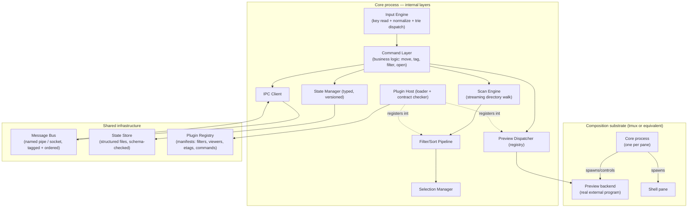

# A Reference Architecture for Terminal File Managers

> Language-agnostic. Reference implementation notes target Bash (5+), since that keeps the
> orchestration layer thin, keeps plugin authorship accessible, and lets the tool stay a
> composition layer over existing programs (`find`, `fzf`, `rg`, `tmux`, viewers) rather than
> reimplementing them — the property that made `ftl`'s previews best-in-class and is worth
> preserving deliberately, while avoiding the specific structural mistakes that IPC-by-`tmux
> send-keys` and untyped state introduced there.

---

## Table of contents

1. [Design goals & non-goals](#1-design-goals--non-goals)
2. [Component architecture](#2-component-architecture)
3. [Process & concurrency model](#3-process--concurrency-model)
4. [State model](#4-state-model)
5. [Inter-process communication](#5-inter-process-communication)
6. [The listing pipeline](#6-the-listing-pipeline)
7. [The filter/sort pipeline](#7-the-filtersort-pipeline)
8. [Selection model](#8-selection-model)
9. [Preview subsystem](#9-preview-subsystem)
10. [Keyboard / input engine](#10-keyboard--input-engine)
11. [Plugin architecture](#11-plugin-architecture)
12. [Configuration system](#12-configuration-system)
13. [Error handling & observability](#13-error-handling--observability)
14. [Testing strategy](#14-testing-strategy)
15. [Bash reference skeleton](#15-bash-reference-skeleton)
16. [Anti-patterns to avoid](#16-anti-patterns-to-avoid)

---

## 1. Design goals & non-goals

### 1.1 Goals

- **Composition over reimplementation.** A preview of a PDF should be real PDF-rendering software, not a hand-rolled renderer. The file manager's job is orchestration: know what to run, run it in the right place, keep it in sync with cursor movement.
- **Streaming, not batch.** A directory with 500,000 entries should show its first entry before the scan finishes.
- **Independent, recoverable panes.** A crash in one pane's preview backend must never take down the whole session.
- **Typed, versioned state.** Anything written to disk that will later be read back — by this process, a sibling process, or a future version of the program — has a schema and a version.
- **A real plugin contract.** "Define a function with this name" is not a contract. A contract has a declared interface, a validation step, and a failure mode that doesn't corrupt the host process.
- **Terminal-multiplexer-native, but not multiplexer-locked.** The architecture should work with tmux as the reference composition substrate, but the core (state, filtering, selection, plugin model) must not assume tmux-specific mechanics leak into business logic — a GUI or different-multiplexer front end should be able to sit on the same core.

### 1.2 Non-goals

- **Not a network filesystem client.** Remote access is delegated to FUSE mounts or explicit sync tools, not reimplemented.
- **Not a package manager for viewers.** The tool orchestrates whatever viewers are installed; it does not vendor or manage them.
- **Not cross-shell portable at the plugin layer.** Pick one implementation language for the core and plugin API (Bash, in the reference notes here) and use it well, rather than targeting the lowest common denominator across shells.

---

## 2. Component architecture



### 2.1 Layer responsibilities

| layer | owns | does not own |
|---|---|---|
| Input Engine | raw key reads, escape-sequence normalization, count/leader/sub-mode state machine, trie dispatch | what a command actually does |
| Command Layer | business logic — the verbs (move, tag, copy, filter, open) | rendering, key parsing |
| Scan Engine | walking a directory (or any path source) and streaming entries | filtering, formatting |
| Filter/Sort Pipeline | composing filter stages over a stream of paths, from any source | how the stream was produced |
| Selection Manager | which paths are tagged, in which class, and how that's shared cross-pane | file operations themselves |
| Preview Dispatcher | matching a path to a handler and launching it in the right place | rendering content itself (delegated to real programs) |
| State Manager | typed load/save of everything that must survive a restart or cross a pane boundary | how other panes learn about a change (delegated to IPC) |
| Plugin Host | discovering, validating, and loading plugin manifests | plugin business logic |
| IPC Client | sending/receiving tagged, ordered messages to/from sibling panes | interpreting what a message means (delegated back to Command Layer) |

---

## 3. Process & concurrency model

**Recommendation: keep per-pane process independence.** This is the one architectural choice from `ftl` worth carrying forward unconditionally — it is the only way to get true fault isolation and true OS-scheduled parallelism in a shell language with no threads, and it remains a reasonable choice even in languages that *do* have threads, because it also isolates plugin crashes and makes "kill and restart one pane" a real recovery mechanism.

What must change relative to a naive implementation:

- **The scan/filter pipeline runs as background jobs within the pane's process**, streaming through pipes, so the pane's main loop is never blocked waiting for a full directory walk (§6).
- **Long-running commands (bulk copy, checksum, re-encode) run as detached background jobs** that report progress back through the message bus, not synchronously in the main loop. The main loop stays responsive to input at all times; a running job is visible in the UI as a status line, cancellable, and its completion is a message like any other.
- **A supervisor responsibility exists at the "primary pane" level**: it tracks which child panes (previews, splits) it spawned, detects when one has died, and either respawns it or surfaces the failure — never silently leaves a dangling multiplexer pane.

---

## 4. State model

Every piece of state that crosses a process boundary (disk or IPC) is:

1. **Typed.** A declared schema: field name, type (string / int / bool / enum / list / map), and whether it's required.
2. **Versioned.** A version marker in the serialized form, with an explicit migration function per version transition.
3. **Not executable.** Loading state must never mean "run this as code." A structured format (line-oriented `key=value` with a strict parser, JSON, or any format with a real grammar) is fine; sourcing a shell file as a serialization mechanism is not, regardless of implementation language — the two purposes (config-as-code vs. state-as-data) must be kept separate even when both happen to be text files on disk.

```
# reference state-file shape (line-oriented, still trivially bash-parseable
# with a real read loop instead of `source`)
state_version=3
pwd=/home/user/project
cursor_index=5
selection_revision=41
selection[0]=/home/user/project/a.txt
selection[1]=/home/user/project/b.txt
sort_type=name
sort_reversed=false
```

A minimal Bash-native loader for this shape avoids `source` entirely:

```bash
ftl::state::load()
{
local file="$1"
local -A state=()
local line key value

while IFS='=' read -r key value ; do
	[[ $key == \#* || -z $key ]] && continue
	state["$key"]="$value"
	done < "$file"

case "${state[state_version]:-0}" in
	1) ftl::state::migrate_1_to_2 state ; ftl::state::migrate_2_to_3 state ;;
	2) ftl::state::migrate_2_to_3 state ;;
	3) : ;;
	*) ftl::log::error "unknown state version: ${state[state_version]:-<none>}" ; return 1 ;;
	esac

ftl::state::apply state
}
```

Each pane still owns its own state directory; sibling panes still read each other's state directory to sync selection/cursor — that part of `ftl`'s model is right. What changes is that the *format* is parseable without executing it, and *carries a version* so a future release can evolve the shape without corrupting a running older-version sibling pane.

---

## 5. Inter-process communication

Replace bare single-character multiplexer signals with a **tagged, ordered message** sent over a named pipe (or Unix domain socket where available) per receiving pane:

```
# one message per line on the pane's inbox pipe
seq=118  type=selection_changed  revision=42  sender=1044821
seq=119  type=refresh_request    reason=file_op  sender=1044821
seq=120  type=query              id=q7  what=current_dir  sender=1044903
```

Properties this buys over a bare signal byte:

- **A payload.** The receiver doesn't have to re-derive "what changed" by re-reading every shared file; the message says.
- **Ordering.** A monotonic `seq` per sender lets the receiver detect and recover from a dropped message (gap in `seq`) instead of silently missing an update.
- **Request/response.** A `query` message with an `id` can be answered with a matching `reply id=q7 ...` message, enabling the "what's your current directory?" class of interaction that a bare-signal model cannot support at all.
- **No collision with user input.** The pane's key-read loop and its message-inbox read are two different file descriptors (`read -u <fd>`), never interleaved in the same `read` call the way tmux-`send-keys`-into-stdin forces v1's model to be.

The trade-off is a slightly more involved main loop (poll or `read -t` across two-plus file descriptors instead of one), which is a fixed, one-time cost paid by the core engine — not by every plugin author.

---

## 6. The listing pipeline

Keep the streaming, tee'd-to-multiple-consumers design — it is architecturally correct and should not be "fixed," only generalized:

```
                         ┌─────────────┐
   path source  ────────▶│  tee to N   │──▶ consumer 1: dir-only filter
 (find / a saved         │   FIFOs     │──▶ consumer 2: file filter + format
  selection / a git      │             │──▶ consumer 3: size aggregation
  diff / search hits)    └─────────────┘──▶ consumer N: any plugin-registered stage
```

The key generalization relative to a naive implementation: **the thing being scanned is a "path source," not necessarily a live `find` on the current directory.** A path source is any process (or generator function) that emits one path per line. This makes the following all the same mechanism, differing only in the source:

- a normal directory listing (`find $PWD -maxdepth 1`)
- a recursive search result (`rg --files-with-matches`)
- a saved/virtual selection (`cat $selection_file`)
- files changed by a commit (`git diff --name-only $rev^ $rev`)
- output of any other command the user pipes in

Each consumer stage is a pure filter: reads paths on stdin, writes kept paths on stdout, in any implementation language. The render layer never knows or cares whether it's looking at a real directory or a virtual one — the only difference is whether "provenance" (original location, source) needs to be displayed per-entry, which is a formatting concern layered on top, not a different pipeline.

---

## 7. The filter/sort pipeline

Filters compose left-to-right as a shell pipeline (or equivalent composition in another language), each stage a pure function over a path stream:

```
source | filter_by_extension | filter_by_regex | filter_by_size | sort_stage
```

Design rules:

- **Each stage is independently testable** — feed it a fixed input, assert the output.
- **Stages are named and orderable**, not hardcoded in sequence; a plugin registers a stage with a declared priority.
- **A stage never mutates global state as a side effect of filtering.** If a stage wants to expose statistics (e.g. "matched 42 of 500"), it writes them to a well-known output slot the pipeline orchestrator collects after the run — not to an ambient global variable a completely different part of the program might also be writing to.
- **Per-view composition, not one global filter.** Each independent view (tab, virtual directory) holds its own ordered list of active stages, so two views can show differently-filtered projections of the same or different sources simultaneously.

---

## 8. Selection model

- A selection is a set of `(path, class)` pairs — supporting more than one class (as `ftl` does with 4 tag classes) costs little and buys workflow flexibility (e.g. "these go here, those go there" in one pass).
- Selection state is versioned with a **revision counter**, incremented on every change, included in every cross-pane IPC message about selection (§5) — this is what makes event-driven sync (rather than polling) possible: a pane only needs to re-read selection state when it receives a `selection_changed` message with a revision newer than the one it already has.
- Selection supports **set operations** (union, intersect, subtract, save/load named sets) as a core primitive, not a bolted-on plugin — file managers are frequently used to build up a working set across multiple navigation steps, and re-deriving that by hand every time is exactly the kind of repetitive task the tool should absorb.
- Selection validity is checked lazily at the point of use (a file operation), not eagerly on every render — but a stale-selection indicator (a tagged path that no longer exists) should be visible in the UI, not just fail silently when the user finally acts on it.

---

## 9. Preview subsystem

### 9.1 Registry, not conditional chain

```bash
# registration, from any plugin
ftl::prev::register()
{
local priority="$1" matcher="$2" handler="$3"

ftl_prev_registry+=("$priority|$matcher|$handler")
}

# dispatch
ftl::prev::dispatch()
{
local path="$1" entry matcher handler

mapfile -t sorted < <(printf '%s\n' "${ftl_prev_registry[@]}" | sort -t'|' -k1,1n)

for entry in "${sorted[@]}" ; do
	IFS='|' read -r _ matcher handler <<< "$entry"

	if "$matcher" "$path" ; then
		"$handler" "$path"
		return 0
		fi
	done

ftl::prev::fallback "$path"
}
```

A plugin registers a `(priority, matcher, handler)` triple. `matcher` is a small predicate function (extension check, MIME check, magic-byte check — whatever it needs). `handler` does the two-step pattern that already works well in `ftl`: clear the preview surface, then launch the real external program into it. A user can override a built-in viewer for one type simply by registering a higher-priority matcher for the same condition — no core file edits required.

### 9.2 Backend lifecycle

- **Launch** happens through one narrow interface (`ftl::prev::launch_in_surface <command...>`), so the mechanics of "what a preview surface is" (a multiplexer pane today, potentially something else tomorrow) are isolated to one function.
- **Teardown** is explicit and paired with launch — every handler that opens a backend registers a corresponding stop function, called automatically when the cursor moves off that entry or the pane closes, so nothing is ever left running as an orphan.
- **Timeouts** are enforced by the dispatcher, not left to each handler to remember — a handler that hangs (a malformed file feeding a slow renderer) is killed after a configurable deadline and a "preview timed out" message is shown, instead of freezing the pane.
- **Caching** is content-hash-keyed with a size cap and an eviction policy (LRU is sufficient), not "grows forever," and cache invalidation is tied to the source file's mtime/hash rather than trusted blindly once generated.

---

## 10. Keyboard / input engine

Keep the trie-based design — it is the correct data structure for this problem:

```bash
declare -Ag ftl_kbd_trie=()   # "gg" -> command, "d" -> is-a-prefix marker, etc.

ftl::kbd::bind()
{
local keys="$1" command="$2"

ftl_kbd_trie["$keys"]="$command"
}

ftl::kbd::dispatch()
{
local accumulated="" key

while : ; do
	ftl::kbd::read_key key
	accumulated+="$key"

	local cmd="${ftl_kbd_trie[$accumulated]:-}"

	if [[ -n $cmd ]] && declare -F "$cmd" >/dev/null ; then
		"$cmd"
		return
		fi

	# no exact match: if nothing in the trie starts with $accumulated, it's a dead end
	if ! ftl::kbd::has_prefix "$accumulated" ; then
		return
		fi
	done
}
```

Generalizations worth adding relative to a naive first pass:

- **Sub-mode handoff is explicit and stack-based** (incremental search, inline rename, fzf-driven sub-modes each push/pop a handler), so nested sub-modes are possible without ad-hoc global flags.
- **A count prefix and a leader key are core, not per-binding conventions** — every bound command can be invoked with a numeric repeat count for free.
- **A redo key that replays the last dispatched command** is a cheap, high-value primitive once the dispatcher already tracks "what ran last."
- **Binding profiles are swappable** (vim-style, arrow/function-key "CUA" style, a minimal beginner set) rather than one hardcoded keymap, selected at config load time.

---

## 11. Plugin architecture

### 11.1 Categories

Mirror `ftl`'s proven six-category split — it maps cleanly onto the component architecture in §2 and keeps each plugin small and single-purpose:

| category | registers into | contract |
|---|---|---|
| filter | Filter/Sort Pipeline | reads paths on stdin, writes kept paths on stdout |
| etag (annotator) | render formatting | `annotate_source()` (per-listing setup) + `annotate_entry(path) -> text` |
| viewer | Preview Dispatcher | `matches(path) -> bool` + `render(path)` |
| generator | thumbnail/cache layer | `generate(source, cache_dir, opts) -> path-to-generated-artifact` |
| command | Command Layer | a named action, invocable from the palette, the prompt, or a binding |
| binding | Input Engine | declares key sequences → existing command names (does not itself define new behavior) |

### 11.2 The contract, made real

The difference between a convention and a contract is enforcement. A manifest header per plugin file, and a loader that checks it before sourcing the rest:

```bash
# plugin: by_extension
# category: filter
# provides: ftl_plugin_by_extension_filter
# requires_capabilities: none
```

```bash
ftl::plugin::load()
{
local file="$1" declared_provides declared_category

declared_category="$(ftl::plugin::manifest_field "$file" category)"
declared_provides="$(ftl::plugin::manifest_field "$file" provides)"

source "$file"

if ! declare -F "$declared_provides" >/dev/null ; then
	ftl::log::error "plugin $file declares '$declared_provides' but does not define it — not loaded"
	return 1
	fi

ftl::plugin::registry_add "$declared_category" "$declared_provides" "$file"
}
```

This alone (manifest + post-source existence check) catches the most common failure mode — a plugin that half-loads due to a typo — and turns it into a clear error instead of silent misbehavior, at negligible implementation cost.

### 11.3 Capability boundaries

Not every plugin needs the same power. A filter plugin should never need to spawn a multiplexer pane; a command plugin legitimately might. Declaring required capabilities in the manifest (`requires_capabilities: spawn_pane, exec_external`) and having the plugin host expose only the requested capability functions to that plugin's sourced scope (or, in languages that support it, refuse to load a plugin whose declared category structurally shouldn't need a capability it's using) is the pragmatic middle ground between "no isolation at all" and "full sandboxing," which is usually not worth the complexity for a locally-trusted, single-user tool.

### 11.4 Namespacing

Every plugin-visible function and variable is namespaced by convention (`<tool>_plugin_<name>_*`), enforced by a lint step in the plugin loader (reject a plugin whose declared `provides` function doesn't match its own file's naming convention). This alone eliminates the most common cross-plugin collision bug class ("two filters both defined `keep`") without needing full process isolation.

---

## 12. Configuration system

Layered, each layer overriding the previous, resolved once at startup:

```
factory defaults  →  user config  →  per-project config  →  per-directory config
```

- **Factory defaults** ship with the tool and are never edited by the user directly (a `ftl --diff-config` command shows what the user has overridden relative to defaults).
- **User config** is one file per concern (options, bindings, colors, external-tool paths), not one monolithic file — a 400-line single config file is hard to navigate and hard to override selectively.
- **Per-project config** lives at a project root (detected by a marker file, e.g. `.git`) and can override sort order, active filters, or default view mode for that project.
- **Per-directory config** is the finest grain (`ftl`'s existing `.ftlrc_dir` pattern), sourced when present.
- **Every option has a declared type and default**, checked at load time; an unrecognized option in a user file produces a warning naming the file and line, not silent ignoring.
- **A `--check-config` mode** validates every layer without launching the UI, exits non-zero with a clear diagnostic on the first structural problem.

---

## 13. Error handling & observability

- **Every external command invocation goes through one wrapper** that captures exit status and stderr, logs it with context (command, args, working directory, calling function), and only *then* decides whether to surface it to the user — "swallow silently" is never a default, only an explicit, deliberate choice for specific known-noisy commands.
- **Structured log levels** (`TRACE`/`DEBUG`/`INFO`/`WARN`/`ERROR`), a configurable minimum level, and a log file the user can tail live in a side pane — turning "the listing silently stopped auto-refreshing" from a mystery into a one-line diagnosis.
- **User-facing errors are non-blocking by default** (a status-line message, not a full-screen modal) unless the error genuinely requires a decision (a destructive-operation conflict), reserving the jarring full-screen treatment for situations that actually need it.
- **A crash handler** that, on an unexpected exit, writes a stack trace and the last N log lines to a crash file and tells the user where it is — rather than dropping them back to a shell prompt with no trail.

---

## 14. Testing strategy

- **Unit-test every filter/sort/formatting stage** as a pure function: fixed input on stdin, assert output on stdout. This is nearly free in Bash (or any language) precisely because the pipeline design (§6–§7) already forces each stage to be a pure stdin→stdout transform.
- **Unit-test state serialization/deserialization** round-trips, including every declared schema version's migration path.
- **Unit-test the keyboard trie** against synthetic key sequences (count prefix, leader, multi-key sequences, sub-mode entry/exit) without needing a real terminal.
- **Integration-test the IPC layer** with two mock panes exchanging messages over a real named pipe, asserting ordering and delivery under simulated load.
- **Integration-test plugin loading** against deliberately malformed plugins (missing `provides`, wrong category, naming-convention violation) asserting the loader rejects them cleanly instead of corrupting the host process.
- **Wire it into CI from day one.** A test suite that only runs locally, inconsistently, catches regressions inconsistently. The cost of GitHub-Actions-equivalent CI for a Bash test suite is a few lines of YAML and is worth paying immediately, not deferred.

---

## 15. Bash reference skeleton

A minimal, runnable skeleton showing how the pieces in §2–§11 fit together as actual files. Not a full implementation — a scaffold to start from.

```
fm/
├── bin/fm                       entrypoint
├── core/
│   ├── util.sh
│   ├── log.sh                   §13
│   ├── state.sh                 §4
│   ├── ipc.sh                   §5
│   ├── keyboard.sh               §10
│   ├── scan.sh                  §6
│   ├── filter.sh                §7
│   ├── selection.sh             §8
│   ├── preview.sh               §9
│   ├── plugin.sh                §11
│   └── commands.sh
├── plugins/
│   ├── filters/by_extension.sh
│   ├── viewers/image.sh
│   ├── viewers/pdf.sh
│   ├── etags/git_status.sh
│   └── commands/duplicate.sh
├── config/
│   ├── defaults.sh
│   └── bindings/vim.sh
└── test/
    ├── unit/test_filter.sh
    ├── unit/test_state.sh
    ├── unit/test_keyboard.sh
    └── integration/test_ipc.sh
```

`bin/fm` — the entrypoint, deliberately thin:

```bash
#!/usr/bin/env bash
set -euo pipefail

fm_root="$(cd "$(dirname "${BASH_SOURCE[0]}")/.." && pwd)"

for module in util log state ipc keyboard scan filter selection preview plugin commands ; do
	source "$fm_root/core/$module.sh"
	done

source "$fm_root/config/defaults.sh"
[[ -f ~/.config/fm/config.sh ]] && source ~/.config/fm/config.sh

fm::plugin::load_all "$fm_root/plugins"

fm::state::init_session
fm::scan::change_dir "${1:-$PWD}"

while : ; do
	fm::kbd::read_key key
	fm::ipc::drain_inbox
	fm::kbd::dispatch "$key"
	done
```

`core/filter.sh` — a pure-function filter stage, the pattern every filter plugin follows:

```bash
fm::filter::by_extension()
{
local -a exts=("$@")
local path ext

while IFS= read -r path ; do
	ext="${path##*.}"

	for e in "${exts[@]}" ; do
		[[ $ext == "$e" ]] && { echo "$path" ; continue 2 ; }
		done
	done
}
```

`core/plugin.sh` — the loader with the contract check from §11.2, applied uniformly to every category.

This skeleton is intentionally small: the point is that §2's layering maps directly onto one file per concern, each independently testable, with plugins living entirely outside the core tree and loaded through one narrow, validated entry point.

---

## 16. Anti-patterns to avoid

Learned directly from tracing a mature, real-world implementation's structural weak points — avoid these from the start rather than retrofitting fixes later:

1. **Do not use bare single-character signals for IPC.** No payload, no ordering, no delivery guarantee, and it collides with the user-input channel. Use a tagged message on its own file descriptor (§5).
2. **Do not serialize state as executable source.** Sourcing a file to "load" it means anything that can write that file can run code in your process. Use a real (even if minimal) data format with a parser (§4).
3. **Do not poll for cross-process sync when a push mechanism is available.** Polling caps reactivity at the poll interval and wastes cycles when idle; an event on the message bus is both faster and cheaper (§5, §8).
4. **Do not hardcode a preview dispatcher as a growing if-else chain.** It will keep growing, and every addition requires a core-file edit. Use a registry from the start (§9).
5. **Do not let plugins share one flat global namespace with zero contract checking.** Two plugins that pick the same variable or function name will silently break each other. Namespace by convention *and* enforce it at load time (§11.4).
6. **Do not run long operations synchronously in the main input loop.** A slow `du` or a large copy should never freeze keyboard responsiveness; background it and report progress over the message bus (§3).
7. **Do not let a thumbnail/preview cache grow unbounded.** Cap it, key it by content hash, evict LRU (§9.2).
8. **Do not swallow errors silently by default.** An error a user never sees is a bug report they can't file. Log everything with context; surface what matters (§13).
9. **Do not bake column/attribute data into one pre-formatted display string.** It works until the first feature that needs per-column sorting, per-column visibility toggles, or heterogeneous-source entries (a virtual directory) that need to show provenance — at which point the formatted-string approach has to be unwound entirely. Model entries as structured records with a separate render step from the start.
10. **Do not treat "the current directory's `find` output" as the only possible path source.** Generalizing the scan pipeline to accept any path-emitting source (§6) costs little up front and is what makes search results, saved selections, and git-diff output all first-class, browsable "directories" later — retrofitting it after the pipeline is hardwired to `find` is a much larger change.
