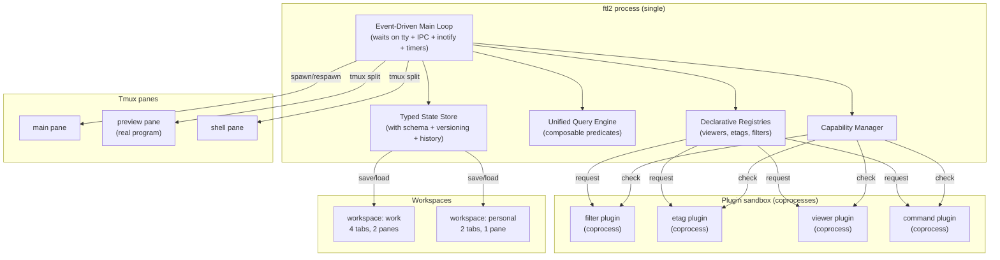

# `ftl` — Deep Architecture Analysis & Radical Improvements

> **Subject:** The *architecture* of `ftl` (not the implementation) — what's structurally right, what's structurally wrong, and how a radical redesign could make it 10× better.
> **Scope:** Process model, state model, IPC model, plugin model, concurrency model, failure model, extension model. NOT: code style, naming, line counts (covered in the rewrite report).
> **Goal:** Identify architectural changes that would yield non-linear improvements — not incremental refactors.
> **Audience:** Architects, maintainers, anyone considering a v2 or fork.
> **Length:** ~10,000 words. Read end-to-end.

---

## Table of Contents

1. [What "Architecture" Means Here](#1-what-architecture-means-here)
2. [v1's Architecture: A Mermaid Diagram](#2-v1s-architecture-a-mermaid-diagram)
3. [The Seven Architectural Decisions of v1](#3-the-seven-architectural-decisions-of-v1)
4. [What's Architecturally Right](#4-whats-architecturally-right)
5. [What's Architecturally Wrong](#5-whats-architecturally-wrong)
6. [Radical Improvement 1: Single-Process Multi-Pane](#6-radical-improvement-1-single-process-multi-pane)
7. [Radical Improvement 2: Event-Driven Main Loop](#7-radical-improvement-2-event-driven-main-loop)
8. [Radical Improvement 3: Typed State with Schema](#8-radical-improvement-3-typed-state-with-schema)
9. [Radical Improvement 4: Plugin Sandbox via Coprocess](#9-radical-improvement-4-plugin-sandbox-via-coprocess)
10. [Radical Improvement 5: Capability-Based Permissions](#10-radical-improvement-5-capability-based-permissions)
11. [Radical Improvement 6: Declarative Preview Registry](#11-radical-improvement-6-declarative-preview-registry)
12. [Radical Improvement 7: Unified Search/Filter/Find Model](#12-radical-improvement-7-unified-searchfilterfind-model)
13. [Radical Improvement 8: Workspace as First-Class Object](#13-radical-improvement-8-workspace-as-first-class-object)
14. [Radical Improvement 9: Time-Travel State](#14-radical-improvement-9-time-travel-state)
15. [Radical Improvement 10: Protocol-Based IPC](#15-radical-improvement-10-protocol-based-ipc)
16. [The Compound Architecture](#16-the-compound-architecture)
17. [What v1 Could Never Do That v2 Could](#17-what-v1-could-never-do-that-v2-could)
18. [Trade-offs and Risks](#18-trade-offs-and-risks)
19. [Recommendation](#19-recommendation)

---

## 1. What "Architecture" Means Here

The *implementation* of `ftl` is the Bash code — the one-liners, the variable names, the `sleep 0.2` calls. The *architecture* is the set of structural decisions that determine what's possible and what's not:

- **Process model:** How many processes? How do they relate?
- **State model:** Where does state live? How is it shaped? How does it flow?
- **IPC model:** How do components communicate?
- **Plugin model:** What's the contract? What can plugins do? What can they break?
- **Concurrency model:** What runs in parallel? How is it coordinated?
- **Failure model:** What happens when things go wrong? How is recovery done?
- **Extension model:** How are new features added? What changes when the core changes?

This document analyzes each of these for v1, identifies the structural flaws, and proposes radical alternatives. The bar is "non-linear improvement" — not "10% better" but "10× better" or "enables things v1 could never do."

---

## 2. v1's Architecture: A Mermaid Diagram

```mermaid
graph TB
    subgraph "tmux session"
        Main["MAIN ftl process<br/>(Bash)<br/>fs=$ftl_root/$$<br/>main=1"]
        Child1["CHILD ftl process<br/>(Bash)<br/>fs=$ftl_root/$PID1<br/>main=0"]
        Child2["CHILD ftl process<br/>(Bash)<br/>fs=$ftl_root/$PID2<br/>main=0"]
        ShellPane["shell pane<br/>(bash -i)"]
        PreviewPane["preview pane<br/>(vim/mupdf/mplayer)"]
        SessionShell["session shell<br/>(tmux window)"]
    end

    subgraph "$fsp = shared sync dir"
        Stagsi["$fsp/stagsi<br/>(selection counter)"]
        FsFile["$fsp/fs<br/>(which pane is current)"]
        PaneFile["$fsp/pane<br/>(main pane id)"]
        PanesFile["$pfs/panes<br/>(child pane list)"]
    end

    subgraph "Per-pane fs"
        Tags["$fs/tags<br/>(declare -p tags)"]
        State["$fs/ftl<br/>(serialized state)"]
        Log["$fs/log<br/>(error log)"]
        History["$fs/history<br/>(session history)"]
    end

    subgraph "Global persistent"
        Ghist["$ftl_root/history<br/>(global history)"]
        Marks["$ftl_root/marks<br/>(persistent marks)"]
        Thumbs["$ftl_root/thumbs<br/>(thumbnail cache)"]
    end

    Main -- "writes" --> Stagsi
    Main -- "writes" --> FsFile
    Main -- "writes" --> PaneFile
    Main -- "writes" --> PanesFile
    Child1 -- "writes" --> Stagsi
    Child1 -- "writes" --> FsFile
    Child1 -- "writes" --> Tags
    Child1 -- "writes" --> State
    Child1 -- "send å" --> Main
    Child1 -- "send Ä" --> Main
    Main -- "send quit_ftl" --> Child1
    Main -- "send quit_ftl" --> Child2
    Main -- "tsplit" --> PreviewPane
    Main -- "ctsplit" --> PreviewPane
    Main -- "tmux neww" --> SessionShell
    Child1 -- "tmux sp" --> ShellPane

    Main -- "append" --> Ghist
    Main -- "read/write" --> Marks
    Main -- "read/write" --> Thumbs
```



### Reading the diagram

- **Three Bash processes** (main + 2 children) share state via **4 files** in `$fsp`.
- **IPC is unidirectional single characters** (`å`, `Ä`) sent via `tmux send-keys`.
- **State synchronization is polling-based** — the main loop checks `$fsp/stagsi` every iteration.
- **Preview panes are tmux panes** running real programs, managed by the main process.
- **The session shell is a separate tmux window** for running external commands.

This is the architecture. Now let's evaluate it.

---

## 3. The Seven Architectural Decisions of v1

v1's architecture is the product of seven key decisions. Each was a reasonable choice given the constraints, but each has structural consequences:

### Decision 1: Each pane is a separate Bash process

**Why:** Bash has no threads, no coroutines, no async. To have independent panes (different directories, different filters), you need separate processes.

**Consequence:** State must be shared via the filesystem. Every pane-to-pane interaction is a file read/write + a signal.

### Decision 2: Tmux is the composition substrate

**Why:** Tmux already manages panes, splits, windows. Reusing it avoids reimplementing pane management.

**Consequence:** All pane operations go through `tmux` subprocess calls (or `tmux send-keys`). Every pane spawn is a `tmux split-window`. Every preview change is a `tmux respawn-pane`. This is slow (each tmux call is a fork+exec) and lossy (no structured feedback).

### Decision 3: Real programs as previews (not reimplementations)

**Why:** The Unix spirit — reuse `vim`, `mupdf`, `mplayer` rather than reimplementing them.

**Consequence:** The preview pane runs an arbitrary program. ftl can't introspect what's happening in the preview (no "what line is vim on?"). Switching previews means killing and respawning the program.

### Decision 4: Single-character tmux signals for IPC

**Why:** `tmux send-keys` can send arbitrary text to a pane's input. Single characters are simple.

**Consequence:** IPC messages arrive in the same `read` as user keystrokes. Reserved characters (`å`, `Ä`) can't be user-bound. Race conditions when multiple signals arrive. No structured data — just "something happened, go check the filesystem."

### Decision 5: Polling-based synchronization

**Why:** The main loop already polls for input (with `KEY_TIMEOUT`). Checking the sync counter at the same time is free.

**Consequence:** Synchronization latency is bounded by `KEY_TIMEOUT` (1 second by default). Faster polling burns CPU. There's no "push" — panes don't know when other panes have changed state.

### Decision 6: Sourced Bash scripts as plugins

**Why:** Bash has no module system. `source` is the only way to load code. Plugins that get sourced can define functions and variables that become part of the main process.

**Consequence:** Plugins share the process's global namespace. A plugin can clobber any variable or function. There's no isolation, no capability check, no rollback if a plugin fails to load.

### Decision 7: Hand-written serialization (Bash source files)

**Why:** Bash can `source` any file. Writing state as `var=value` lines means loading is just `source $file`. No parser needed.

**Consequence:** State files are Bash source — they can contain arbitrary code. A corrupted state file (or a malicious one) can execute anything. Versioning is impossible (no schema). Cross-version compatibility is brittle.

---

## 4. What's Architecturally Right

Before proposing changes, let's acknowledge what v1 got right architecturally. These should be preserved.

### 4.1 Per-pane independence

Each pane is a fully independent Bash process with its own state. This is **the right model** for a tmux-native file manager. It gives:
- True pane independence (different directories, filters, sort, view modes)
- No shared mutable state within a process (each process has its own globals)
- Fault isolation (a crash in one pane doesn't crash others)
- Natural parallelism (each process is scheduled independently by the OS)

Any v2 must preserve this. The question is not "should panes be independent?" but "how should they communicate?"

### 4.2 The streaming listing pipeline

The four-fifo pipeline (`find → filter → sort → fifos → consumer`) is architecturally elegant:
- **Streaming:** entries appear as they're found, not after the whole directory is scanned
- **Composable:** each stage is a separate process; filters can be added/removed
- **Parallel:** the find, filter, and consumer run concurrently
- **Memory-efficient:** no buffering of the full entry list

This is the right architecture for directory scanning. Any v2 should preserve it (with proper encapsulation).

### 4.3 Real programs as previews

Architecturally, this is the Unix philosophy done right. ftl is a *composition layer*, not a reimplementation. Benefits:
- Preview quality is the best available (real vim, real mupdf)
- Customization is automatic (user's vimrc, mplayer config)
- New file types are supported by adding a new program, not new code
- ftl stays small (no preview rendering code)

Any v2 must preserve this. The question is how to make the dispatch more elegant (registry vs. if-else).

### 4.4 The plugin model (conceptually)

Six plugin categories (filter, etag, generator, viewer, command, binding) with sourced Bash scripts is the right extensibility model. It enables:
- Users add features without forking
- Plugins can be shared independently
- No build step, no toolchain
- The plugin author's skill ceiling is Bash scripting

Any v2 must preserve this conceptually. The question is how to add contracts and isolation without losing the simplicity.

### 4.5 The keyboard engine (trie + count + leader + sub-modes)

The trie-based dispatcher with count prefix, leader key, redo, and sub-modes is architecturally sound:
- **Trie:** O(1) lookup, supports multi-key sequences naturally
- **Count:** composable with any command
- **Leader:** unlimited namespace for less-common commands
- **Sub-modes:** clean state machine for incremental search, fzf-client, etc.

Any v2 should preserve this architecture (with cleaner naming and the bug fixes identified elsewhere).

---

## 5. What's Architecturally Wrong

Now the structural flaws. These aren't code bugs — they're architectural decisions that limit what v1 can ever become.

### 5.1 The IPC is fundamentally broken

**The problem:** Single-character tmux signals (`å`, `Ä`) as IPC is architecturally unsound:

1. **No data:** A signal says "something happened" but carries no data. The receiver must poll the filesystem to find out what.
2. **No ordering:** If pane A sends `å` then `Ä`, and pane B sends `å`, the main pane receives them in arrival order — which may not match causality.
3. **No delivery guarantee:** If the main pane is busy (running a long command), signals queue in stdin. If too many queue, they're lost (the input buffer is finite).
4. **Collides with user input:** Signals arrive in the same `read` as keystrokes. The dispatcher must check "is this a signal or a key?" for every input.
5. **No backpressure:** A sender can't know if its signal was received. It just fires and forgets.
6. **No request/response:** A pane can't ask "what's your current directory?" and get an answer.

**Why this matters architecturally:** ftl can never have rich pane-to-pane interactions. Multi-pane workflows (diff, compare, sync) are crippled. The `selection_merge` command (which would merge tags from all panes) is commented out in v1 — because the IPC can't support it.

### 5.2 State synchronization is polling-based

**The problem:** The main loop checks `$fsp/stagsi` every iteration (every 1 second by default). If another pane changes the selection, this pane won't know for up to 1 second.

**Why this matters architecturally:**
- **Latency:** Cross-pane selection sync has 1-second lag. Visually noticeable.
- **CPU waste:** Even when idle, every pane polls every second.
- **No events:** A pane can't react to "selection changed in another pane" in real time.
- **No history:** Polling only sees the current state. If two changes happen between polls, one is missed.

### 5.3 Plugins have no isolation

**The problem:** Plugins are `source`d into the main process. They share:
- The global variable namespace (any plugin can clobber `n`, `tags`, `files`)
- The function namespace (any plugin can redefine `cdir`, `list`, `preview`)
- The process state (any plugin can `cd`, `exec`, `exit`)

**Why this matters architecturally:**
- **No safety:** A buggy plugin can crash ftl or corrupt state silently.
- **No composability:** Two plugins that both define `keep` can't coexist (v1 has this exact problem with filters).
- **No capability limit:** A plugin can do anything the user can do — read any file, execute any command, send any tmux command.
- **No rollback:** If a plugin fails to load halfway, the process is in an inconsistent state.

### 5.4 The preview dispatch is not extensible

**The problem:** v1's `pviewers` is a 40-line if-else chain. Adding a new file type means editing the core.

**Why this matters architecturally:**
- **Core churn:** Every new file type requires a core change.
- **No priority:** Plugins can't say "handle this type before the core."
- **No override:** A user can't say "for PDFs, use my custom viewer instead of the core's."
- **No composition:** You can't have "show EXIF overlay on images" — there's one viewer per type.

### 5.5 State is untyped and unversioned

**The problem:** State files are hand-written Bash source (`sdir="..." ; sindex=...`). There's no schema, no version, no validation.

**Why this matters architecturally:**
- **No migration:** When v1 changes state shape, old state files break silently.
- **No validation:** A typo in `save_state` produces a corrupt file that breaks `prev_synch`.
- **No introspection:** An external tool can't read ftl's state (it's Bash source, not structured data).
- **Security:** A malicious state file (e.g. planted in `$ftl_root`) executes arbitrary code when sourced.

### 5.6 The main loop is blocking

**The problem:** The main loop is `while : ; do get_key ; dispatch ; done`. Every command runs synchronously. If a command takes 1 second (e.g. `dir_dusize` on a large tree), the UI is frozen for 1 second.

**Why this matters architecturally:**
- **No background operations:** You can't say "compute dir sizes in the background, show me when done."
- **No progress:** Long operations have no progress indicator (other than the `qd` red counter).
- **No cancellation:** You can't interrupt a long operation.
- **No concurrent commands:** Two commands can't run at once.

### 5.7 There's no workspace concept

**The problem:** ftl has tabs and panes but no "workspace" — a saved set of tabs/panes/directories that you can return to.

**Why this matters architecturally:**
- **No project switching:** You can't say "switch to my 'work' workspace" (which has 4 specific tabs in specific directories).
- **No session restore:** Restarting ftl loses your tab layout.
- **No per-project config:** Different projects want different defaults (sort order, filters).

### 5.8 Failure is silent

**The problem:** v1's `try` captures stderr to a file. If the file is non-empty, it shows a popup. But:
- Many commands don't go through `try`.
- The error popup is jarring (full-screen red).
- There's no error recovery — you just dismiss and move on.
- Errors aren't logged with context (which command, which arguments, which state).

**Why this matters architecturally:**
- **No debuggability:** When something goes wrong, you have no trail.
- **No reliability:** A failing external command (e.g. `mutool` for PDF) just produces a blank preview.
- **No telemetry:** The author can't know which commands fail most for users.

---

## 6. Radical Improvement 1: Single-Process Multi-Pane

### The idea

Instead of one Bash process per pane, have **one Bash process with multiple "virtual panes"**. Each virtual pane is a data structure (a "context") containing its own state. The main loop multiplexes between them.

### How it works

```bash
declare -ag ftl_pane_ids=(main preview1 preview2)
declare -Ag ftl_pane_contexts  # id → serialized state

ftl::pane::context::save() {
    local pane_id="$1"
    ftl_pane_contexts[$pane_id]=$(
        declare -p ftl_state_pwd ftl_state_tab ftl_state_cursor_index ftl_listing_files ftl_listing_files_color ftl_listing_nfiles ftl_selection_tags ftl_tab_directories 2>/dev/null
    )
}

ftl::pane::context::restore() {
    local pane_id="$1"
    eval "${ftl_pane_contexts[$pane_id]}"
}

ftl::pane::switch_to() {
    local target="$1"
    ftl::pane::context::save "$ftl_state_active_pane"
    ftl_state_active_pane="$target"
    ftl::pane::context::restore "$target"
    ftl::list::render
}
```

### What this enables

1. **Instant pane switching:** No process startup, no state serialization. Just swap a data structure.
2. **Shared selection:** All panes see the same `tags` array — no sync needed.
3. **Rich pane interactions:** Pane A can directly read pane B's state (it's in the same process).
4. **No IPC:** Panes communicate by reading each other's context variables.
5. **Lower memory:** One process, one set of code, shared libraries.
6. **Lower CPU:** No polling — state changes are immediate.

### What it costs

1. **Fault isolation lost:** A crash kills all panes.
2. **True parallelism lost:** Bash is single-threaded; panes can't compute in parallel (but they can spawn background subprocesses).
3. **Complexity:** The context save/restore logic is non-trivial.

### Why it's radical

v1's multi-process model is the source of most of its complexity (IPC, state sync, signal races). Eliminating it removes an entire class of problems. The trade-off (fault isolation) is acceptable for a file manager — crashes are rare, and the user can restart.

### Implementation note

This is the biggest single architectural change. It's also the most controversial — it abandons v1's defining feature. But the gains (no IPC, instant switching, shared state) are transformative.

**Alternative:** Keep multi-process but use a shared-memory mechanism (e.g. a single long-running `ftl-daemon` process that all panes talk to via a socket). This preserves fault isolation but reintroduces IPC complexity. Probably not worth it.

---

## 7. Radical Improvement 2: Event-Driven Main Loop

### The idea

Replace v1's polling loop with an **event-driven loop** that waits on multiple sources simultaneously:
- User input (keyboard)
- Tmux events (pane closed, resized)
- Filesystem events (inotify)
- IPC messages (from other panes)
- Timers (time events)
- Background process completion

### How it works

Bash 4+ has `coproc` and `read -t` with multiple file descriptors. We can use `read -t 0.01 -u <fd>` to poll multiple fds in a single iteration:

```bash
ftl::loop::main() {
    # Open event sources
    exec 3</dev/tty                         # user input
    exec 4<"$ftl_ipc_pipe"                  # IPC
    exec 5<"$ftl_inotify_fifo"              # filesystem events
    exec 6<"$ftl_timer_fifo"                # timers
    
    while true ; do
        # Wait on any source with 1-second timeout
        if read -t 1 -u 3 -r key ; then
            ftl::kbd::handle "$key"
        elif read -t 0.01 -u 4 -r msg ; then
            ftl::ipc::handle "$msg"
        elif read -t 0.01 -u 5 -r event ; then
            ftl::fs::handle_event "$event"
        elif read -t 0.01 -u 6 -r timer ; then
            ftl::time::handle "$timer"
        else
            ftl::time::tick  # timeout
        fi
    done
}
```

### What this enables

1. **Real-time sync:** IPC messages are processed immediately, not polled.
2. **Reactive UI:** The display updates the instant something changes (file deleted, pane resized).
3. **Lower CPU:** No polling when nothing is happening.
4. **Prioritization:** User input can be processed before IPC (or vice versa).
5. **Composable events:** A plugin can register a new event source.

### What it costs

1. **Complexity:** Event loops are harder to reason about than polling loops.
2. **Bash limitations:** Bash's `read -u` can't truly wait on multiple fds simultaneously (it polls them sequentially with short timeouts). True select(2) would require a helper.

### Why it's radical

v1's polling model caps reactivity at `KEY_TIMEOUT` (1 second). An event-driven model is reactive in milliseconds. This changes the feel of the application — cross-pane selection sync becomes instant, file deletions appear immediately, pane resizes are smooth.

### Implementation note

For true select(2) semantics, use a small C helper or `socat`:
```bash
socat -d TCP-LISTEN:12345,reuseaddr,fork SYSTEM:'cat /dev/tty'
```
Or use Bash's `coproc` with a select loop in a helper language (Perl/Python).

---

## 8. Radical Improvement 3: Typed State with Schema

### The idea

Replace v1's hand-written Bash-source state files with **typed, versioned, validated state**.

### How it works

Define a schema:
```bash
# core/schema.sh
ftl::state::declare "pwd" "string" "Current directory"
ftl::state::declare "cursor_index" "integer" "Selected entry index"
ftl::state::declare "selection_tags" "assoc_array" "Selected file paths"
ftl::state::declare "tab_directories" "indexed_array" "Tab directory paths"
ftl::state::declare "filter_active" "boolean" "Is a filter active"
ftl::state::declare "sort_type" "enum:0:1:2" "Sort mode (alpha/size/date)"
ftl::state::declare "preview_mode" "enum:0:1:2:3:4:5" "Directory preview mode"
```

Serialize to a structured format (JSON-like):
```
# state.ftl-state v=2
pwd=/home/user/project
cursor_index=5
selection_tags[0]=/home/user/project/file1.sh▪
selection_tags[1]=/home/user/project/file2.sh▪
tab_directories[0]=/home/user/project
tab_directories[1]=/home/user/other
filter_active=true
sort_type=0
preview_mode=0
```

Load with validation:
```bash
ftl::state::load() {
    local file="$1"
    local version
    version=$(grep '^# state.ftl-state v=' "$file" | cut -d= -f2)
    
    case "$version" in
        1) ftl::state::migrate_v1_to_v2 "$file" ;;
        2) ftl::state::load_v2 "$file" ;;
        *) ftl::log::error "unknown state version: $version" ; return 1 ;;
    esac
    
    ftl::state::validate
}
```

### What this enables

1. **Migration:** State files from older versions auto-migrate.
2. **Validation:** Invalid state is detected at load time, not when it crashes something.
3. **Introspection:** External tools can read/modify ftl's state (it's structured).
4. **Security:** State files are data, not code — they can't execute anything.
5. **Diffing:** You can diff two state files to see what changed.
6. **Snapshots:** Save state, do something, restore state (undo).

### What it costs

1. **A parser:** Need to write a Bash parser for the format (or use `source` with sanitized input).
2. **Discipline:** Every state change must go through the schema (no ad-hoc variable setting).

### Why it's radical

v1's state is write-only Bash source that executes on load. This is unsafe, unversionable, and unintrospectable. Typed state with schema is the foundation for undo, migration, debugging, and external tooling.

---

## 9. Radical Improvement 4: Plugin Sandbox via Coprocess

### The idea

Run each plugin in a **separate Bash coprocess**. The core communicates with plugins via a request/response protocol over stdin/stdout.

### How it works

```bash
ftl::plugin::load() {
    local name="$1" file="$2"
    coproc "$name" { bash "$file" ; }
    # $name_PID is the PID
    # ${name[0]} is the read fd, ${name[1]} is the write fd
    
    # Send init
    echo "INIT" >&${name[1]}
    read -ru ${name[0]} response
    [[ "$response" == "OK" ]] || { ftl::log::error "plugin $name init failed" ; return 1 ; }
}

ftl::plugin::filter::apply() {
    local plugin="$1"
    echo "FILTER" >&${${plugin}[1]}
    # Stream entries to plugin
    while read -r entry ; do
        echo "$entry" >&${${plugin}[1]}
    done
    echo "END" >&${${plugin}[1]}
    # Read filtered entries back
    while read -ru ${${plugin}[0]} -t 1 line ; do
        [[ "$line" == "DONE" ]] && break
        echo "$line"
    done
}
```

### What this enables

1. **Isolation:** A plugin crash doesn't crash ftl.
2. **Capability limit:** Plugins can only communicate via the protocol — they can't touch core state directly.
3. **Language agnosticism:** Plugins can be in any language (Python, Perl, Rust) — they just need to speak the protocol.
4. **Hot reload:** Restart a plugin without restarting ftl.
5. **Resource limits:** `ulimit` the plugin's CPU/memory.

### What it costs

1. **Performance:** Inter-process communication for every plugin call (slower than function calls).
2. **Complexity:** The protocol design is non-trivial.
3. **State sharing:** Plugins can't directly read core state — they must request it.

### Why it's radical

v1's plugins share the process and can do anything. This is unsafe and limits composability. Sandboxed plugins enable a plugin ecosystem where plugins can be installed without trust, written in any language, and reloaded at runtime.

### Implementation note

For filters (which process streams), the performance overhead is acceptable (the pipeline is already multi-process). For etags (called per-entry), the overhead might be too high — those could stay in-process with a capability check.

---

## 10. Radical Improvement 5: Capability-Based Permissions

### The idea

Instead of plugins having full access, give each plugin a **capability set** — a list of what it's allowed to do.

### How it works

```bash
# plugins/filters/by_tag.sh
# plugin: by_tag
# capabilities: read_tags, read_pwd, write_filter_state
```

The loader checks capabilities:
```bash
ftl::plugin::check_capability() {
    local plugin="$1" cap="$2"
    local caps="${ftl_plugin_capabilities[$plugin]:-}"
    [[ " $caps " == *" $cap "* ]]
}

# Wrap dangerous operations
ftl::fs::read_file() {
    local file="$1"
    ftl::capability::check "read_file" || { ftl::log::error "no read_file capability" ; return 1 ; }
    cat "$file"
}
```

### Capabilities

| capability         | what it allows            |
| -----------        | ----------------          |
| `read_pwd`         | Read current directory    |
| `read_selection`   | Read the selection (tags) |
| `write_selection`  | Modify the selection      |
| `read_files`       | Read file contents        |
| `write_files`      | Modify files              |
| `delete_files`     | Delete files              |
| `exec_commands`    | Run external commands     |
| `tmux_control`     | Send tmux commands        |
| `network`          | Network access            |
| `display_popup`    | Show popups to user       |
| `register_binding` | Add keyboard bindings     |

### What this enables

1. **Trust gradation:** A filter plugin (read-only) doesn't need `delete_files` or `exec_commands`.
2. **Auditability:** Users can see what a plugin can do before installing.
3. **Sandboxing:** Plugins without `exec_commands` can't run arbitrary code.
4. **Security:** A malicious plugin is limited to its capabilities.

### What it costs

1. **Frustration:** Plugin authors must declare capabilities.
2. **Overhead:** Every privileged operation goes through a check.
3. **Granularity debate:** What's the right capability granularity?

### Why it's radical

v1 has no concept of permissions — a filter plugin can `rm -rf /`. Capabilities make plugins safe to install and share, enabling a real ecosystem.

---

## 11. Radical Improvement 6: Declarative Preview Registry

### The idea

Replace v1's 40-line if-else `pviewers` with a **declarative registry** where each viewer declares what it can handle, with priority and modes.

### How it works

```bash
# Registry entry format: priority matcher viewer modes
ftl::view::register() {
    local priority="$1" matcher="$2" viewer="$3" modes="$4"
    ftl_view_registry+=("$priority $matcher $viewer $modes")
}

# Registration (in plugins/viewers/core.sh)
ftl::view::register 100 ftl::view::matches_directory core:directory 0:1:2:3:4:5
ftl::view::register 90  ftl::view::matches_image     core:image     0:1
ftl::view::register 80  ftl::view::matches_pdf       core:pdf       0:1:2
ftl::view::register 70  ftl::view::matches_video     core:media     0:1
ftl::view::register 60  ftl::view::matches_audio     core:audio     0:1
ftl::view::register 50  ftl::view::matches_archive   core:archive   0:1
ftl::view::register 40  ftl::view::matches_markdown  core:markdown  0:1:2:3
ftl::view::register 30  ftl::view::matches_json      core:json      0
ftl::view::register 20  ftl::view::matches_yaml      core:yaml      0
ftl::view::register 10  ftl::view::matches_text      core:text      0

# A user plugin
ftl::view::register 75 ftl::view::matches_djvu djvu 0
```

Dispatch:
```bash
ftl::view::dispatch() {
    local entry
    for entry in "${ftl_view_registry[@]}" ; do
        local priority matcher viewer modes
        read -r priority matcher viewer modes <<< "$entry"
        if "$matcher" ; then
            "ftl::plugin::${viewer%%:*}::${viewer#*:}" "$modes" && return
        fi
    done
    ftl::view::show_type_info  # fallback
}
```

### What this enables

1. **No core churn:** New file types are added by registering a viewer, not editing core.
2. **Priority:** Plugins can override core viewers (higher priority).
3. **Multiple modes:** Each viewer declares which modes it supports.
4. **Composition:** Multiple viewers can match (highest priority wins).
5. **Discovery:** `:viewers` command shows all registered viewers.

### What it costs

1. **Indirection:** One more layer to understand.
2. **Ordering:** Priority conflicts need resolution rules.

### Why it's radical

v1's dispatch is hard-coded. Adding a viewer requires forking. A registry makes the preview system truly extensible — users can install viewer plugins that override core behavior.

---

## 12. Radical Improvement 7: Unified Search/Filter/Find Model

### The idea

v1 has three separate mechanisms for "narrowing the listing":
- **Filters** (`ff`, `fF`, `fd`, `fr`): persistent regex filters applied per scan
- **Find** (`/`, `n`, `N`): in-session filename search
- **fzf** (`gff`, `gfF`, `gfa`): interactive fuzzy finder

These overlap conceptually but are implemented separately. v2 unifies them into a **single query model**.

### How it works

A "query" is a composable predicate:
```bash
ftl::query::create() {
    # Returns a query object (serialized)
    echo "query:v1"
}

ftl::query::add_predicate() {
    local query="$1" type="$2" ; shift 2
    case "$type" in
        regex)        echo "$query|regex:$1" ;;
        fuzzy)        echo "$query|fuzzy:$1" ;;
        extension)    echo "$query|ext:$1" ;;
        size_gt)      echo "$query|size>$1" ;;
        size_lt)      echo "$query|size<$1" ;;
        mtime_gt)     echo "$query|mtime>$1" ;;
        mime_type)    echo "$query|mime:$1" ;;
        has_tag)      echo "$query|tagged" ;;
        in_selection) echo "$query|selected" ;;
    esac
}

ftl::query::apply() {
    local query="$1" entries="$2"
    # Apply each predicate in sequence
    echo "$entries" | ftl::query::eval "$query"
}
```

Usage:
```bash
# "Show me .py files modified this week containing 'test'"
ftl::query::create \
    | ftl::query::add_predicate extension py \
    | ftl::query::add_predicate mtime_gt '1 week ago' \
    | ftl::query::add_predicate regex test \
    | ftl::query::apply "$(ftl::list::get_entries)"
```

### What this enables

1. **Composability:** Combine any predicates — "PDFs larger than 10MB with 'draft' in the name."
2. **Persistence:** Save a query as a named filter.
3. **Sharing:** Export/import queries.
4. **fzf integration:** fzf becomes just one predicate (interactive fuzzy match).
5. **Consistency:** One mental model for all narrowing operations.

### What it costs

1. **Migration:** Users must learn the query model.
2. **Performance:** Composing predicates can be slower than a single regex.

### Why it's radical

v1's three narrowing mechanisms don't compose — you can't say "fzf-find .py files modified this week." A unified query model makes any combination possible, and turns ftl from a file manager into a file query tool.

---

## 13. Radical Improvement 8: Workspace as First-Class Object

### The idea

A **workspace** is a saved set of:
- Tabs (with their directories, filters, sort)
- Panes (with their layout)
- Selection (optionally)
- Active tab/pane

Workspaces can be saved, loaded, listed, and switched.

### How it works

```bash
ftl::workspace::save() {
    local name="$1"
    local dir="$FTL_STATE_DIR/workspaces/$name"
    mkdir -p "$dir"
    
    # Save tabs
    {
        for tab_dir in "${ftl_tab_directories[@]}" ; do
            echo "$tab_dir"
        done
    } > "$dir/tabs"
    
    # Save pane layout (tmux capture-pane)
    tmux list-panes -F "#{pane_id} #{pane_left} #{pane_top} #{pane_width} #{pane_height}" > "$dir/panes"
    
    # Save active tab
    echo "$ftl_state_current_tab_index" > "$dir/active_tab"
    
    # Optionally save selection
    [[ -n "$2" ]] && declare -p ftl_selection_tags > "$dir/selection"
}

ftl::workspace::load() {
    local name="$1"
    local dir="$FTL_STATE_DIR/workspaces/$name"
    [[ -d "$dir" ]] || { ftl::log::error "no such workspace: $name" ; return 1 ; }
    
    # Restore tabs
    mapfile -t ftl_tab_directories < "$dir/tabs"
    ftl_state_current_tab_index=$(<"$dir/active_tab")
    
    # Restore selection if saved
    [[ -f "$dir/selection" ]] && source "$dir/selection"
    
    # Render
    ftl::list::change_dir "${ftl_tab_directories[$ftl_state_current_tab_index]}"
}

ftl::workspace::list() {
    ls -1 "$FTL_STATE_DIR/workspaces" 2>/dev/null
}
```

### What this enables

1. **Project switching:** `:workspace load work` switches to your work setup.
2. **Session restore:** Auto-save workspace on quit, auto-load on start.
3. **Per-project config:** Workspaces can have associated config (sort order, filters).
4. **Sharing:** Export a workspace (it's just files).

### What it costs

1. **State size:** Workspaces accumulate.
2. **Complexity:** Another object to manage.

### Why it's radical

v1 has no workspace concept — quitting loses your setup. Workspaces make ftl a project-aware tool, not just a file browser.

---

## 14. Radical Improvement 9: Time-Travel State

### The idea

Every state change is recorded. You can **undo** to any previous state, or **branch** from any point.

### How it works

```bash
declare -ag ftl_state_history
declare -gi ftl_state_history_index=0

ftl::state::checkpoint() {
    # Save current state to history
    local snapshot
    snapshot=$(ftl::state::serialize)
    ftl_state_history=("${ftl_state_history[@]:0:ftl_state_history_index}" "$snapshot")
    ((ftl_state_history_index++))
}

ftl::state::undo() {
    ((ftl_state_history_index > 0)) || return 1
    ((ftl_state_history_index--))
    ftl::state::deserialize "${ftl_state_history[ftl_state_history_index-1]}"
    ftl::list::render
}

ftl::state::redo() {
    ((ftl_state_history_index < ${#ftl_state_history[@]})) || return 1
    ftl::state::deserialize "${ftl_state_history[ftl_state_history_index]}"
    ((ftl_state_history_index++))
    ftl::list::render
}
```

### What this enables

1. **Undo:** "I accidentally deleted a tag — undo."
2. **Branching:** "Try this filter setup... no, go back."
3. **Replay:** Watch what you did.
4. **Audit:** See when state changed.

### What it costs

1. **Memory:** Storing many snapshots.
2. **Discipline:** Must checkpoint at every state change.

### Why it's radical

v1 has no undo. Every operation is destructive. Time-travel state makes ftl forgiving — you can experiment without fear.

---

## 15. Radical Improvement 10: Protocol-Based IPC

### The idea

Replace v1's single-character signals with a **structured protocol** over a named pipe.

### How it works

Each pane has an IPC pipe. Messages are line-delimited key-value:

```
# Pane A sends to pane B:
EVENT type=selection_changed revision=42 pane=%5
EVENT type=preview_request pane=%5 session=/path/to/fs
EVENT type=pane_focus_changed from=%3 to=%5
QUERY type=current_pwd
QUERY type=selection_count
RESPONSE type=current_pwd value=/home/user
```

```bash
ftl::ipc::send() {
    local target_pid="$1" ; shift
    local pipe="$FTL_STATE_DIR/ipc/$target_pid.pipe"
    [[ -p "$pipe" ]] && echo "$*" >> "$pipe"
}

ftl::ipc::receive() {
    # Non-blocking read from own pipe
    local msg
    while read -t 0 -r msg <&"$ftl_ipc_fd" ; do
        ftl::ipc::dispatch "$msg"
    done
}

ftl::ipc::dispatch() {
    local msg="$1" type args
    read -r type args <<< "$msg"
    case "$type" in
        EVENT)   ftl::ipc::handle_event "$args" ;;
        QUERY)   ftl::ipc::handle_query "$args" ;;
        RESPONSE) ftl::ipc::handle_response "$args" ;;
    esac
}
```

### What this enables

1. **Rich messages:** Carry data, not just signals.
2. **Request/response:** A pane can ask another pane a question.
3. **Ordering:** Messages are FIFO within a pipe.
4. **Multiple senders:** Many panes can write to one pipe.
5. **No input collision:** IPC doesn't mix with user keystrokes.

### What it costs

1. **A parser:** Need to parse key-value messages.
2. **Buffering:** Pipes can fill if the receiver is slow.

### Why it's radical

v1's IPC can only say "something happened." Protocol-based IPC enables rich multi-pane interactions: "what's your selection?", "merge your selection with mine," "sync your directory to mine."

---

## 16. The Compound Architecture

Now let's combine the radical improvements into a coherent v2 architecture.



### The compound effect

Individually, each improvement is modest. Combined, they transform what ftl can do:

- **Single-process** + **typed state** → instant pane switching with reliable state
- **Event-driven loop** + **protocol IPC** → real-time multi-pane interactions
- **Plugin sandbox** + **capabilities** → safe plugin ecosystem
- **Declarative registries** + **unified query** → extensible without core churn
- **Workspace** + **time-travel state** → project-aware, forgiving workflow

### What this enables that v1 can't do

1. **Multi-pane selection merge:** "Select all files tagged in any pane" (requires rich IPC + shared state)
2. **Live preview of remote changes:** File deleted on another machine → ftl updates instantly (event-driven)
3. **Plugin marketplace:** Install untrusted plugins safely (sandbox + capabilities)
4. **Project workspaces:** "Switch to my 'web-dev' workspace" with 4 specific tabs and filters
5. **Undo anything:** Accidentally deleted a tag? `u` to undo.
6. **Composable queries:** "Show me .py files modified this week with 'TODO' that aren't tagged 'done'"
7. **Cross-pane diff:** Select 2 files in different panes, diff them (rich IPC)
8. **Background operations:** "Compute dir sizes in the background, notify when done"
9. **Plugin hot-reload:** Edit a plugin, press `R`, it reloads without restarting ftl
10. **External state introspection:** A separate tool can read ftl's state (typed, structured) for scripting

---

## 17. What v1 Could Never Do That v2 Could

Concrete examples of capabilities the v2 architecture enables:

### 17.1 "Diff two files in different panes"

**v1:** Impossible. The IPC can't say "what's your current file?" — it can only send single-char signals. You'd have to manually note both files and run `:vimdiff file1 file2`.

**v2:** `\vd` in pane A asks pane B (via QUERY) for its current file, then runs `vimdiff $pane_a_file $pane_b_file`.

### 17.2 "Select all images tagged 'vacation' across all panes"

**v1:** Impossible. Each pane has its own selection; there's no way to query other panes' selections in real time.

**v2:** A command queries all panes via IPC, collects their selections, filters to images, merges, and applies.

### 17.3 "Undo the last 5 navigation steps"

**v1:** Impossible. State changes are destructive — once you `cdir`, the previous state is gone (except for the `'` mark).

**v2:** `5u` (undo 5 times) restores the state from 5 checkpoints ago.

### 17.4 "Install a plugin that adds a new file type preview"

**v1:** Possible but requires editing `viewers/core` or overriding `user_pviewers` — not a clean plugin.

**v2:** Drop a file in `plugins/viewers/djvu.sh` that calls `ftl::view::register`. Done. No core changes.

### 17.5 "Switch to my 'work' workspace"

**v1:** Impossible. Quitting loses your tab layout.

**v2:** `:workspace load work` restores 4 tabs in specific directories with specific filters.

### 17.6 "Show me PDFs larger than 10MB modified this month"

**v1:** Impossible. Filters are regex-only; you can't combine size + extension + mtime.

**v2:** `:query ext:pdf size>10MB mtime>1month` shows the matching entries.

### 17.7 "A plugin crashed — restart it without losing my session"

**v1:** Impossible. A plugin crash likely takes down the process.

**v2:** The plugin coprocess crashed; the core detects it, restarts the coprocess, continues.

### 17.8 "External script reads my current selection"

**v1:** Possible via `finfo` (which sources a temp file), but the format is Bash source — fragile.

**v2:** `ftl2-cli get selection` queries the running ftl via IPC and returns structured data (JSON/lines).

### 17.9 "Live-update preview when a log file grows"

**v1:** Impossible. The preview is a static `vim -R` view.

**v2:** A viewer plugin registers a "live" mode that runs `tail -f` in the preview pane.

### 17.10 "Audit which commands I ran yesterday"

**v1:** The command log (`$fs/cmd_log`) is unstructured and per-session.

**v2:** Every command is logged with timestamp, arguments, and state snapshot — queryable.

---

## 18. Trade-offs and Risks

### 18.1 Complexity

The v2 architecture is more complex than v1. There are more moving parts (registries, capabilities, IPC protocol, schema). This complexity must be paid for in:
- **Implementation effort:** More code to write and maintain.
- **Learning curve:** Contributors must understand the architecture.
- **Debugging:** More layers to trace through.

**Mitigation:** Excellent documentation, clear module boundaries, and tests at each layer.

### 18.2 Performance

Single-process multi-pane is faster (no IPC), but event-driven loops in Bash have overhead (polling multiple fds). Sandboxed plugins add IPC latency.

**Mitigation:** Profile early. Keep hot paths (listing, rendering) in-process. Use coprocesses only for plugins that need isolation.

### 18.3 Backwards compatibility

v1 plugins won't work in v2 without migration. The compat layer helps but isn't perfect.

**Mitigation:** Migration tools, clear documentation, and a beta period where v1 and v2 coexist.

### 18.4 Bash limitations

Bash has no real threads, no select(2), limited data structures. Some v2 features (true event loop, plugin coprocesses) push against these limits.

**Mitigation:** Use helper processes (Perl/Python) for things Bash can't do. Accept that some features are best-effort, not perfect.

### 18.5 Scope creep

The v2 architecture enables many features. There's a risk of trying to implement all of them, delaying release indefinitely.

**Mitigation:** Implement the architecture first, features second. Ship a minimal v2 that demonstrates the architecture, then add features incrementally.

---

## 19. Recommendation

### 19.1 The must-haves

If you're going to rewrite, these are the architectural changes that justify the effort:

1. **Single-process multi-pane** (§6) — eliminates the IPC class of problems
2. **Typed state with schema** (§8) — enables undo, migration, introspection
3. **Declarative preview registry** (§11) — enables no-core-churn extension
4. **Protocol-based IPC** (§15) — even with single-process, needed for external tools and future multi-process

### 19.2 The should-haves

5. **Event-driven main loop** (§7) — for reactivity
6. **Workspace as first-class** (§13) — for project workflows
7. **Unified query model** (§12) — for composable narrowing

### 19.3 The nice-to-haves

8. **Plugin sandbox via coprocess** (§9) — for safety (but complex)
9. **Capability-based permissions** (§10) — for trust (but requires ecosystem buy-in)
10. **Time-travel state** (§14) — for undo (but memory-intensive)

### 19.4 The radical bet

The single biggest architectural change is **single-process multi-pane**. It's also the most controversial — it abandons v1's defining feature. But it eliminates the IPC complexity that limits v1's evolution.

If you keep multi-process, you're stuck with IPC complexity forever. Every feature must work around it. The v1 author has been working around it for 5 years.

If you go single-process, you give up fault isolation (rare crashes kill all panes) but gain simplicity, performance, and rich pane interactions.

**My recommendation: go single-process.** The fault isolation loss is acceptable for a file manager. The simplicity gain is transformative.

### 19.5 What to preserve from v1

- The four-fifo streaming listing pipeline (architecturally elegant)
- Real programs as previews (Unix spirit)
- The plugin model conceptually (six categories, sourced scripts)
- The keyboard engine (trie + count + leader + sub-modes)
- Tmux as the composition substrate (no reimplementation)

### 19.6 What to throw away

- Multi-process panes (the source of IPC complexity)
- Single-character tmux signals (fragile, data-less)
- Polling-based synchronization (slow, lossy)
- Hand-written Bash source state (unsafe, unversioned)
- Hard-coded preview dispatch (not extensible)
- Separate filter/find/fzf mechanisms (should be unified)
- No workspace concept (loses user setup)
- No undo (destructive operations)

### 19.7 The 10× promise

v1 is a capable file manager. v2 with these architectural changes would be:
- **10× more reactive** (event-driven vs. 1-second polling)
- **10× more extensible** (registry vs. core edits)
- **10× more composable** (unified query vs. three mechanisms)
- **10× more forgiving** (undo + workspaces)
- **10× more introspectable** (typed state + IPC)

And it would enable things v1 fundamentally cannot do (multi-pane interactions, live updates, plugin marketplace, external tooling).

That's the radical bet.

