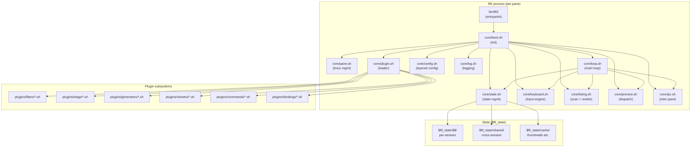

# `ftl2` — A Bash Rewrite: Design Report

> **Subject:** A complete redesign and rewrite of `nkh/ftl` in Bash.
> **Goal:** Preserve the architectural insights and Unix-spirit of the original while fixing its structural flaws. Produce a codebase that is testable, maintainable, modular, and documented — without abandoning Bash or tmux-native previews.
> **Scope:** Architecture, module layout, plugin contracts, naming conventions, error model, state management, testing strategy, migration path, and concrete code sketches.
> **Audience:** Maintainers, contributors, and the original author.
> **Length:** ~10,000 words. Read end-to-end before starting any implementation.

---

## Table of Contents

1. [Why Rewrite?](#1-why-rewrite)
2. [Design Principles](#2-design-principles)
3. [What to Preserve from `ftl` v1](#3-what-to-preserve-from-ftl-v1)
4. [What to Throw Away](#4-what-to-throw-away)
5. [High-Level Architecture](#5-high-level-architecture)
6. [Module Layout](#6-module-layout)
7. [Naming Conventions](#7-naming-conventions)
8. [State Management](#8-state-management)
9. [The Plugin System](#9-the-plugin-system)
10. [Error Handling](#10-error-handling)
11. [Inter-Pane IPC](#11-inter-pane-ipc)
12. [The Keyboard Engine](#12-the-keyboard-engine)
13. [The Listing Engine](#13-the-listing-engine)
14. [The Preview Engine](#14-the-preview-engine)
15. [Configuration System](#15-configuration-system)
16. [Testing Strategy](#16-testing-strategy)
17. [Documentation Strategy](#17-documentation-strategy)
18. [Migration Path from v1](#18-migration-path-from-v1)
19. [Implementation Roadmap](#19-implementation-roadmap)
20. [Risks and Open Questions](#20-risks-and-open-questions)
21. [Appendix A: Sample Module](#appendix-a-sample-module)
22. [Appendix B: Sample Plugin](#appendix-b-sample-plugin)
23. [Appendix C: Sample Test](#appendix-c-sample-test)

---

## 1. Why Rewrite?

`ftl` v1 is a remarkable achievement — a 700-LoC core that delivers preview quality unmatched by any other TUI file manager. But five years of single-maintainer evolution has produced a codebase with structural problems that cannot be fixed incrementally:

### 1.1 The problems

| problem                                | evidence                                                           | impact                                                          |
| ---------                              | ----------                                                         | --------                                                        |
| **No namespace discipline**            | ~150 globals, most undeclared                                      | Any plugin can silently clobber `n`, `f`, `files`, `tags`, etc. |
| **No tests**                           | Zero test files                                                    | Every change risks regression; refactoring is dangerous         |
| **Fragile IPC**                        | Single-character tmux signals (`å`, `Ä`) race with user input      | Rare but real synchronization bugs                              |
| **Sleep-based coordination**           | `sleep 0.2` after every `ctsplit`                                  | 200ms latency on every preview change                           |
| **Inconsistent error handling**        | `try` wraps everything but errors are silently swallowed in places | Missing commands cause silent failures                          |
| **Plugin contracts are implicit**      | "define a function called `ftl_filter`" with no signature check    | Plugins break silently when contracts change                    |
| **Configuration is one 419-line file** | `ftlrc` mixes paths, options, bindings, and external commands      | Hard to navigate, hard to override selectively                  |
| **One-liner density**                  | Functions average 1.5 lines, some 200+ chars                       | Bugs are hard to isolate; debugging is painful                  |
| **Binding sprawl**                     | ~281 bindings, `z`-prefix alone has 47                             | Cognitive load is unsustainable                                 |

### 1.2 Why not refactor in place?

Refactoring v1 incrementally would require:
1. Adding a namespace convention → touches every file
2. Adding tests → requires mocking tmux, the filesystem, and the terminal
3. Splitting `ftlrc` → breaks every user's override file
4. Replacing the IPC mechanism → touches every pane-management function
5. Restructuring bindings → breaks muscle memory

Each of these is a major undertaking on its own. Doing them all incrementally, while keeping v1 usable, would take years and produce a transitional mess. A clean rewrite — with v1 as the spec — is faster and produces a better result.

### 1.3 Why stay in Bash?

The original author's argument: "Bash is the language that packs a real punch (and sometimes punches you)." But there are concrete reasons to stay:

1. **Plugin authors don't need a toolchain.** A filter is a 20-line `.sh` file. No compiler, no package manager, no dependencies.
2. **Bash is already the integration language.** `ftl` calls `find`, `rg`, `fzf`, `tmux`, `vim`, `mupdf` — all of which are easiest to orchestrate from Bash.
3. **The user base is Bash users.** They can read and modify the code without learning a new language.
4. **The problems aren't Bash's fault.** They're architecture problems (no namespaces, no tests, no contracts). You can fix those in Bash with discipline.

The rewrite should use **Bash 5+** features aggressively: `declare -g`, `declare -n` (namerefs), `${var@Q}`, `mapfile`, `printf -v`, associative arrays, `${var^^}`/`${var,,}`, `coproc`. No sh compatibility.

### 1.4 What a rewrite buys

- **Testable:** Every module can be sourced in a test harness with mocked dependencies.
- **Documented:** Every module has a header docstring; every public function has a usage comment.
- **Namespaced:** Every global is `ftl_*` prefixed; plugins use `ftl_plugin_<name>_*`.
- **Contract-checked:** Plugin loading validates the contract; bad plugins are rejected with a clear error.
- **Modular:** Configuration is split into logical files; bindings are organized by category.
- **Observable:** A proper logging system (levels: DEBUG/INFO/WARN/ERROR) replaces the ad-hoc `pdh`.
- **Recoverable:** Errors are caught, reported, and the user is offered recovery options.

---

## 2. Design Principles

1. **Bash 5+ only.** No sh portability. Use modern Bash aggressively.
2. **Namespacing by convention.** All globals are `ftl_*`. All public functions are `ftl::*` (using `::` as a namespace separator, like Perl). All private functions are `_ftl::*`.
3. **Defensive by default.** Every external command is wrapped. Every file operation checks existence. Every `declare -A` is initialized.
4. **Contracts are explicit.** Every plugin point has a documented interface and a runtime check.
5. **Tests are first-class.** Every module has a test file. CI runs them.
6. **Documentation is in the code.** Every file has a header docstring. Every function has a usage comment. No separate docs that drift.
7. **No `eval` unless absolutely necessary.** And when used, the input is sanitized.
8. **No `sleep` for synchronization.** Use tmux hooks (`-d` for detached, wait-for commands) or proper file locks.
9. **Configuration is layered.** Defaults → user → project → directory. Each layer can override.
10. **Errors are recoverable.** No silent failures. Every error offers the user a way forward.

---

## 3. What to Preserve from `ftl` v1

These are the architectural insights that make `ftl` unique and that the rewrite must keep:

### 3.1 Per-pane independent processes

Each pane is a separate Bash process running the same script. State is shared via the filesystem. This is the right model for tmux-native file management — it gives true pane independence (different directories, different filters, different sort) without the complexity of threads or coroutines.

**Keep:** The multi-process model.
**Change:** Replace the single-character tmux signals (`å`/`Ä`) with a proper socket or named-pipe protocol. Replace `sleep`-based coordination with tmux `wait-for`.

### 3.2 The four-fifo streaming listing pipeline

`find → ftl_filter → rg → sort → output_size/output_path → fifos → consumer` is a genuinely elegant way to stream directory entries through multiple filters while keeping size, color, and name in lockstep. The rewrite should preserve this architecture.

**Keep:** The streaming pipeline with fifos.
**Change:** Wrap it in a proper function (`ftl::listing::scan`) with a documented interface. Make the fifos named (not just fd 4/5/6) for debuggability.

### 3.3 Real programs as previews

The preview pane runs real `vim`, real `mupdf`, real `mplayer` — not reimplementations. This is the Unix spirit done right.

**Keep:** Every preview is a real program in a tmux pane.
**Change:** Make the dispatch table data-driven (a registry) rather than a 40-line if-else chain. This makes adding new previewers trivial.

### 3.4 The plugin model

Filters, etags, generators, viewers, commands, bindings — all are sourced Bash scripts with a defined contract. This is the right extensibility model.

**Keep:** The plugin categories and the source-on-load model.
**Change:** Add contract validation. Add namespacing (`ftl_plugin_<name>_*`). Add a plugin manifest with declared dependencies.

### 3.5 The leader-key + count + trie keyboard model

The keyboard engine (trie lookup with count prefix, leader key, redo key, sub-modes) is solid and vim-idiomatic.

**Keep:** The trie, the count, the leader, the redo.
**Change:** Move from `kbd_trie[$HAS_COUNT$keys_command]` to a proper two-level structure (count trie + key trie). Reserve `F1`-`F12` and `ALT-*` for bindings.

### 3.6 Virtual entry injection

The ability to inject fake entries (with custom preview and key handling) is unique to `ftl` and surprisingly powerful.

**Keep:** The virtual entry subsystem.
**Change:** Make the callback contract explicit and validated. Give virtual entries a distinct visual marker by default.

### 3.7 TMSU integration (optional)

Deep TMSU integration is a killer feature for heavy taggers.

**Keep:** The TMSU plugin.
**Change:** Make it truly optional (loadable only if TMSU is installed). Add a built-in lightweight tag store as a fallback.

---

## 4. What to Throw Away

### 4.1 The single-character IPC signals

`å` and `Ä` as IPC signals is clever but fragile. The signals arrive in the same `read` as user keystrokes, requiring reservation and careful filtering. Race conditions are inevitable.

**Replace with:** A named pipe (`$fsp/ipc`) per session. Panes write structured messages (`{"event":"pane_focus","pane":"%5"}\n`). The main loop uses `read -t 0` to check for pending messages without blocking.

### 4.2 The `sleep`-based coordination

`sleep 0.2` after `ctsplit`, `sleep 0.04` after `tsplit`, `sleep 0.05` after `select_myp`, `sleep 0.01` after `tcpreview` — these are heuristics that assume tmux needs time to settle. They add up to significant latency.

**Replace with:** tmux's `wait-for` command. After spawning a pane, the parent blocks on `tmux wait-for <signal>`; the child sends the signal when ready. This is what tmux's wait-for is for.

### 4.3 The `try` error wrapper

`try() { exec 9>&2 2>"$fs/log" ; "$@" ; exec 2>&9 ; [[ -s $fs/log ]] && { ... } ; }` redirects stderr to a file, runs the command, then checks if the file is non-empty. This catches errors but:
- It swallows stderr (you can't see it in real time).
- It can't distinguish warnings from errors.
- It doesn't capture the exit code.
- The error popup is jarring (full-screen red).

**Replace with:** A proper logging system with levels. `ftl::log::error "message"` logs to `$ftl_state/log` and shows a non-intrusive status-line message. `ftl::log::debug` is silent unless `FTL_DEBUG=1`.

### 4.4 The one-liner density

Functions like `tcpreview() { [[ "$pane_id" ]] && { tmux killp -t $pane_id &>/dev/null ; pane_id= ; in_pdir= ; in_viprev= ; in_ftli= ; sleep 0.01 ; } ; tcpreview2 ; [[ $1 ]] && prev_all=$1 ; }` are impressive but unreadable. A bug in a 200-character one-liner is nearly impossible to isolate.

**Replace with:** Multi-line functions with clear structure. The Bash interpreter doesn't care about line count; humans do.

### 4.5 The `eval` for pipeline construction

`eval "$filter_pipe"` and `eval "$($FTL_CFG/etc/bin/parse_parts "$1")"` are dangerous even when controlled.

**Replace with:** A proper filter registry. Filters register themselves; the pipeline is built by calling registered filters in order. No `eval`.

### 4.6 The flat `ftlrc`

419 lines mixing paths, options, bindings, and external commands. Hard to navigate, hard to override.

**Replace with:** A layered config system (see §15).

### 4.7 The implicit plugin contracts

"Define a function called `ftl_filter`" with no validation. Plugins break silently when contracts change.

**Replace with:** Explicit contracts with runtime validation. Each plugin declares its interface; the loader checks it.

### 4.8 The `ftlrc_not_so_vim_like` file

An older, unmaintained alternative binding set. Confusing.

**Replace with:** A proper binding-profile system (see §15.4).

### 4.9 The unused `ftl_cmds` variable

Defined and touched but never read. Vestigial.

**Remove.**

---

## 5. High-Level Architecture



### 5.1 Process model

Same as v1: each pane is a separate `ftl2` process. The main process is the "primary"; child panes are "secondary". State is shared via `$ftl_state/shared/`.

### 5.2 Module model

Every `.sh` file in `core/` is a module. Modules are sourced in dependency order by `boot.sh`. Each module:
- Has a header docstring explaining its purpose.
- Declares its globals with `declare -g ftl_<module>_*`.
- Defines `ftl::<module>::<function>` for public functions.
- Defines `_ftl::<module>::<function>` for private functions.
- May define `ftl::<module>::init` which `boot.sh` calls after sourcing.

### 5.3 Plugin model

Plugins live in `plugins/<category>/<name>.sh`. Each plugin:
- Has a manifest comment at the top declaring its contract.
- Uses the `ftl_plugin_<name>_*` namespace for its globals.
- Defines the required interface functions for its category.
- Is validated at load time by `core/plugin.sh`.

---

## 6. Module Layout

```
ftl2/
├── bin/
│   └── ftl2                          # entrypoint (50 lines)
├── lib/
│   ├── core/
│   │   ├── boot.sh                   # initialization orchestrator
│   │   ├── config.sh                 # layered config loader
│   │   ├── state.sh                  # state management & serialization
│   │   ├── log.sh                    # logging system
│   │   ├── ipc.sh                    # inter-pane communication
│   │   ├── keyboard.sh               # key parsing + trie
│   │   ├── listing.sh                # directory scan + render
│   │   ├── preview.sh                # preview dispatch
│   │   ├── pane.sh                   # tmux pane management
│   │   ├── plugin.sh                 # plugin loader & validator
│   │   ├── selection.sh              # tag/selection management
│   │   ├── tabs.sh                   # tab management
│   │   ├── marks.sh                  # bookmarks & history
│   │   ├── filter.sh                 # filter pipeline
│   │   ├── etag.sh                   # etag dispatch
│   │   ├── viewer.sh                 # viewer dispatch
│   │   ├── generator.sh              # thumbnail generation
│   │   ├── command.sh                # command prompt & user commands
│   │   └── loop.sh                   # main loop
│   └── util/
│       ├── path.sh                   # path manipulation
│       ├── ansi.sh                   # ANSI escape helpers
│       ├── tmux.sh                   # tmux wrapper
│       ├── fs.sh                     # filesystem helpers
│       └── validate.sh               # input validation
├── plugins/
│   ├── filters/                      # by_extension, by_size, by_tag, ...
│   ├── etags/                        # git, date, lines, image_size, ...
│   ├── generators/                   # pdf, svg, mp4, stl, ...
│   ├── viewers/                      # core, cmus, mplayer_local, ...
│   ├── commands/                     # tree, url, fma, fmr, ...
│   └── bindings/                     # leader, leader_ftl, tmsu, ...
├── config/
│   ├── defaults.sh                   # factory defaults
│   ├── paths.sh                      # path variables
│   ├── options.sh                    # behavior toggles
│   ├── external.sh                   # external command names
│   ├── glyphs.sh                     # glyph tables
│   ├── filters.sh                    # filter regexes
│   └── bindings/
│       ├── vim.sh                    # vim-style bindings (default)
│       ├── cua.sh                    # GUI-style bindings
│       ├── minimal.sh                # minimal bindings
│       └── emacs.sh                  # emacs-style bindings
├── test/
│   ├── harness.sh                    # test framework
│   ├── mock/
│   │   ├── tmux.sh                   # mocks tmux commands
│   │   ├── terminal.sh               # mocks stty/tput
│   │   └── fs.sh                     # mocks filesystem
│   ├── unit/
│   │   ├── test_keyboard.sh
│   │   ├── test_listing.sh
│   │   ├── test_state.sh
│   │   └── ...
│   └── integration/
│       ├── test_pane_split.sh
│       ├── test_preview.sh
│       └── ...
├── doc/
│   ├── architecture.md               # this document
│   ├── plugin-api.md                 # plugin contracts
│   ├── config.md                     # config reference
│   └── migration.md                  # v1 → v2 migration
└── man/
    └── ftl2.1.md                     # man page
```

### 6.1 Module size guidelines

- **Core modules:** 100-300 lines each. If a module exceeds 300 lines, split it.
- **Plugins:** 20-100 lines each. If a plugin exceeds 100 lines, it's doing too much.
- **Config files:** 50-150 lines each. Split by concern.
- **Tests:** Unlimited. Test files can be as long as needed.

### 6.2 Dependency rules

- `core/` modules may depend on `util/` modules and other `core/` modules (in declared order).
- `util/` modules may not depend on `core/` or `plugins/`.
- `plugins/` may depend on `core/` and `util/` but not on other plugins (use the registry instead).
- `config/` files may set variables and call `ftl::config::set` but not define functions.

---

## 7. Naming Conventions

### 7.1 Global variables

| pattern                   | meaning              | example                                 |
| ---------                 | ---------            | ---------                               |
| `ftl_<module>_<name>`     | module-owned global  | `ftl_listing_files`, `ftl_pane_id`      |
| `ftl_cfg_<name>`          | config variable      | `ftl_cfg_editor`, `ftl_cfg_zoom_levels` |
| `ftl_state_<name>`        | runtime state        | `ftl_state_pwd`, `ftl_state_tab`        |
| `FTL_<NAME>`              | environment variable | `FTL_CFG`, `FTL_DEBUG`, `FTL_STATE`     |
| `ftl_plugin_<name>_<var>` | plugin-owned global  | `ftl_plugin_bytag_keep`                 |

**No bare globals.** Every global must be prefixed. The boot module can enforce this with a `declare` audit.

### 7.2 Functions

| pattern                     | meaning          | example                                    |
| ---------                   | ---------        | ---------                                  |
| `ftl::<module>::<name>`     | public function  | `ftl::listing::render`, `ftl::pane::split` |
| `_ftl::<module>::<name>`    | private function | `_ftl::listing::compute_top`               |
| `ftl::plugin::<name>::<fn>` | plugin function  | `ftl::plugin::bytag::filter`               |

Bash allows `::` in function names. This is a namespace convention, not enforced, but the loader can warn on violations.

### 7.3 Local variables

All locals are declared with `local`:
```bash
ftl::listing::render() {
    local entry color cursor
    local -i idx line_no
    # ...
}
```

No bare assignments inside functions — they leak to global scope.

### 7.4 File names

- `lowercase_with_underscores.sh`
- One module per file
- Filename matches module name (`keyboard.sh` defines the `keyboard` module)

---

## 8. State Management

### 8.1 The state hierarchy

```
$FTL_STATE/                          # default: $XDG_STATE_HOME/ftl2 or $HOME/.local/state/ftl2
├── shared/                          # cross-session state
│   ├── history                      # global directory history
│   ├── marks                        # persistent bookmarks
│   ├── cmd_history                  # shell command history
│   ├── tags.db                      # built-in tag store (optional)
│   └── ipc/                         # IPC sockets/pipes
│       └── <session-id>.sock
├── <pid>/                           # per-session state (one per ftl2 process)
│   ├── log                          # this session's log
│   ├── errors_log                   # this session's error log
│   ├── tags                         # serialized selection (declare -p)
│   ├── state                        # serialized state (for preview sync)
│   ├── info                         # serialized info (for external cmds)
│   ├── history                      # session directory history
│   ├── cmd_log                      # command log
│   ├── fifos/                       # named pipes for listing pipeline
│   │   ├── names
│   │   ├── colors
│   │   └── sizes
│   ├── lock_preview/                # pinned previews
│   ├── mnt/                         # mounted archives
│   └── tmp/                         # misc temp files
├── cache/                           # caches
│   ├── thumbs/                      # thumbnail cache (with LRU eviction)
│   │   ├── pdf/
│   │   ├── svg/
│   │   └── ...
│   ├── mime/                        # mime-type cache
│   └── dir_sizes/                   # directory size cache
└── workspaces/                      # saved workspaces
    └── <name>/
```

### 8.2 State ownership

| scope             | owner                | lifetime       | examples                                               |
| -------           | -------              | ----------     | ----------                                             |
| Process-local     | one process          | process        | `ftl_listing_files`, `ftl_state_pwd`                   |
| Per-session       | one pane             | until quit     | `$FTL_STATE/<pid>/log`, `$FTL_STATE/<pid>/tags`        |
| Per-shared-parent | main pane + children | until all quit | `$FTL_STATE/<pid>/prev/` (the `$fsp` equivalent)       |
| Cross-session     | all sessions         | persistent     | `$FTL_STATE/shared/history`, `$FTL_STATE/shared/marks` |
| Cache             | all sessions         | until evicted  | `$FTL_STATE/cache/thumbs/`                             |

### 8.3 Serialization format

v1 uses hand-written Bash source files (`sdir="..." ; sindex=...`). v2 uses the same approach but with a structured format:

```bash
# $FTL_STATE/<pid>/state — serialized state for preview sync
# This file is Bash source. Source it to restore state.
ftl_state_pwd='/home/user/project'
ftl_state_tab=0
ftl_state_file=5
ftl_state_nfiles=42
ftl_state_filter_ext='by_extension'
ftl_state_etag_s='git'
ftl_state_dirmode=0
ftl_state_extmode=0
ftl_state_show_size=1
ftl_state_sort_type=0
ftl_state_reversed=
ftl_state_vmode=0
ftl_state_lmode=0
ftl_state_hidden=
ftl_state_filters='.'
ftl_state_filters2='.'
ftl_state_filters_dir='.'
ftl_state_rfilters='\.sw.$'
ftl_state_tfilters=
ftl_state_ntfilter=
declare -p ftl_cfg_lignore ftl_cfg_lkeep  # arrays
```

This is still Bash source (so it can be `source`d), but the variable names are consistent and the format is documented.

### 8.4 The state module

```bash
# core/state.sh
ftl::state::init() {
    ftl_state_session_dir="$FTL_STATE/$$"
    ftl_state_shared_dir="$ftl_state_session_dir/shared"
    ftl_state_cache_dir="$FTL_STATE/cache"
    mkdir -p "$ftl_state_session_dir"/{fifos,lock_preview,mnt,tmp}
    mkdir -p "$ftl_state_cache_dir"/thumbs
    mkdir -p "$FTL_STATE/shared"/{ipc,workspaces}
}

ftl::state::save() {
    # Serialize current state to $ftl_state_session_dir/state
    {
        echo "# ftl2 state file — source to restore"
        echo "ftl_state_pwd='${PWD@Q}'"
        echo "ftl_state_tab=$ftl_state_tab"
        echo "ftl_state_file=${ftl_state_file:-0}"
        # ... etc
    } > "$ftl_state_session_dir/state"
}

ftl::state::load() {
    local source_file="$ftl_state_session_dir/state"
    [[ -f "$source_file" ]] && source "$source_file"
}

ftl::state::save_selection() {
    declare -p ftl_selection_tags | sed 's/^declare -A ftl_selection_tags/declare -Ag ftl_selection_tags/' \
        > "$ftl_state_session_dir/tags"
}

ftl::state::load_selection() {
    local from="$1"
    [[ -f "$from/tags" ]] && source "$from/tags"
}

ftl::state::cleanup() {
    rm -rf "$ftl_state_session_dir"
}
```

### 8.5 The selection counter

Keep v1's `stagsi` counter pattern — it's an efficient way to detect "another pane has newer state". But namespace it:

```bash
declare -gi ftl_state_stagsi=0    # this pane's selection counter
# ftl_state_ostagsi is read from $ftl_state_shared_dir/stagsi
```

### 8.6 Thumbnail cache with LRU

v1's thumbnail cache grows unbounded. v2 adds LRU eviction:

```bash
ftl::cache::thumb_path() {
    local source_file="$1" ext="$2"
    local hash
    hash=$(md5sum <<<"$source_file" | cut -d' ' -f1)
    echo "$ftl_state_cache_dir/thumbs/$ext/${hash}_$(basename "$source_file")"
}

ftl::cache::thumb_evict() {
    # Called periodically (time_event) if cache exceeds ftl_cfg_thumb_max_size
    local size=$(du -s "$ftl_state_cache_dir/thumbs" | cut -f1)
    if (( size > ftl_cfg_thumb_max_size_kb )) ; then
        find "$ftl_state_cache_dir/thumbs" -type f -printf '%T@ %p\n' \
            | sort -n | head -n 100 | awk '{print $2}' | xargs -r rm
        ftl::log::info "evicted 100 old thumbnails"
    fi
}
```

---

## 9. The Plugin System

### 9.1 Plugin categories

Same six categories as v1:

| category   | location              | contract                                                   |
| ---------- | ----------            | ----------                                                 |
| filter     | `plugins/filters/`    | defines `ftl::plugin::<name>::filter`                      |
| etag       | `plugins/etags/`      | defines `ftl::plugin::<name>::dir` and `::tag`             |
| generator  | `plugins/generators/` | executable; args: source, thumb_dir, mode, FORCE           |
| viewer     | `plugins/viewers/`    | defines `ftl::plugin::<name>::preview` and/or `::external` |
| command    | `plugins/commands/`   | sourced or executable; receives args                       |
| binding    | `plugins/bindings/`   | calls `ftl::keyboard::bind`                                |

### 9.2 Plugin manifest

Every plugin starts with a manifest comment block:

```bash
# plugin: by_extension
# category: filter
# version: 1.0
# author: ftl2 team
# description: Filter by file extension
# provides:
#   - ftl::plugin::by_extension::filter
# config:
#   - ftl_plugin_by_extension_exts (associative array)
# state:
#   - ftl_plugin_by_extension_keep (associative array, cached)
```

The loader parses this manifest and:
1. Checks that the declared functions exist after sourcing.
2. Registers the plugin in the appropriate registry.
3. Makes the config variables known (for the `c` bindings display).

### 9.3 The loader

```bash
# core/plugin.sh
ftl::plugin::load_category() {
    local category="$1"
    local dir="$FTL_LIB/plugins/$category"
    [[ -d "$dir" ]] || return 0
    
    local plugin_file
    while IFS= read -r plugin_file; do
        ftl::plugin::load "$plugin_file" "$category"
    done < <(find "$dir" -maxdepth 1 -type f -name '*.sh' | sort)
}

ftl::plugin::load() {
    local file="$1" category="$2"
    local name
    name=$(grep -m1 '^# plugin:' "$file" | awk '{print $3}')
    
    [[ -n "$name" ]] || { ftl::log::error "plugin $file: no name in manifest"; return 1; }
    
    # Source the plugin
    if ! source "$file" ; then
        ftl::log::error "plugin $name: failed to source $file"
        return 1
    fi
    
    # Validate contract
    case "$category" in
        filter)
            ftl::plugin::validate_filter "$name" ;;
        etag)
            ftl::plugin::validate_etag "$name" ;;
        viewer)
            ftl::plugin::validate_viewer "$name" ;;
        # ...
    esac
    
    # Register
    ftl_plugin_registry[$category]+="$name "
    ftl::log::debug "loaded plugin: $category/$name"
}

ftl::plugin::validate_filter() {
    local name="$1"
    local fn="ftl::plugin::${name}::filter"
    if ! declare -f "$fn" >/dev/null ; then
        ftl::log::error "filter plugin $name: missing $fn"
        return 1
    fi
}
```

### 9.4 Plugin lifecycle

```bash
# Filter lifecycle
ftl::plugin::bytag::load()     # called when filter is selected
ftl::plugin::bytag::filter()   # called per directory scan
ftl::plugin::bytag::reset()    # called when filter is cleared

# Etag lifecycle
ftl::plugin::git::dir()        # called once per directory scan
ftl::plugin::git::tag()        # called per visible entry

# Viewer lifecycle
ftl::plugin::pdf::preview()    # called when entry is displayed
ftl::plugin::pdf::external()   # called when external viewer requested
```

### 9.5 Plugin isolation

Plugins share the process, so they can clobber globals. Mitigations:

1. **Namespace enforcement:** Plugins must use `ftl_plugin_<name>_*`. The loader warns on other globals.
2. **No override of core functions:** The loader checks `declare -f` before and after sourcing; if a core function is redefined, it warns.
3. **Plugin-local state:** Each plugin gets a subdirectory under `$FTL_STATE/<pid>/plugins/<name>/` for its temp files.

### 9.6 Plugin discovery for users

A new command, `:plugins`, shows all loaded plugins:
```
filters:
  by_extension   (loaded)   Filter by file extension
  by_size        (loaded)   Filter by minimum file size
  by_tag         (loaded)   Filter by TMSU tags
etags:
  git            (loaded)   Show git status
  date           (loaded)   Show modification date
generators:
  pdf            (loaded)   PDF preview generator
  ...
```

---

## 10. Error Handling

### 10.1 The logging system

```bash
# core/log.sh
declare -gi ftl_log_level=1   # 0=error, 1=warn, 2=info, 3=debug

ftl::log::error()   { ftl::log::write 0 "ERROR" "$*" ; }
ftl::log::warn()    { ftl::log::write 1 "WARN"  "$*" ; }
ftl::log::info()    { ftl::log::write 2 "INFO"  "$*" ; }
ftl::log::debug()   { ftl::log::write 3 "DEBUG" "$*" ; }

ftl::log::write() {
    local level=$1 label=$2 msg=$3
    (( level > ftl_log_level )) && return
    local line="[$(date +%H:%M:%S)] $$ $label $msg"
    echo "$line" >> "$ftl_state_session_dir/log"
    # Show errors and warnings in a status line
    (( level <= 1 )) && ftl::log::show_status "$label: $msg"
}

ftl::log::show_status() {
    # Show a non-intrusive message at the bottom of the pane
    local msg="$1"
    local saved_pos
    saved_pos=$(tmux save-buffer - 2>/dev/null)  # or use cursor save
    echo -ne "\e[s\e[${LINES};0H\e[K\e[33m$msg\e[m\e[u"
    # Auto-clear after 3 seconds via time_event
}
```

### 10.2 Error recovery

```bash
ftl::error::recover() {
    local context="$1" error="$2"
    ftl::log::error "in $context: $error"
    # Offer recovery options
    local choice
    choice=$(printf "retry\nskip\nquit\n" | fzf-tmux -p 30% --header "Error in $context: $error")
    case "$choice" in
        retry) return 0 ;;  # caller retries
        skip)  return 1 ;;
        quit)  ftl::quit ;;
    esac
}
```

### 10.3 Command wrapping

Every external command goes through a wrapper that checks existence and handles failure:

```bash
ftl::util::run() {
    local cmd="$1" ; shift
    if ! command -v "${cmd%% *}" >/dev/null ; then
        ftl::log::error "command not found: $cmd"
        return 127
    fi
    "$cmd" "$@" || {
        ftl::log::error "$cmd failed with exit $?"
        return $?
    }
}
```

### 10.4 No `set -e`

`set -e` is dangerous in Bash (it exits on any non-zero return, including intentional `return 1` for control flow). Instead, v2 uses explicit error checking at boundaries (external commands, file operations) and lets internal logic use return codes naturally.

### 10.5 Trap handlers

```bash
ftl::boot::setup_traps() {
    trap 'ftl::log::debug "received SIGINT"' SIGINT
    trap 'ftl::log::debug "received SIGWINCH"; ftl_state_winch=1' SIGWINCH
    trap 'ftl::state::cleanup; exit' EXIT
    # ERR trap is too aggressive in Bash; don't use it
}
```

---

## 11. Inter-Pane IPC

### 11.1 The IPC protocol

Replace v1's single-character signals with a structured protocol over a named pipe.

Each session has an IPC pipe at `$FTL_STATE/shared/ipc/<session-id>.pipe`. The main pane creates it; child panes write to it.

**Message format:** JSON-like, one per line:
```
EVENT pane_focus pane=%5
EVENT preview_request pane=%5 fs=/path/to/fs
EVENT selection_update stagsi=42
EVENT refresh
```

(JSON is overkill — a simple `KEY VALUE` format is sufficient and parseable with `read`.)

### 11.2 The IPC module

```bash
# core/ipc.sh
ftl::ipc::init() {
    ftl_ipc_pipe="$FTL_STATE/shared/ipc/ftl-$$.pipe"
    [[ -p "$ftl_ipc_pipe" ]] || mkfifo "$ftl_ipc_pipe"
    exec 8<>"$ftl_ipc_pipe"   # keep it open for read+write
}

ftl::ipc::send() {
    # Send a message to another pane's IPC pipe
    local target_pid="$1" ; shift
    local target_pipe="$FTL_STATE/shared/ipc/ftl-$target_pid.pipe"
    [[ -p "$target_pipe" ]] && echo "$*" >> "$target_pipe"
}

ftl::ipc::poll() {
    # Non-blocking check for pending messages
    local msg
    while read -t 0 -r msg <&8 ; do
        ftl::ipc::dispatch "$msg"
    done
}

ftl::ipc::dispatch() {
    local msg="$1"
    local event args
    read -r event args <<<"$msg"
    case "$event" in
        EVENT) ftl::ipc::handle_event "$args" ;;
        *)     ftl::log::warn "unknown IPC: $msg" ;;
    esac
}

ftl::ipc::handle_event() {
    local args="$1"
    local type pane fs stagsi
    eval "$args"   # safe — args is constructed by ftl::ipc::send
    case "${args%% *}" in
        pane_focus)       ftl::pane::on_focus_change "$pane" ;;
        preview_request)  ftl::preview::on_request "$pane" "$fs" ;;
        selection_update) ftl::selection::on_update "$stagsi" ;;
        refresh)          ftl::state::winch=1 ;;
    esac
}

ftl::ipc::cleanup() {
    rm -f "$ftl_ipc_pipe"
}
```

### 11.3 Integration with the main loop

```bash
# core/loop.sh
ftl::loop::main() {
    while : ; do
        ftl::selection::synch
        ftl::ipc::poll           # new: check for IPC messages
        ftl::listing::check_winch
        ftl::time::tick
        
        # Get a key (with timeout for time events)
        if [[ -n "$ftl_state_pending_input" ]] ; then
            ftl_state_reply="${ftl_state_pending_input:0:1}"
            ftl_state_pending_input="${ftl_state_pending_input:1}"
        else
            ftl::keyboard::get_key "$ftl_cfg_key_timeout"
        fi
        
        ftl::keyboard::dispatch
        ftl::keyboard::drain      # kbdf equivalent
    done
}
```

### 11.4 Replacing the `sleep` calls

v1 uses `sleep 0.2` after `ctsplit` to let tmux settle. v2 uses tmux's `wait-for`:

```bash
ftl::pane::split() {
    local cmd="$1" size="${2:-${ftl_cfg_zoom_levels[$ftl_state_zoom]}%}"
    local signal="ftl-split-$$-$RANDOM"
    
    # Spawn the pane; it will send the signal when ready
    tmux split-window -t "$ftl_state_my_pane" -l "$size" -c "$PWD" \
        "$cmd ; tmux wait-for -S $signal" &>/dev/null
    
    # Block until the signal arrives (with timeout fallback)
    timeout 2 tmux wait-for "$signal" 2>/dev/null
    
    ftl_state_pane_id=$(tmux display -p '#{pane_id}')
}
```

This eliminates the arbitrary `sleep` and uses tmux's intended synchronization primitive. The `timeout 2` is a safety net.

---

## 12. The Keyboard Engine

### 12.1 The trie structure

Keep v1's trie (`kbd_trie[$shortcut]`), but namespace and add a count-aware layer:

```bash
declare -Ag ftl_kbd_trie           # key-sequence → command-name
declare -Ag ftl_kbd_count_trie     # "COUNT<seq>" → command-name (for count-required commands)
declare -Ag ftl_kbd_bindings       # display data for the `c` command
declare -Ag ftl_kbd_reverse        # command-name → key-sequence (for R= queue)
```

### 12.2 The bind function

```bash
ftl::keyboard::bind() {
    local map="$1" section="$2" keys="$3" command="$4" help="${5:-}"
    local -a keys_arr=( $keys )
    local shortcut="" dscut=""
    local key
    
    for key in "${keys_arr[@]}" ; do
        shortcut+="$key"
        # Check for conflicts
        if [[ -n "${ftl_kbd_trie[$shortcut]:-}" ]] && [[ "${ftl_kbd_trie[$shortcut]}" != "$command" ]] ; then
            ftl::log::warn "bind: '$shortcut' ($command) overrides '${ftl_kbd_trie[$shortcut]}'"
        fi
        ftl_kbd_trie[$shortcut]+="$command "   # space-separated for multi-match
        # Build display string with AltGr annotations
        dscut+="$(ftl::keyboard::annotate_key "$key")"
    done
    
    ftl_kbd_trie[$shortcut]="$command"
    ftl_kbd_reverse[$command]="$shortcut"
    ftl_kbd_bindings[$dscut]="$map"$'\t'"$section"$'\t'"$dscut"$'\t'"$command"$'\t'"$help"
}
```

### 12.3 The key parser

Keep v1's `get_key` normalizer but make it more robust:

```bash
ftl::keyboard::get_key() {
    local timeout="${1:-}" 
    local raw e1 e2 e3 e4
    
    # Read first byte
    if [[ -n "$timeout" ]] ; then
        read -rsn 1 -t "$timeout" raw || raw="ERROR_$?"
    else
        read -rsn 1 raw || raw="ERROR_$?"
    fi
    
    # Slurp up to 4 more bytes (for escape sequences) with 1ms timeout
    read -rsn 4 -t 0.001 e1 e2 e3 e4
    
    # Normalize
    ftl_state_reply="$(ftl::keyboard::normalize "$raw$e1$e2$e3$e4")"
    ftl_state_raw_reply="$raw"
}

ftl::keyboard::normalize() {
    local seq="$1"
    case "$seq" in
        $'\e')                           echo "ESCAPE" ;;
        $'\177')                         echo "BACKSPACE" ;;
        $'\\')                           echo "BACKSLASH" ;;
        $' ')                            echo "SPACE" ;;
        # ... (full table from v1, but as a separate function for testability)
        $'\e[A'|$'\e[OA'|$'\e[A\e[')     echo "UP" ;;
        # ...
    esac
}
```

### 12.4 The dispatcher

```bash
ftl::keyboard::dispatch() {
    local reply="$ftl_state_reply"
    
    # Overflow guard
    (( ${#ftl_kbd_keys_command} > 3 )) && { ftl_kbd_keys_command="" ; ftl_kbd_count="" ; return ; }
    
    # Timeout
    [[ "$reply" == ERROR_* ]] && { ftl_kbd_keys_command="" ; ftl_kbd_count="" ; return ; }
    
    # Sub-mode dispatch
    [[ -n "$ftl_kbd_submode" ]] && { "$ftl_kbd_submode" ; return ; }
    
    # Leader key
    [[ "$reply" == "$ftl_cfg_leader_key" ]] && reply="LEADER"
    
    # Escape interrupts
    [[ "$reply" == "ESCAPE" ]] && { ftl_kbd_keys_command="" ; ftl_kbd_count="" ; return ; }
    
    # Count accumulation
    if [[ -z "$ftl_kbd_keys_command" || "$ftl_kbd_keys_command" =~ ^[0-9]$ ]] ; then
        if [[ "$reply" =~ ^[0-9]$ ]] ; then
            [[ "$ftl_kbd_count$reply" != "0" ]] && {
                ftl_kbd_has_count=1
                ftl_kbd_count+="$reply"
            }
            return
        fi
    fi
    
    # Accumulate
    ftl_kbd_keys_command+="$reply"
    
    # Virtual entry intercept
    if (( ${#ftl_plugin_vfiles[@]} || ${#ftl_plugin_vdirs[@]} )) ; then
        ftl::plugin::virtual::key "$ftl_kbd_keys_command" && return
    fi
    
    # Trie lookup (with optional count prefix)
    local lookup="${ftl_kbd_has_count:+COUNT}$ftl_kbd_keys_command"
    local cmd="${ftl_kbd_trie[$lookup]:-${ftl_kbd_trie[$ftl_kbd_keys_command]:-}}"
    
    if [[ -n "$cmd" ]] && declare -f "$cmd" >/dev/null ; then
        ftl::state::setup_info
        "$cmd"
        [[ "${ftl_kbd_exclude_from_redo[$cmd]:-}" ]] || ftl_kbd_last_command="$cmd"
        ftl_kbd_keys_command="" ; ftl_kbd_count="" ; ftl_kbd_has_count=
        ftl_state_reply=""
        return
    fi
    
    # Redo key
    if [[ "$lookup" == "$ftl_cfg_redo_key" && -n "$ftl_kbd_last_command" ]] ; then
        "$ftl_kbd_last_command"
        ftl_kbd_keys_command="" ; ftl_kbd_count="" ; ftl_kbd_has_count=
    fi
}
```

### 12.5 Binding profiles

v1 has `ftlrc_not_so_vim_like`. v2 has proper profiles:

```bash
# config/bindings/vim.sh      — vim-style (default)
# config/bindings/cua.sh      — GUI-style (F2 rename, F5 copy, etc.)
# config/bindings/minimal.sh  — 50 bindings max
# config/bindings/emacs.sh    — emacs-style

# User selects via:
#   ftl_bindings_profile=vim   # in ftlrc
# Loader sources the appropriate file
```

---

## 13. The Listing Engine

### 13.1 The scan function

Preserve v1's four-fifo streaming pipeline, but wrap it properly:

```bash
ftl::listing::scan() {
    local target_dir="${1:-$PWD}"
    
    ftl::listing::reset_arrays
    
    # Start background thumbnail generation
    (( ftl_state_gpreview )) || ftl::generator::batch "$target_dir" &
    
    # Run the filter pipeline
    ftl::filter::run_pipeline "$target_dir" | ftl::filter::sort | ftl::listing::consume_stream
    
    ftl::listing::prepare
}

ftl::filter::run_pipeline() {
    local dir="$1"
    
    # Directories
    if (( ftl_state_lmode < 2 )) ; then
        ftl::filter::find_entries "$dir" "-type d,l -xtype d"
        ftl::filter::virtual_dirs
    fi | ftl::filter::apply_external | ftl::filter::apply_dir_filter | ftl::filter::sort | ftl::filter::output
    
    # Special files (pipes, broken symlinks)
    ftl::filter::find_entries "$dir" "-xtype p,l" \
        | ftl::filter::apply_external | ftl::filter::apply_file_filters | ftl::filter::sort | ftl::filter::output
    
    # Files
    if (( ftl_state_lmode != 1 )) ; then
        ftl::filter::find_entries "$dir" "-type f,l -xtype f"
        ftl::filter::virtual_files
    fi | ftl::filter::apply_external | ftl::filter::apply_file_filters | ftl::filter::sort | ftl::filter::output
    
    ftl::filter::signal_done
}
```

### 13.2 The consumer

```bash
ftl::listing::consume_stream() {
    local name color size
    declare -A seen
    
    while true ; do
        read -s -u 4 name || break
        (( $? > 128 )) && break
        [[ -z "$name" ]] && break
        (( ${seen[$name]:-0} )) && continue
        seen[$name]=1
        
        read -s -u 5 color
        read -s -u 6 size
        
        ftl_listing_entries+=("$name")
        ftl_listing_paths[$name]="$PWD"
        ftl_listing_colors[$name]="$color"
        ftl_listing_sizes[$name]="$size"
        
        # Quick-display progress
        ftl::listing::maybe_show_progress
    done
}
```

### 13.3 The prepare function

```bash
ftl::listing::prepare() {
    local -i idx=0
    local entry color path size ext
    
    ftl_listing_files=()
    ftl_listing_files_color=()
    ftl_listing_nfiles=0
    ftl_listing_sum=0
    
    # Compute padding for index column
    printf -v ftl_listing_pad "%d" ${#ftl_listing_entries[@]}
    ftl_listing_pad=${#ftl_listing_pad}
    
    for entry in "${ftl_listing_entries[@]}" ; do
        color="${ftl_listing_colors[$entry]}"
        path="${ftl_listing_paths[$entry]}"
        size="${ftl_listing_sizes[$entry]}"
        (( ftl_listing_sum += size ))
        
        # Extension filtering
        if [[ -f "$entry" ]] ; then
            if ! ftl::filter::check_extension "$entry" ; then
                continue
            fi
        fi
        
        # Color inaccessible directories
        [[ -d "$entry" && ! -x "$entry" ]] && color="\e[31m$entry"
        
        # Etag
        if (( ftl_state_etag )) ; then
            local tag tag_len
            ftl::etag::get "$entry" tag tag_len
            color="$tag$color"
        fi
        
        # Size column
        if (( ftl_state_show_size )) ; then
            if [[ -d "$entry" ]] ; then
                (( ftl_state_show_size > 1 )) && color="$(ftl::listing::dir_size "$entry") $color" || color="      $color"
            else
                color="\e[94m$(ftl::listing::format_size "$size")\e[m $color"
            fi
        fi
        
        # Index column
        if (( ftl_state_show_line )) ; then
            (( ftl_listing_line++ ))
            printf -v color "$ftl_cfg_line_color%${ftl_listing_pad}d\e[m¿${color//\%/%%}" "$ftl_listing_line"
        fi
        
        # Truncation
        color="$(ftl::listing::truncate "$color" "$entry")"
        
        ftl_listing_files[$ftl_listing_nfiles]="$path/${ftl_sep:-/}$entry"
        ftl_listing_files_color[$ftl_listing_nfiles]="$color"
        
        [[ -z "$ftl_listing_first_file" && -f "$entry" ]] && ftl_listing_first_file=$ftl_listing_nfiles
        
        (( ftl_listing_nfiles++ ))
    done
}
```

### 13.4 The render function

```bash
ftl::listing::render() {
    local select_idx="${1:-}"
    [[ -n "$select_idx" ]] && ftl_state_dir_file["${ftl_state_tab}_$PWD"]="$select_idx"
    
    ftl_state_file=${ftl_state_dir_file["${ftl_state_tab}_$PWD"]:-0}
    (( ftl_state_file = ftl_state_file > ftl_listing_nfiles - 1 ? ftl_listing_nfiles - 1 : ftl_state_file ))
    
    (( ftl_listing_nfiles )) && ftl::path::parse "${ftl_listing_files[$ftl_state_file]}" || ftl::path::clear
    
    ftl::state::save
    
    # Compute window
    local -i lines=$(( ftl_listing_nfiles > LINES - 1 ? LINES - 1 : ftl_listing_nfiles ))
    local -i center=$(( lines / 2 ))
    local -i top bottom
    if (( ftl_listing_nfiles < lines || ftl_state_file <= center )) ; then
        top=0
    elif (( ftl_state_file >= ftl_listing_nfiles - center )) ; then
        top=$(( ftl_listing_nfiles - lines ))
    else
        top=$(( ftl_state_file - center ))
    fi
    bottom=$(( top + lines - 1 ))
    
    # Render header
    ftl::listing::render_header
    
    # Render entries
    if (( ftl_listing_nfiles )) ; then
        local -i i tline=2
        local cursor
        for (( i=top ; i <= bottom ; i++, tline++ )) ; do
            cursor=${ftl_selection_tags[${ftl_listing_files[$i]}]:- }
            [[ $i == $ftl_state_file ]] && cursor="${ftl_cfg_cursor_color}$cursor\e[m"
            echo -ne "\e[${tline};0H\e[m\e[K$cursor${ftl_listing_files_color[$i]/¿/$ftl_listing_flip}\e[0m"
            (( i != bottom )) && echo
        done
        ftl::listing::clear_below "$tline"
        ftl::preview::dispatch
    else
        ftl::pane::clear_preview
        ftl::listing::clear_below 0
    fi
}
```

---

## 14. The Preview Engine

### 14.1 The viewer registry

Replace v1's 40-line if-else chain with a data-driven registry:

```bash
declare -ag ftl_viewer_registry=(
    # format: priority  matcher  viewer_plugin  modes
    "100  ftl::viewer::matches_directory  core  0:1:2:3:4:5"
    "90   ftl::viewer::matches_image      core  0:1"
    "80   ftl::viewer::matches_pdf        core  0:1:2"
    "70   ftl::viewer::matches_video      core  0:1"
    "60   ftl::viewer::matches_audio      core  0:1"
    "50   ftl::viewer::matches_archive    core  0:1"
    "40   ftl::viewer::matches_markdown   core  0:1:2:3"
    "30   ftl::viewer::matches_json       core  0"
    "20   ftl::viewer::matches_yaml       core  0"
    "10   ftl::viewer::matches_text       core  0"
)
```

### 14.2 The dispatch function

```bash
ftl::preview::dispatch() {
    if (( ftl_state_main )) ; then
        if (( ftl_state_emode )) ; then
            ftl::preview::external
            ftl_state_emode=0
        elif (( ftl_state_prev_all )) ; then
            ftl::preview::internal
        fi
        ftl_state_extmode=0
    else
        ftl::state::save
        echo "$ftl_state_session_dir" > "$ftl_state_shared_dir/fs"
        echo "$ftl_state_my_pane" > "$ftl_state_shared_dir/pane"
        ftl::ipc::send "$ftl_state_main_pid" "EVENT preview_request pane=$ftl_state_my_pane fs=$ftl_state_session_dir"
    fi
}

ftl::preview::internal() {
    # Try user override first
    if ftl::plugin::user_pviewers ; then return ; fi
    
    # Try virtual entry handler
    if (( ${#ftl_plugin_vfiles[@]} || ${#ftl_plugin_vdirs[@]} )) ; then
        ftl::plugin::virtual::preview && return
    fi
    
    # Try registered viewers in priority order
    local entry
    for entry in "${ftl_viewer_registry[@]}" ; do
        local priority matcher plugin modes
        read -r priority matcher plugin modes <<< "$entry"
        if "$matcher" ; then
            "ftl::plugin::${plugin}::preview" "$modes" && return
        fi
    done
    
    # Fallback: show file info
    ftl::preview::show_type_info
}
```

### 14.3 Matcher functions

```bash
ftl::viewer::matches_directory() { [[ -d "$ftl_state_n" ]] ; }
ftl::viewer::matches_image()     { [[ "$ftl_state_e" =~ ^($ftl_cfg_ifilter)$ ]] ; }
ftl::viewer::matches_pdf()       { [[ "$ftl_state_e" =~ ^(pdf|PDF)$ ]] ; }
ftl::viewer::matches_video()     { [[ "$ftl_state_e" =~ ^($ftl_cfg_mfilter)$ ]] ; }
ftl::viewer::matches_markdown()  { [[ "$ftl_state_e" =~ ^(md|MD|markdown)$ ]] ; }
# etc.
```

### 14.4 Adding a new viewer

A user can add a viewer without touching the core:

```bash
# plugins/viewers/djvu.sh
# plugin: djvu
# category: viewer
# provides:
#   - ftl::plugin::djvu::preview
#   - ftl::plugin::djvu::matches
# priority: 75

ftl::plugin::djvu::matches() {
    [[ "$ftl_state_e" == "djvu" ]]
}

ftl::plugin::djvu::preview() {
    local modes="$1"
    ftl::pane::preview_split "djview4 ${ftl_state_n@Q}"
}

# Register
ftl::viewer::register 75 ftl::plugin::djvu::matches djvu 0
```

---

## 15. Configuration System

### 15.1 Layered config

```bash
# Load order (later layers override earlier):
1. config/defaults.sh          # factory defaults
2. config/paths.sh             # path variables
3. config/options.sh           # behavior toggles
4. config/external.sh          # external command names
5. config/glyphs.sh            # glyph tables
6. config/filters.sh           # filter regexes
7. $FTL_CONFIG/ftlrc.sh        # user global override
8. $FTL_CONFIG/profiles/$FTL_PROFILE.sh  # user profile
9. .ftlrc_dir                  # per-directory override (in cwd)
```

### 15.2 Config file structure

```bash
# config/defaults.sh — factory defaults, do not edit
ftl::config::default KEY_TIMEOUT 1
ftl::config::default SHELL_H 40%
ftl::config::default AUTO_SELECTION 1
ftl::config::default TIME_EVENT 0
# ...

ftl::config::default RM "rm -rf"
ftl::config::default EDITOR "vim -p"
ftl::config::default SXIV sxiv
# ...
```

```bash
# config/options.sh — behavior options
ftl::config::declare KEY_TIMEOUT "integer" "Seconds for key read timeout"
ftl::config::declare SHELL_H "string" "Shell pane height (tmux size spec)"
ftl::config::declare AUTO_SELECTION "boolean" "Auto-sync selection between panes"
# ...
```

### 15.3 The config module

```bash
# core/config.sh
declare -Ag ftl_config_values
declare -Ag ftl_config_types
declare -Ag ftl_config_descriptions

ftl::config::declare() {
    local name="$1" type="$2" desc="$3"
    ftl_config_types[$name]="$type"
    ftl_config_descriptions[$name]="$desc"
}

ftl::config::default() {
    local name="$1" value="$2"
    [[ -v "ftl_config_values[$name]" ]] || ftl_config_values[$name]="$value"
}

ftl::config::set() {
    local name="$1" value="$2"
    ftl::config::validate "$name" "$value" || return 1
    ftl_config_values[$name]="$value"
}

ftl::config::get() {
    local name="$1"
    echo "${ftl_config_values[$name]:-}"
}

ftl::config::validate() {
    local name="$1" value="$2"
    local type="${ftl_config_types[$name]:-string}"
    case "$type" in
        integer) [[ "$value" =~ ^[0-9]+$ ]] || { ftl::log::error "$name: expected integer, got '$value'" ; return 1 ; } ;;
        boolean) [[ "$value" =~ ^[01]$ ]] || { ftl::log::error "$name: expected 0 or 1, got '$value'" ; return 1 ; } ;;
        string)  true ;;
    esac
}
```

### 15.4 Binding profiles

```bash
# User sets in ftlrc:
ftl_bindings_profile=vim

# Loader sources:
# config/bindings/vim.sh    (or cua.sh, minimal.sh, emacs.sh)
```

### 15.5 Config validation at startup

```bash
ftl::config::validate_all() {
    local errors=0
    local cmd
    for cmd in $ftl_cfg_editor $ftl_cfg_sxiv $ftl_cfg_mimetype $ftl_cfg_hexview $ftl_cfg_hexedit \
               $ftl_cfg_json_viewer $ftl_cfg_yaml_viewer $ftl_cfg_ncdu ; do
        if ! command -v "${cmd%% *}" >/dev/null ; then
            ftl::log::warn "missing external command: $cmd"
            ((errors++))
        fi
    done
    return $errors
}
```

### 15.6 Live reload

```bash
ftl::config::reload() {
    ftl::log::info "reloading config..."
    ftl::config::load_all
    ftl::log::info "config reloaded"
}
bind ftl ftl "\rc" ftl::config::reload "reload config"
```

---

## 16. Testing Strategy

### 16.1 The test harness

```bash
# test/harness.sh
ftl::test::run() {
    local test_file="$1"
    local passes=0 fails=0
    
    # Setup mocks
    source "$FTL_TEST_DIR/mock/tmux.sh"
    source "$FTL_TEST_DIR/mock/terminal.sh"
    source "$FTL_TEST_DIR/mock/fs.sh"
    
    # Source the test
    source "$test_file"
    
    # Run tests
    local test_name
    for test_name in $(declare -F | awk '/^declare -f test_/ {print $3}') ; do
        ftl::test::run_one "$test_name" && ((passes++)) || ((fails++))
    done
    
    echo "$test_file: $passes passed, $fails failed"
    return $fails
}

ftl::test::assert_eq() {
    local expected="$1" actual="$2" msg="${3:-}"
    if [[ "$expected" == "$actual" ]] ; then
        return 0
    else
        ftl::test::fail "expected '$expected', got '$actual'${msg:+: $msg}"
        return 1
    fi
}

ftl::test::run_one() {
    local name="$1"
    ftl::test::setup
    "$name" 2>"$FTL_TEST_DIR/tmp/err"
    local rc=$?
    ftl::test::teardown
    if (( rc == 0 )) ; then
        echo "  PASS: $name"
    else
        echo "  FAIL: $name"
        cat "$FTL_TEST_DIR/tmp/err" >&2
    fi
    return $rc
}
```

### 16.2 Mocks

```bash
# test/mock/tmux.sh — mock tmux commands
declare -ag ftl_mock_tmux_calls

tmux() {
    ftl_mock_tmux_calls+=("$*")
    # Return mock data based on the command
    case "$1" in
        display) echo "%5" ;;  # mock pane id
        lsp)     echo "" ;;
        # ...
    esac
}

# test/mock/terminal.sh
stty() { : ; }
tput() { : ; }
```

### 16.3 Sample unit test

```bash
# test/unit/test_keyboard.sh
source "$FTL_LIB/core/keyboard.sh"

test_key_normalization() {
    ftl::keyboard::get_key_raw $'\e[A'
    ftl::test::assert_eq "UP" "$ftl_state_reply"
    
    ftl::keyboard::get_key_raw $'\e[OA'
    ftl::test::assert_eq "UP" "$ftl_state_reply"
    
    ftl::keyboard::get_key_raw $'\e'
    ftl::test::assert_eq "ESCAPE" "$ftl_state_reply"
}

test_trie_lookup() {
    ftl::keyboard::bind ftl move "j" move_down "down"
    ftl::test::assert_eq "move_down" "${ftl_kbd_trie[j]}"
    ftl::test::assert_eq "j" "${ftl_kbd_reverse[move_down]}"
}

test_count_prefix() {
    ftl::keyboard::bind ftl move "COUNT %" move_percent "jump by %"
    ftl_kbd_count="50"
    ftl_kbd_has_count=1
    ftl_kbd_keys_command="%"
    # ... simulate dispatch
    ftl::test::assert_eq "50" "$ftl_kbd_count"
}
```

### 16.4 Integration tests

```bash
# test/integration/test_pane_split.sh
ftl::test::integration::pane_split() {
    # Requires a real tmux session
    ftl::test::require_tmux
    
    # Start ftl2 in a tmux session
    tmux new-session -d -s test "ftl2 /tmp/test-dir"
    sleep 1
    
    # Send a pane-split command
    tmux send-keys -t test "CTL-W l"
    sleep 0.5
    
    # Verify two panes exist
    local panes
    panes=$(tmux lsp -t test | wc -l)
    ftl::test::assert_eq 2 "$panes" "expected 2 panes after split"
    
    # Cleanup
    tmux kill-session -t test
}
```

### 16.5 CI

A GitHub Actions workflow runs:
1. `bash test/harness.sh unit/*` — unit tests (no tmux required)
2. `bash test/harness.sh integration/*` — integration tests (requires tmux)
3. ShellCheck on all `.sh` files
4. `shfmt -d` for formatting check

---

## 17. Documentation Strategy

### 17.1 In-code documentation

Every file starts with:
```bash
# core/listing.sh — directory scanning and rendering
#
# This module is responsible for:
#   - Scanning directories via the streaming pipeline
#   - Applying filters and sorting
#   - Rendering the listing to the terminal
#
# Public functions:
#   ftl::listing::scan <dir>          — scan a directory
#   ftl::listing::render [index]      — render the current listing
#   ftl::listing::refresh             — re-render without re-scanning
#
# Globals:
#   ftl_listing_files                 — indexed array of full paths
#   ftl_listing_files_color           — indexed array of ANSI-colored names
#   ftl_listing_nfiles                — count of entries
#
# Dependencies: core/state, core/filter, core/etag, util/path
```

Every function has:
```bash
ftl::listing::scan() {
    # Scan a directory and populate ftl_listing_* arrays.
    # Args:
    #   $1: directory path (default: $PWD)
    # Returns: 0 on success, 1 on error
    # Side effects: populates ftl_listing_*, starts background thumbnail generation
    # ...
}
```

### 17.2 External documentation

- `doc/architecture.md` — this document
- `doc/plugin-api.md` — plugin contracts with examples
- `doc/config.md` — every config variable with type, default, and description
- `doc/migration.md` — v1 → v2 migration guide
- `man/ftl2.1.md` — user man page (generated to `ftl2.1` via pandoc)

### 17.3 Generated docs

A script `tools/gen-docs.sh` extracts:
- All `ftl::config::declare` calls → config reference table
- All `ftl::keyboard::bind` calls → binding reference table
- All plugin manifests → plugin reference table

---

## 18. Migration Path from v1

### 18.1 Compatibility layer

A `compat/v1.sh` module re-creates v1's global variable names as aliases for v2's namespaced ones:

```bash
# compat/v1.sh — v1 compatibility shims
# Source this if you have v1 plugins or ftlrc that expect v1 variable names.

# Variable aliases
n=$ftl_state_n
f=$ftl_state_f
e=$ftl_state_e
files=("${ftl_listing_files[@]}")
nfiles=$ftl_listing_nfiles
file=$ftl_state_file
tags=("${ftl_selection_tags[@]}")  # note: array copy, not alias
# ...

# Function aliases
cdir() { ftl::listing::change_dir "$@" ; }
list() { ftl::listing::render "$@" ; }
preview() { ftl::preview::dispatch ; }
# ...
```

### 18.2 Config migration

A `tools/migrate-config.sh` script converts v1 `ftlrc` to v2 layered config:

```bash
#!/bin/bash
# tools/migrate-config.sh
# Converts a v1 ftlrc to v2 config files.

v1_rc="$1"
v2_dir="$2"

# Extract path variables → config/paths.sh
awk '/^[a-z_]+=\$FTL_CFG/ {print}' "$v1_rc" > "$v2_dir/paths.sh"

# Extract options → config/options.sh
awk '/^[A-Z_]+=|^: \$\{/{print}' "$v1_rc" > "$v2_dir/options.sh"

# Extract bind lines → config/bindings/vim.sh
awk '/^bind /{print}' "$v1_rc" > "$v2_dir/bindings/vim.sh"

# ...
```

### 18.3 Plugin migration

v1 plugins need minimal changes:
1. Add a manifest comment.
2. Rename `ftl_filter` to `ftl::plugin::<name>::filter`.
3. Prefix globals with `ftl_plugin_<name>_`.

A `tools/migrate-plugin.sh` script automates this.

### 18.4 Adoption strategy

1. **Develop v2 in parallel** — don't touch v1.
2. **Reach feature parity** — every v1 feature works in v2 (with compat layer if needed).
3. **Beta period** — invite v1 users to try v2 with compat layer.
4. **Cut over** — v2 becomes the default; v1 enters maintenance.
5. **Sunset v1** — after 6-12 months, v1 is archived.

---

## 19. Implementation Roadmap

### Phase 1: Foundation (4-6 weeks)

- Set up repo structure
- Implement `core/boot.sh`, `core/log.sh`, `core/config.sh`, `core/state.sh`
- Implement `util/` modules (path, ansi, tmux, fs, validate)
- Set up test harness and mocks
- Write unit tests for `util/` modules

### Phase 2: Core engine (6-8 weeks)

- Implement `core/keyboard.sh` (with tests)
- Implement `core/listing.sh` (with tests)
- Implement `core/filter.sh` (with tests)
- Implement `core/state.sh` (with tests)
- Implement `core/loop.sh`
- Get a minimal `ftl2` running: cd, list, move cursor, quit

### Phase 3: Preview & panes (4-6 weeks)

- Implement `core/pane.sh` (with tmux wait-for instead of sleep)
- Implement `core/preview.sh` (with viewer registry)
- Port v1's `viewers/core` to the registry
- Implement `core/ipc.sh` (named-pipe protocol)
- Multi-pane support working

### Phase 4: Plugin system (3-4 weeks)

- Implement `core/plugin.sh` (loader + validator)
- Port v1's filters, etags, generators to the new contract
- Port v1's bindings (vim profile)
- Port v1's commands

### Phase 5: Feature parity (4-6 weeks)

- Selection management
- Tabs
- Marks & history
- Shell pane
- TMSU integration
- Git integration
- All v1 features working

### Phase 6: Polish (2-4 weeks)

- Config validation
- Live reload
- Documentation
- Migration tools
- Performance tuning
- Beta release

**Total: ~25-35 weeks** (6-8 months) for a focused developer.

---

## 20. Risks and Open Questions

### 20.1 Risks

1. **Bash performance.** v1 is fast enough; v2 with more abstraction might not be. Mitigation: profile early, optimize hot paths (listing, rendering) last.

2. **Plugin compatibility.** v1 users have custom plugins. The compat layer helps, but some plugins may need manual porting. Mitigation: clear migration guide; offer to port plugins on request.

3. **tmux wait-for availability.** `tmux wait-for` requires tmux 2.0+. The INSTALL script already requires recent tmux, so this should be fine.

4. **Test maintenance.** Tests are a maintenance burden. Mitigation: keep tests focused on behavior, not implementation. Refactor tests when refactoring code.

5. **Scope creep.** The rewrite could grow to include every feature from the "missing functionality" document. Mitigation: feature parity with v1 first; new features after.

### 20.2 Open questions

1. **Should v2 support Wayland?** v1 uses w3mimgdisplay which is X11-only. Wayland support would require a different image preview backend (e.g. `kitty +kitten icat`, `wezterm imgcat`). Decision: defer; X11 first.

2. **Should v2 have a non-tmux mode?** v1 requires tmux. A non-tmux mode would limit features (no panes, no preview) but enable portability. Decision: no; tmux is a hard dependency.

3. **Should v2 use `declare -g` aggressively or a single state associative array?** Aggressive `declare -g` is more readable but pollutes the namespace. A single `ftl_state[key]` array is cleaner but more verbose. Decision: hybrid — `declare -g ftl_<module>_*` for module-owned state, `ftl_state[key]` for cross-module state.

4. **Should v2 support multiple selection sets (like vim's marks a-z vs A-Z)?** v1 has 4 classes. v2 could extend this. Decision: keep 4 classes; add more if requested.

5. **Should v2 have a GUI mode?** No. v2 is TUI-only. A GUI wrapper could be a separate project.

---

## Appendix A: Sample Module

```bash
# core/marks.sh — bookmarks and persistent marks
#
# Manages two kinds of bookmarks:
#   - Session marks (lost when ftl quits)
#   - Persistent marks (saved to $FTL_STATE/shared/marks)
#
# Public functions:
#   ftl::marks::set <key> <path>       — set a session mark
#   ftl::marks::go <key>               — go to a session mark
#   ftl::marks::persistent_set <path>  — add a persistent mark
#   ftl::marks::persistent_go          — fzf to a persistent mark
#   ftl::marks::persistent_clear       — clear all persistent marks
#
# Globals:
#   ftl_marks_session — associative array: key → path
#   ftl_marks_persistent_file — path to persistent marks file

declare -Ag ftl_marks_session
ftl_marks_persistent_file="$FTL_STATE/shared/marks"

ftl::marks::init() {
    [[ -f "$ftl_marks_persistent_file" ]] || touch "$ftl_marks_persistent_file"
    # Default marks
    ftl_marks_session[0]=/
    ftl_marks_session[1]="$HOME"
    ftl_marks_session[2]="${ftl_marks_session[2]:-/CHANGE_ME}"
    ftl_marks_session[3]="${ftl_marks_session[3]:-/CHANGE_ME}"
}

ftl::marks::set() {
    local key="$1" path="$2"
    [[ -z "$key" || -z "$path" ]] && { ftl::log::error "marks::set: requires key and path" ; return 1 ; }
    [[ ${#key} -ne 1 ]] && { ftl::log::error "marks::set: key must be single char" ; return 1 ; }
    ftl_marks_session[$key]="$path"
}

ftl::marks::go() {
    local key="$1"
    [[ -z "${ftl_marks_session[$key]:-}" ]] && { ftl::log::warn "mark '$key' not set" ; return 1 ; }
    local path="${ftl_marks_session[$key]}"
    local dir file
    if [[ "$path" == */ ]] ; then
        dir="${path%/}" ; file=""
    else
        dir="$(dirname "$path")" ; file="$(basename "$path")"
    fi
    ftl::listing::change_dir "$dir" "$file"
}

ftl::marks::persistent_set() {
    local path="${1:-$ftl_state_n}"
    [[ -z "$path" ]] && return 1
    # Deduplicate
    grep -vxF "$path" "$ftl_marks_persistent_file" > "$ftl_marks_persistent_file.tmp" 2>/dev/null
    echo "$path" >> "$ftl_marks_persistent_file.tmp"
    mv "$ftl_marks_persistent_file.tmp" "$ftl_marks_persistent_file"
}

ftl::marks::persistent_go() {
    [[ -s "$ftl_marks_persistent_file" ]] || { ftl::log::warn "no persistent marks" ; return 1 ; }
    local choice
    choice=$(cat "$ftl_marks_persistent_file" | fzf-tmux $ftl_cfg_fzf_opt)
    [[ -n "$choice" ]] && ftl::listing::change_dir "$(dirname "$choice")" "$(basename "$choice")"
}

ftl::marks::persistent_clear() {
    : > "$ftl_marks_persistent_file"
    ftl::log::info "cleared persistent marks"
}
```

---

## Appendix B: Sample Plugin

```bash
# plugins/filters/by_extension.sh — filter by file extension
# plugin: by_extension
# category: filter
# version: 1.0
# description: Filter listing by selected file extensions
# provides:
#   - ftl::plugin::by_extension::load
#   - ftl::plugin::by_extension::filter
#   - ftl::plugin::by_extension::reset
# state:
#   ftl_plugin_by_extension_exts — associative array of selected extensions
# cache:
#   $ftl_state_session_dir/plugins/by_extension/cache

declare -Ag ftl_plugin_by_extension_exts

ftl::plugin::by_extension::load() {
    local cache="$ftl_state_session_dir/plugins/by_extension/cache"
    mkdir -p "$(dirname "$cache")"
    
    if [[ -f "$cache" ]] ; then
        source "$cache"
        return
    fi
    
    # Interactive selection
    shopt -s dotglob
    local -a exts=()
    local f ext
    for f in * ; do
        [[ -f "$f" && "$f" == *.* ]] && exts+=(".${f##*.}")
    done
    shopt -u dotglob
    
    local selected
    selected=$(printf "%s\n" "${exts[@]}" | sort -u | { echo "-no_extension-" ; cat ; } | \
        fzf-tmux -p 30% -m --ansi --layout=reverse --bind ctrl-s:select-all)
    
    while read -r ext ; do
        ftl_plugin_by_extension_exts[$ext]=1
    done <<< "$selected"
    
    declare -p ftl_plugin_by_extension_exts > "$cache"
}

ftl::plugin::by_extension::filter() {
    local entry name ext
    while IFS= read -r entry ; do
        name="${entry#$'*\t'*$'\t'}"
        if [[ -d "$name" ]] ; then
            echo "$entry"
        elif [[ "$name" == *.* ]] ; then
            ext=".${name##*.}"
            [[ "${ftl_plugin_by_extension_exts[$ext]:-}" == 1 ]] && echo "$entry"
        else
            [[ "${ftl_plugin_by_extension_exts[-no_extension-]:-}" == 1 ]] && echo "$entry"
        fi
    done
}

ftl::plugin::by_extension::reset() {
    unset ftl_plugin_by_extension_exts
    declare -Ag ftl_plugin_by_extension_exts
    rm -f "$ftl_state_session_dir/plugins/by_extension/cache"
}
```

---

## Appendix C: Sample Test

```bash
# test/unit/test_marks.sh
source "$FTL_LIB/core/marks.sh"

ftl::test::setup() {
    ftl_marks_persistent_file="$FTL_TEST_DIR/tmp/marks"
    : > "$ftl_marks_persistent_file"
    ftl_marks_session=()
}

ftl::test::teardown() {
    rm -f "$ftl_marks_persistent_file"
}

test_session_mark_set_and_go() {
    ftl::marks::set "a" "/tmp"
    ftl::test::assert_eq "/tmp" "${ftl_marks_session[a]}"
}

test_session_mark_requires_single_char_key() {
    ftl::marks::set "ab" "/tmp"
    ftl::test::assert_eq 1 $?  "should fail with multi-char key"
}

test_session_mark_requires_path() {
    ftl::marks::set "a" ""
    ftl::test::assert_eq 1 $?  "should fail with empty path"
}

test_default_marks() {
    ftl::marks::init
    ftl::test::assert_eq "/" "${ftl_marks_session[0]}"
    ftl::test::assert_eq "$HOME" "${ftl_marks_session[1]}"
}

test_persistent_mark_set() {
    ftl::marks::persistent_set "/tmp"
    ftl::test::assert_eq "/tmp" "$(cat "$ftl_marks_persistent_file")"
}

test_persistent_mark_dedup() {
    ftl::marks::persistent_set "/tmp"
    ftl::marks::persistent_set "/tmp"
    ftl::test::assert_eq 1 "$(wc -l < "$ftl_marks_persistent_file")"  "should dedupe"
}

test_persistent_mark_clear() {
    ftl::marks::persistent_set "/tmp"
    ftl::marks::persistent_clear
    ftl::test::assert_eq 0 "$(wc -l < "$ftl_marks_persistent_file")"  "should be empty"
}
```

---

## Summary

`ftl2` is a Bash rewrite that preserves the architectural insights of v1 (per-pane processes, four-fifo streaming, real-program previews, plugin model, vim-style keyboard) while fixing the structural flaws (no namespaces, no tests, no contracts, no documentation, fragile IPC, sleep-based coordination, flat config, binding sprawl).

The rewrite is organized as:
- **20 core/util modules** in `lib/`, each 100-300 lines, with documented interfaces
- **6 plugin categories** in `plugins/`, with manifest-validated contracts
- **Layered config** in `config/`, split by concern
- **Test harness** in `test/`, with mocks for tmux/terminal/fs
- **Documentation** in `doc/`, generated and hand-written

The migration path includes a compatibility layer for v1 plugins and config, plus automated migration tools. The implementation roadmap is ~6-8 months for feature parity, with new features (from the missing-functionality analysis) added after.

The result should be a file manager that is:
- **As powerful as v1** (same feature set, same tmux-native previews)
- **More maintainable** (modular, documented, tested)
- **More extensible** (validated plugin contracts, data-driven viewer registry)
- **More robust** (proper error handling, no sleep-based coordination, LRU cache)
- **More usable** (binding profiles, config validation, command palette)

Without abandoning the Bash + tmux foundation that makes `ftl` unique.

