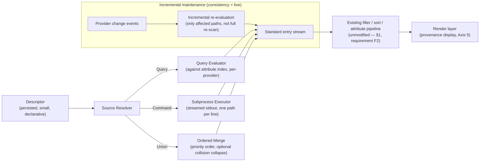

# Virtual Directories: A General-Purpose Design for Query-Backed, Composable File Collections

> A generic, tool-agnostic design proposal. Grounded in filesystem and database research
> (semantic file systems, namespace composition, indexed live queries, view materialization
> theory) and in the documented behavior — including the documented failure modes — of five
> production systems that each solved part of this problem. Written to be checked: every design
> decision below is stated with the alternative it was chosen over, the prior-art evidence for
> the choice, and the failure mode it is meant to close.

---

## Table of contents

1. [Problem statement and requirements](#1-problem-statement-and-requirements)
2. [Prior art — five systems that solved part of this](#2-prior-art--five-systems-that-solved-part-of-this)
3. [The design space: six axes, with tradeoffs](#3-the-design-space-six-axes-with-tradeoffs)
4. [Formal data model](#4-formal-data-model)
5. [Architecture: evaluator, pipeline, incremental maintenance](#5-architecture-evaluator-pipeline-incremental-maintenance)
6. [Correctness analysis: failure modes and their resolutions](#6-correctness-analysis-failure-modes-and-their-resolutions)
7. [Worked examples](#7-worked-examples)
8. [Performance and complexity analysis](#8-performance-and-complexity-analysis)
9. [Prior art vs. requirements — comparison matrix](#9-prior-art-vs-requirements--comparison-matrix)
10. [Recommended default design](#10-recommended-default-design)
11. [Risks and open questions](#11-risks-and-open-questions)
12. [References](#12-references)

---

## 1. Problem statement and requirements

A file manager's listing model is, by default, "the current directory's contents." Users routinely need something else: a set of paths gathered by search, by version-control state, by manual selection, or by an attribute query, browsed with the same navigation, tagging, previewing, and file operations as a real directory. Every mature file manager eventually grows some version of this — search results you can act on, a "recently changed" view, a saved selection — usually as several separate, weaker mechanisms built at different times, because the underlying listing pipeline was never designed to accept anything other than a live directory scan.

This document treats that as one problem with one general solution: a **virtual directory** — a collection of entries, from one or more sources, addressed, filtered, sorted, tagged, and operated on exactly like a real directory, whose *contents* are computed by a declared rule rather than fixed by a single filesystem location.

### 1.1 Functional requirements

- **F1.** Construct a virtual directory from: an attribute/content query, the output of an arbitrary external command, a version-control diff or snapshot, and a manually assembled (ad hoc or saved) set of paths.
- **F2.** Every standard directory operation — list, sort, filter, tag/select, preview, copy/move/delete/rename of an entry — works unmodified inside a virtual directory.
- **F3.** A virtual directory can be named, saved, and reopened later as the same live or snapshot object.
- **F4.** A virtual directory may contain entries from more than one real parent directory, and this must be visible and usable (sortable/groupable), not merely tolerated.
- **F5.** Two or more sources can be composed into one virtual directory with a defined precedence when they overlap.

### 1.2 Non-functional requirements

- **N1 (correctness under drift).** The system must have a defined, documented answer for every one of: an entry deleted from disk after being listed, a rename, a basename collision from two different source directories, and a source becoming unavailable (offline network share, revoked permission).
- **N2 (no silent staleness).** If a virtual directory's contents can go out of date without the user knowing, the UI must say so; a stale-looking-live view is a documented failure mode of at least one shipping system (§2.4) and must not recur here.
- **N3 (bounded cost).** Constructing and, where declared live, maintaining a virtual directory must have a stated cost model, not an implicit "however long the query takes" that only becomes visible in production on a large or remote source.
- **N4 (safety of ambiguous operations).** "Remove this entry" is ambiguous between "stop showing it here" and "delete the underlying file." The design must make these two different actions, not one action with an easy-to-hit destructive default.
- **N5 (no special-cased sources).** Git integration, search integration, and saved selections must be expressions of the same general mechanism, not three independent code paths — this is both a simplicity requirement and a correctness one: a mechanism built three times is validated three times, at three times the cost, and typically only two of the three get finished.

---

## 2. Prior art — five systems that solved part of this

### 2.1 Semantic File Systems (Gifford, Jouvelot, Sheldon & O'Toole, 1991)

The foundational systems-research statement of the idea. A semantic file system associates every file with a set of key/value attributes, extracted automatically by **type-specific transducers** (a mail transducer extracts sender/subject/date; a source-file transducer extracts defined symbols), and interprets a **virtual directory name as a query** over that attribute space: the directory's contents are computed live from the current attribute index, not stored as a fixed list. The design's most important engineering decision is that this is layered as an ordinary directory service, compatible with the NFS protocol of the day — any existing client, unmodified, can browse a query result as if it were a real directory, because from the protocol's point of view it is one.

**What this gets right:** the query-as-directory-name idea, and — critically — building it as a layer that any existing tool can consume unmodified, so the abstraction doesn't require rewriting every client. **What it leaves open:** cost. A transducer-and-query system's usefulness is bounded by whether attributes are actually indexed; the paper's own examples assume a workable index exists. It does not, on its own, say what to do when the underlying store cannot be indexed cheaply (§2.2's system, built five years later, ran directly into this).

### 2.2 BFS / BeFS live queries (Giampaolo, 1998; BeOS, 1996–2001)

BeOS's native filesystem indexed extended file attributes with B+trees and exposed a **reduced-SQL query interface** directly at the filesystem level, with **live queries**: a query result window (a "virtual folder" in the Tracker file manager) updated itself the moment a file's attributes changed to newly match or stop matching, with no polling — because the query engine's own index-maintenance code was the same code path that noticed the change. This is the strongest evidence available that a live, attribute-driven virtual directory is not just theoretically nice but shippable at OS scale: BeOS's own contact manager, instant-messaging roster, and several other system features were literally implemented as nothing but files-with-attributes plus saved queries.

**The documented failure mode, and it matters:** BFS's live queries worked because BFS itself maintained the attribute index. The moment a query needed to reach outside BFS — a mounted NFS or SMB share — the entire mechanism went dark: no attribute indexing, no querying, "everything local was nice, everything remote was terrible," in the words of engineers who worked with the system afterward. This is not a minor implementation gap; it is the load-bearing lesson for requirement **N2** and **N3** above: **query-mode virtual directories are only as good as the index behind them, and a design that doesn't make indexability an explicit, checkable property of each source will eventually ship exactly this cliff**, usually invisibly, until a user points a query at a slow source and the tool hangs or silently returns nothing.

### 2.3 Plan 9 namespaces: bind and union directories (Pike et al., 1990s)

Plan 9 solved a related but distinct problem: not "how do I query for files," but **"how do I compose several existing sources into one namespace, with a defined precedence."** Its `bind` operation grafts one directory tree onto a path in the *current process's private namespace* (namespaces are per-process, so this composition never affects any other process); when the target path already has content, `bind -b` (before) or `bind -a` (after) creates a **union directory**, and lookups on a name present in more than one of the unioned sources resolve in the stated priority order — `bind -b new old` searches `new` first, falling back to `old`. `bind -c` additionally designates which member of a union new files should be created in, which is Plan 9's answer to requirement **N4** for the *creation* side of the ambiguity (its read side — which of several same-named entries you *see* — is resolved purely by declared order, no heuristics).

**What this gets right, and why it's a different tool than §2.1/§2.2:** union directories compose *known, named sources* with an explicit, simple precedence rule, cheaply (no query evaluation at all, just an ordered directory-search list) — this is exactly the mechanism needed for requirement **F5** (combining sources), and is a better fit for it than a query engine would be, because "combine these two specific directories, my edits win" is not naturally a predicate over attributes; it's an ordering statement. The per-process private namespace is also directly relevant: **a virtual directory scoped to one session/pane, never visible to any other session unless explicitly shared, is the correct default scope**, and Plan 9 demonstrates that this can be the *systemic* default rather than a special case.

### 2.4 Saved searches as pseudo-folders: macOS Smart Folders / Windows Search Folders (mid-2000s–present)

Both systems persist a query as a small declarative file (`.savedSearch`, a property list, on macOS; `.search-ms`, XML, on Windows) rather than persisting a result list, and present it in the file browser exactly like a folder. This validates requirement **F3** (name, save, reopen) at consumer scale and is the strongest evidence that **the descriptor-not-the-result is the right thing to persist** (§3, axis 6) — because a persisted result list is exactly as stale as the moment it was saved, while a persisted query stays current for as long as the index behind it does.

**Documented, user-visible failure modes, directly useful here:** Smart Folders depend entirely on the system search index; when that index is off for a volume, or the volume is an unindexed network share, results are silently incomplete — the same BFS cliff (§2.2), independently rediscovered twenty years later, which is strong evidence this is a generic hazard of query-backed virtual directories rather than one system's bug. Separately, Smart Folders' criteria editor has a documented ordering bug where deleting certain criteria lines permanently locks the editor into an invalid state, illustrating a narrower but still generalizable lesson: **a descriptor format built from freeform, order-dependent, UI-only-editable criteria is fragile**; a descriptor that is a small, explicit, directly-inspectable/editable structure (§4) is more robust than one that only exists as the accumulated state of a GUI editor. Finally, and load-bearing for requirement **N4**: Smart Folders resolved the membership-vs-deletion ambiguity by fiat — **removing a Smart Folder, by design, only ever deletes the saved search, never a file it found** — the destructive path (deleting an actual matched file) is not even reachable from the "remove this from my view" gesture. This is the cleanest resolution of N4 found in any surveyed system and is adopted directly in §6.

### 2.5 Command output as a browsable panel: Midnight Commander "panelize"

The Orthodox Commander lineage's answer to the same problem, arrived at independently and with none of the query-engine or namespace-composition machinery of §2.1–§2.3: take the stdout of an arbitrary external command — the results of a `find`, a `grep -l`, a custom script — and load it as a directory panel, operable with every normal file command. This is the least theoretically elegant of the five approaches and the cheapest to implement, and it is included here specifically because it demonstrates requirement **F1**'s "arbitrary command" source is not a hypothetical edge case but a mechanism real, shipped software has relied on directly for decades, precisely because it needs zero indexing, zero query language, and works identically well against any data source that can be reduced to "a program that prints paths" — which covers version-control diffs, `ripgrep` results, and arbitrary user scripts with no special-casing at all.

---

## 3. The design space: six axes, with tradeoffs

### Axis 1 — Evaluation model

| model | cost to build | freshness | matches |
|---|---|---|---|
| **Computed-on-read** (a true "view": re-run the whole query/command every time the directory is opened or refreshed) | one full evaluation per open/refresh | as fresh as the last evaluation | database *view* semantics |
| **Materialized snapshot** (evaluate once, persist the resulting path list) | one evaluation, ever, until explicitly refreshed | frozen at capture time by design | database *materialized view*, unrefreshed |
| **Indexed-live** (an index over the relevant attribute space is maintained continuously; the query result updates incrementally as the index changes) | ongoing index-maintenance cost, amortized | continuously current | BFS live queries (§2.2); database *materialized view with incremental maintenance* |

This is precisely the classical database distinction between a view, an unrefreshed materialized view, and an incrementally-maintained materialized view — the same three cost/freshness tradeoffs, the same conclusion: **indexed-live is strictly better when available, but is only available when the source supports indexing and change notification; the system must fall back, explicitly, to computed-on-read rather than pretend to offer live semantics it cannot back (§2.2, §2.4's shared lesson).**

### Axis 2 — Entry identity and addressing

Two candidate identities for an entry inside a virtual directory:

- **Canonical original path** (the real, absolute path to the real file). Correct by construction, survives the virtual directory's own lifecycle, trivially supports write-through (§ axis 4), and is what every surveyed system that got this right (Gifford's, BFS's, Plan 9's, Midnight Commander's) actually uses.
- **A synthetic materialized copy or symlink**, placed into a real temporary directory so that tools unaware of virtual directories can browse it as a real one. This is a real, used technique (several ad hoc "combine these search results into a folder" scripts do exactly this) but has two structural correctness problems worth stating precisely: a symlink resolves by *path*, not by inode, so a rename of the target elsewhere silently breaks it without any signal at the virtual directory layer; and two source files that share a basename cannot both be materialized into one flat directory without one of them being renamed, which then makes the materialized name diverge from the real name — exactly the kind of silent identity drift Axis 2 exists to prevent.

**Decision: canonical original path is the identity, always.** A synthetic materialization directory may still be offered as an *interoperability shim* for external tools that cannot consume the virtual-directory abstraction directly, but never as the internal identity.

### Axis 3 — Consistency window

Directly the isolation-level question from database theory, applied to a directory listing instead of a transaction:

- **Continuously live** — appropriate for a source with real change notification and, for query sources, a maintained index (a local VCS working tree; local disk with attribute indexing). Matches "read committed with push notification."
- **Snapshot-until-refresh** — appropriate for anything expensive to re-evaluate or explicitly meant to represent a moment (an audit list, a diff between two fixed commits). Matches "snapshot isolation": what you see is what matched at open/last-refresh time, by design, and the UI should say so plainly rather than implying liveness it doesn't have.
- **Best-effort polled** — the fallback when a source has no push mechanism but is cheap enough to re-check periodically (a remote directory without inotify-equivalent support). This is the *declared*, honest version of what an un-indexed BFS query silently was: slow, best-effort, and — critically — labeled as such in the UI, closing requirement N2 directly.

A single virtual directory descriptor should declare which of the three it is, and the evaluator should refuse to silently substitute a weaker one without telling the user (e.g., a query built assuming continuously-live degrading to best-effort polled because one of its unioned sources turned out to be a slow remote mount).

### Axis 4 — Write-through and the deletion ambiguity

Every file operation performed *on an entry* (copy, move, rename, edit, tag) resolves to the canonical path (Axis 2) and acts on the real file — this must be true unconditionally, or the virtual directory is a toy. The ambiguity is specifically about **removing an entry from the collection itself**:

- **Detach** (default, low-friction binding): the entry stops being part of this virtual directory's definition or result set. For a materialized/saved list, this edits the saved list. For a live query, this is generally not meaningful per-entry (the query, not the user, decides membership) unless the source is a union/manual-pin type, in which case "detach" un-pins it.
- **Delete** (separate, explicitly higher-friction binding, matching §2.4's Smart Folder precedent exactly): removes the underlying file from storage, exactly as it would from a real directory, with the same confirmation policy the file manager uses for real deletes.

These must never share a keybinding or a menu entry. This single design rule closes requirement N4 completely and is the one piece of this proposal directly copied, not merely inspired by, prior art (§2.4).

### Axis 5 — Provenance and collision display

When a collection's entries come from more than one real parent location (requirement F4), each entry carries its canonical path (which *is* its provenance — no separate field needed) and the render layer is responsible for:

- showing a disambiguating fragment of the path only when two visible entries share a basename (computed at render time, over the currently visible window, not baked in at construction time — so it doesn't waste work on a 50,000-entry collection where only two names ever collide);
- offering "group by / sort by original directory" as a first-class option whenever the collection is not sourced from a single directory, using the same generalized grouping mechanism a normal directory's "group by extension" would use — provenance is just another attribute (extraction is real-time from the canonical path, not stored redundantly).

### Axis 6 — What gets persisted

Directly settled by §2.4's success and by the view/materialized-view distinction in Axis 1: **persist the declarative descriptor (the query, the command, or the union definition) by default.** A separate, explicit **freeze** operation converts a live or snapshot descriptor into a flat, fully materialized path list with no evaluation rule attached — for the case where the user genuinely wants a fixed record ("the file list as it stood at audit time") rather than a живой view that happens to look that way today. Freezing is a one-way, user-initiated action, never an automatic fallback the system performs on the user's behalf, so a frozen list is never mistaken for a live one.

---

## 4. Formal data model

A virtual directory is fully specified by a **descriptor** and evaluated into a **result set** by an evaluator matched to the descriptor's declared source kind.

### 4.1 Descriptor schema

```
VirtualDirectory
  id                  : opaque stable identifier (not the display name — renaming must not
                        break references held elsewhere, e.g. a bookmark)
  label               : user-facing name
  source              : Source                (see 4.2 — exactly one of the three kinds)
  consistency         : live | snapshot | polled(interval)      -- Axis 3
  missing_policy      : mark | hide                              -- see §6.1
  created_at          : timestamp
  last_evaluated_at   : timestamp
  materialized        : bool                                     -- true once "frozen", Axis 6
```

### 4.2 Source — exactly three primitives, composable

Every source in every prior-art system surveyed (§2) reduces to one of three primitives, or a composition of them:

```
Source =
    Query(predicate: AttributeExpression, scope: [Provider])
  | Command(argv: [string], cwd: Path)
  | Union(members: [(Source, priority: int)])   -- Plan-9-style ordered composition
```

- **`Query`** generalizes Gifford's virtual directories and BFS's live queries: an attribute predicate (`size > 10MB AND tag:vacation`, `git_status = modified`, `content ~= /TODO/`) evaluated over one or more providers. This is the primitive behind: saved searches, "tagged" selections (a predicate over a boolean user attribute), attribute-based smart collections.
- **`Command`** generalizes Midnight Commander's panelize: any external program whose stdout is a newline-delimited path list. This is the primitive behind: version-control diffs (`git diff --name-only <rev>..<rev>`), arbitrary user scripts, one-off ad hoc collections the query language doesn't (yet) express.
- **`Union`** generalizes Plan 9 bind: an ordered list of other sources (which may themselves be `Query`, `Command`, or nested `Union`), with **first-listed-wins** precedence on any basename collision the user has asked to deduplicate, and no deduplication at all by default (both entries shown, disambiguated per Axis 5) unless the descriptor explicitly opts into precedence-based collapsing. This is the primitive behind: manually pinned multi-source sets, and "my search results, but with these three files I added by hand pinned at the top."

Any requested feature this document has covered — a generalized virtual directory, VCS integration, a saved selection, a search-result panel — is one of these three primitives or a `Union` of them. No fourth primitive has been needed by any surveyed prior-art system, which is itself evidence the set is complete for this problem.

### 4.3 Result-set entry

```
Entry
  canonical_path      : absolute path (the identity, Axis 2)
  provenance_source_id: which member of a Union (or which provider, for a Query) produced it
  attributes          : the standard structured-attribute bag (intrinsic + extracted + active + user,
                        as in the general property system) — a virtual directory does not get its
                        own separate attribute model; it reuses the file manager's normal one
  present             : bool  -- false if the canonical path failed to stat at last check (§6.1)
```

---

## 5. Architecture: evaluator, pipeline, incremental maintenance



The critical property of this architecture, stated as a requirement rather than an implementation detail: **the standard filter/sort/attribute pipeline is never modified or duplicated for virtual directories.** Every source kind ends at the same "standard entry stream" interface a real directory scan also produces. This is what makes requirement F2 true by construction rather than by parallel re-implementation, and it is the single biggest lesson available from surveying five independent systems that mostly *didn't* do this: Gifford's system did, by design (its virtual directories speak the same NFS protocol real ones do); BFS's live queries did, by design (a query result is a Tracker window like any other); Smart Folders did, mostly, at real cost when the criteria-editor bug (§2.4) shows the descriptor and the general Finder UI weren't as cleanly decoupled as the concept implied.

**Incremental maintenance** (the "indexed-live" cell of Axis 1) is the one piece of real engineering effort this design asks for, and it is asked for deliberately rather than deferred, because deferring it is exactly how a design ends up at the BFS/Smart-Folder cliff: a source declares what change events it can emit (path-level create/modify/delete, or none); when it can, the evaluator re-evaluates the predicate/command **only for the changed paths**, patches the existing result set, and republishes — an O(1)-per-event operation, not an O(n) full re-run. When a source cannot emit change events, `consistency` cannot legally be `live` for it; the descriptor validator should reject that combination at construction time rather than accept it and silently deliver stale results.

---

## 6. Correctness analysis: failure modes and their resolutions

### 6.1 An entry's underlying file disappears

Resolution depends on evaluation model (Axis 1), not on a single global policy:

- **Snapshot/materialized**: the entry stays listed, `present = false`, rendered with a distinguishing marker. This is correct because the snapshot's whole purpose is to represent a moment in time; showing what's now missing *is* the information (this is precisely why an audit-style frozen list is valuable — it tells you what changed since).
- **Live query**: the entry simply stops matching and disappears from the result set on the next incremental update — there is nothing to mark, because a live query never promised permanence of any given entry.
- **`missing_policy: hide`** is available as an override for snapshot mode when the user explicitly wants the list to silently thin rather than show gaps (e.g., a working set the user actively curates by deleting files they're done with).

### 6.2 Basename collision from two source directories

Resolved by Axis 2 (canonical path is identity, never a synthetic flattened name) plus Axis 5 (disambiguation is a render-time concern, computed only over what's actually colliding in the visible set). No renaming, no synthetic suffixing of the identity ever occurs — only of the *display*.

### 6.3 Rename of a file referenced by a snapshot

A snapshot stores canonical paths, not inode references (few filesystems expose stable, cross-directory-operation inode handles to user-level tools, and even BFS's index — the strongest system surveyed here — tracks by indexed attribute, not raw inode, for exactly this reason). A rename **will** break a snapshot entry's reference; this is stated as a documented limitation, not silently patched over, because silently attempting inode-based tracking would create a false expectation of robustness the underlying storage layer usually cannot support portably. Where tracking through rename genuinely matters, the correct answer is to use a **live query** driven by an attribute stable across rename (e.g., a content hash or a user tag) rather than expecting snapshot mode to provide it.

### 6.4 A source becomes slow or unavailable (network mount, revoked permission, unmounted archive)

Per Axis 3, this must already have been declared honestly at construction time (`polled` rather than `live`, if the source can't push change events; the descriptor validator, per §5, refuses a `live` declaration a source can't back). At evaluation time, a source that times out or errors is reported per-source, not as a whole-directory failure: a `Union` with three members where one has gone unreachable still shows the other two, flagged, rather than failing the entire virtual directory — the same principle Plan 9's union directories apply structurally (a missing member of a union is simply absent from the search order, not a fatal error).

### 6.5 Batch file operation hits a stale entry mid-batch

Because operations resolve to the canonical path at execution time (Axis 2, Axis 4), a batch copy/move/delete over a virtual directory can legitimately hit an entry that no longer exists (it was live-query-current when the batch started, gone by the time the batch reaches it). Resolution: report the failure for that specific item, continue the batch, and summarize failures at the end — never abort the whole batch on the first missing item. This differs deliberately from how a real, static directory listing is usually treated (where a missing entry mid-batch is closer to a true anomaly) precisely because heterogeneous, potentially-live collections make this an expected occasional event, not an exceptional one.

### 6.6 Membership removal vs. data deletion

Resolved fully by Axis 4: two distinct actions, two distinct bindings, following §2.4's Smart Folder precedent exactly, including its strongest property — the low-friction action (detach) is structurally incapable of deleting data, not merely discouraged from it by a confirmation dialog.

---

## 7. Worked examples

### 7.1 Version-control diff collection

```
VirtualDirectory
  label:        "Changed since v2.3.0"
  source:       Command(argv: ["git", "diff", "--name-only", "v2.3.0", "HEAD"], cwd: <repo root>)
  consistency:  live         -- the repo's working tree emits change events the evaluator subscribes to
  missing_policy: mark       -- a file present in v2.3.0 but deleted since should show, marked, not vanish
```

Trace: the command runs once at open time, producing the initial path list; each path is resolved to a canonical absolute path and enters the standard pipeline; provenance is not meaningful here (single logical source — the repository), so the render layer instead surfaces `git status`-per-entry as an ordinary active attribute (from the general property system, not something virtual-directory-specific). On a subsequent commit to the working tree, the repo's change events trigger a re-run of the `git diff` command scoped incrementally where the VCS tooling supports it (`git status --porcelain` on the changed paths only, in practice, rather than a full `diff` re-invocation) — this is the incremental-maintenance path from §5 applied to a `Command` source, which is legal exactly because the chosen VCS command is cheap to re-scope, not because `Command` sources get incremental maintenance for free in general (a source declaring `live` with an expensive, non-scopable command should be rejected at construction time per §5's validator, and the honest declaration for it is `polled`).

### 7.2 Ad hoc multi-project pinned set

```
VirtualDirectory
  label:       "Refactor review set"
  source:      Union(members: [
                 (Query(predicate: user_tag = "refactor-review", scope: [ProjectA, ProjectB, ProjectC]), priority: 0)
               ])
  consistency: live           -- the tag predicate is indexed locally; tagging/untagging a file
                              -- anywhere fires an attribute-change event the query subscribes to
  missing_policy: mark
```

Trace: the user tags files while browsing three unrelated project directories over the course of a session; each tag event is a local attribute-index write, which the live `Query` picks up incrementally (§5) — no polling, no re-scan of three project trees. Because the three sources are genuinely different directories, provenance (Axis 5) is meaningful and on by default: the render layer groups by original project directory automatically once it detects more than one distinct parent among visible entries. When the review is done, the user issues **freeze** (Axis 6): the descriptor's `Query` is discarded, `materialized` becomes true, and the virtual directory becomes a fixed record of exactly which files were in the set at that moment — useful as an audit artifact independent of whether the tags are later removed.

### 7.3 Semantic attribute query spanning a mixed local/remote scope

```
VirtualDirectory
  label:       "Large untagged images"
  source:      Query(predicate: type = image AND size > 20MB AND NOT has_tag("archived"),
                      scope: [LocalDisk, TeamShare])
  consistency: live for LocalDisk-derived results; polled(interval: 5m) for TeamShare-derived results
  missing_policy: hide
```

Trace: this directly exercises the §2.2/§2.4 lesson. `LocalDisk` maintains an attribute index, so its share of the query is `live`, incrementally maintained. `TeamShare` is a network mount with no attribute indexing available; per §5's validator, the descriptor is **not permitted to declare `live` for that half of the scope** — the system computes the honest answer (`polled`, five-minute interval, chosen as a declared default the user can tighten) and — per requirement N2 — the render layer shows a small per-source freshness indicator ("TeamShare: as of 4 minutes ago") rather than presenting one uniformly "live-looking" list that is secretly two different freshness guarantees glued together. This is the single concrete design feature that exists specifically because §2.2 and §2.4 both shipped without it and both paid for it in user-visible, reported confusion.

---

## 8. Performance and complexity analysis

Let *n* be the size of a source's underlying provider (files in a directory, commits in a range, rows in a remote listing), *k* the number of members in a `Union`, and *m* the size of the current result set.

- **`Query` evaluation, indexed:** O(matching entries), independent of *n* — this is BFS's own stated advantage over path-based search, and is only achievable when the provider maintains an index on the predicate's attributes; the design must expose whether a given provider/attribute pair is indexed so the evaluator (and the UI) can report which cost model applies, rather than the two being silently conflated.
- **`Query` evaluation, unindexed:** O(n) full-provider scan per evaluation — legitimate as a fallback, but must never silently be declared `live` (§5), since a live O(n) re-scan on every change event degenerates to continuous full scanning under any nontrivial change rate.
- **`Command` evaluation:** bounded by the external command's own complexity; the file manager's obligation is only to stream its stdout rather than buffer it fully before the pipeline starts (matching the general listing-pipeline streaming requirement, unmodified per §5).
- **`Union` merge:** O(sum of member sizes + k log k) for a priority-ordered streaming merge (a k-way merge over already-produced streams), independent of how each member was itself evaluated.
- **Incremental maintenance per change event, indexed-live:** O(1) amortized — a single attribute-index update plus a patch to the existing result set, not a re-run of the whole query. This is the entire performance argument for preferring indexed-live over naive re-poll-and-diff at any real scale, and is the reason §5 treats incremental maintenance as a first-class architectural requirement rather than a later optimization: a design that starts with "just re-run the query on any filesystem event" works in a demo and becomes O(n) per keystroke-adjacent event on a large, active tree.
- **Render-time collision disambiguation (Axis 5):** O(entries currently visible on screen), not O(m) — deliberately scoped to the viewport, since a 50,000-entry collection with two colliding basenames should not pay a full-collection collision-detection pass on every render.

---

## 9. Prior art vs. requirements — comparison matrix

| system | F1 (multi-source-kind) | F3 (save/reopen) | F4 (provenance) | F5 (composition) | N1 (drift correctness) | N2 (no silent staleness) | N4 (deletion safety) |
|---|---|---|---|---|---|---|---|
| Semantic File Systems (Gifford) | query only | protocol-native, implicit | not addressed | not addressed | not addressed | not addressed (assumes index exists) | not addressed |
| BFS live queries | query only | yes (saved query) | not addressed | not addressed | partially (index tracks by attribute) | **fails** off-filesystem (§2.2) | not addressed |
| Plan 9 bind/union | composition only | no (namespace is per-session, not itself persisted as a named object) | n/a (no query result to disambiguate — literal directory merge) | **yes**, cleanly | n/a | n/a (no query, so no staleness) | n/a (create-target rule, not delete) |
| macOS/Windows Smart Folders | query only | **yes**, cleanly (descriptor file) | not addressed | not addressed | partially (index-dependent) | **fails** on unindexed volumes (§2.4) | **yes**, cleanly (§2.4) |
| MC panelize | command only | limited (re-panelize, not a named persistent object in the classic implementation) | not addressed | not addressed | not addressed | n/a (explicitly a one-shot snapshot) | not addressed |
| **This proposal** | **all three primitives** | **yes** (§4.1, §6) | **yes** (§3 Axis 5, §6.2) | **yes** (Union, §4.2) | **yes** (§6.1, §6.3) | **yes** (§3 Axis 3, §7.3) | **yes** (§3 Axis 4, §6.6) |

No single surveyed system satisfies more than two or three of the seven columns; each gap in the table above is a documented, cited limitation of a real, shipped system, not a hypothetical one. The proposal's contribution is not a new primitive — every one of F1–F5 traces to an existing system in §2 — but closing the specific correctness and staleness gaps (N1, N2, N4) that no single surveyed system closed on its own, by combining Plan 9's composition ordering, the database view/materialized-view freshness spectrum applied honestly per-source, and the Smart Folder deletion-safety precedent, into one design.

---

## 10. Recommended default design

For an implementation with limited initial engineering budget, in priority order:

1. **Ship `Command` and `Query`-without-indexing first** (§4.2, §8's unindexed row). This alone satisfies F1's version-control and search-result cases and a large share of real user demand, at the lowest engineering cost, with an honest `polled` or `snapshot` consistency default — never claim `live` until incremental maintenance (§5) actually exists.
2. **Ship the descriptor/persistence model (§4.1, Axis 6) before any query sophistication.** Persisting a small, explicit, directly-editable descriptor is what makes F3 solid and avoids the Smart Folder criteria-editor fragility (§2.4) — a hand-editable structured descriptor is strictly more robust than an accumulated GUI-only editor state.
3. **Ship the detach/delete separation (Axis 4, §6.6) from day one, unconditionally** — this is the cheapest single item on this list and the one whose absence causes the worst outcome (real data loss) if deferred.
4. **Ship `Union` (§4.2) once at least two source kinds exist to compose** — it is a thin, purely mechanical layer over sources that already work.
5. **Only after the above is stable, invest in indexed attributes and incremental maintenance** (§5, §8) for the sources where it pays off (typically local disk first, since that's where an index is cheapest to build and maintain) — and gate the `live` consistency declaration strictly behind that capability actually existing per source, never optimistically.

---

## 11. Risks and open questions

- **Arbitrary command execution as a source (`Command`) is also an arbitrary-code-execution surface.** A shared or synced descriptor containing a `Command` source executes whatever it says with the opening user's privileges; a descriptor sync/sharing feature (§13.12 of the companion architecture document) must either exclude `Command` sources or require explicit per-descriptor trust confirmation before a command from an untrusted origin runs.
- **Index maintenance cost on very large local trees is a real, not hypothetical, cost** (§8) — BFS itself accepted meaningful per-write overhead for attribute indexing; a design that indexes eagerly and universally, rather than on-demand for attributes actually used by a live query, risks paying that cost for queries that are never run. Indexing should be built lazily, per attribute actually referenced by a saved `live` query, not universally at write time.
- **Cross-machine sync of saved virtual directories** is not addressed by this proposal and is nontrivial: a `Query` descriptor referencing local attribute indexes or a `Command` referencing a local tool path is not portable as-is between machines without either re-resolving those references or explicitly declaring the descriptor host-bound.
- **Nested `Union` precedence at depth** — Plan 9's answer (search order determines it, full stop, no heuristic resolution) is adopted here without modification, but has not been stress-tested against deeply nested compositions (a `Union` of `Union`s); it is asserted, not proven, that flattening to a single ordered list at construction time is sufficient and no additional precedence semantics are needed.

---

## 12. References

- Gifford, D. K., Jouvelot, P., Sheldon, M. A., & O'Toole, J. W. (1991). Semantic file systems. *Proceedings of the 13th ACM Symposium on Operating Systems Principles*; *ACM Operating Systems Review*, 25(5), 16–25.
- Giampaolo, D. (1998). *Practical File System Design with the Be File System*. Morgan Kaufmann. (BFS attribute indexing, query language, and live queries.)
- OSNews / community documentation on BFS attribute-driven applications (the BeOS People/contacts database and IM roster built directly on BFS attributes and live queries), and retrospective engineering accounts of BFS's behavior on non-indexed remote volumes.
- Pike, R., Presotto, D., Thompson, K., Trickey, H., & Winterbottom, P. (1990s). The Plan 9 distributed system: per-process namespaces, and the `bind`/`mount` union-directory mechanism (`intro(1)`, Plan 9 manual; contemporary re-implementations and expositions of `bind -a`/`bind -b`/`bind -c` semantics).
- Apple support documentation and independent technical write-ups on Finder Smart Folders (`.savedSearch` files, Spotlight-index dependency, documented behavior on unindexed/network volumes, and the deletion-safety property that removing a Smart Folder never deletes a matched file).
- Microsoft documentation and independent write-ups on Windows Search Folders (`.search-ms`).
- GNU Midnight Commander documentation — "panelize" (loading arbitrary command output as a directory panel).
- Standard relational-database theory of views vs. materialized views and incremental view maintenance, applied here by analogy as the freshness/cost framework for Axis 1 and Axis 3.
